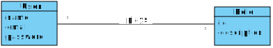
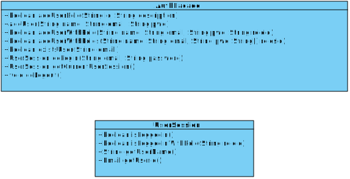

# User Authentication & Authorization

## Context/Requirement

The component responsible for the users' authentication and authorization (called AuthLib) was initially developed by another development team that is also responsible for its maintenance/evolution. This component aims to satisfy a set of generic requirements common to several applications.

**In the scope of this project, the AuthLib component must be reutilized.**

For that aim, a brief overview of the component documentation is presented below.

## AuthLib Documentation

The main concepts covered in this component are represented in the domain model presented below.

 

Accordingly, a _"User"_ plays several _"Role"_ (i.e. functions) as well as the same _"Role"_ can also be played by several _"User"_.

This component makes its functionalities available to other systems through a single access point (i.e. a class of software) called _"AuthFacade"_. In this way, the internal structure of the component can be changed without affecting the applications that are using this component.

Therefore, the relevant documentation regarding the component (re)usage consists of the description of the classes _"AuthFacade"_ and _"UserSession"_ (cf. class diagram). The first provides the following methods:

* **_“boolean addUserRole(String id, String description)”_**: creates a new role that is of interest for the application reusing the component;
* **_“boolean addUser(String name, String email, String pwd)”_**: creates a new user that can use the application;
* **_“boolean addUserWithRole(String name, String email, String pwd, String roleId)”_**: similiar to the previous method, with the advantage of immediately setting a role (based on its _id_) played by such user; 
* **_“boolean addUserWithRoles(String name, String email, String pwd, String[] rolesId)”_**: similiar to the previous method, but with the ability to set several roles played by such user;
* **_“boolean existsUser(String email)”_**: used to know if there is a user that is identifiable by the specified identifier/email;
* **_“UserSession doLogin(String email, String password)”_**: allows to authenticate a user to properly use the application. The result is a user session (i.e. class **_UserSession_**) instance;
* **_“UserSession getCurrentUserSession()”_**: returns current active user session;
* **_“void doLogout()”_**: ends the currently active user session, i.e. the current user is no longer authenticated.

 

A user session (_UserSession_) provides the following methods:

* **_“boolean isLoggedIn()”_**: indicates whether the session actually has a successful authenticated user or not;
* **_“boolean isLoggedInWithRole(String roleId)”_**: indicates whether the authenticated user plays (or not) the role identified by the parameter _"roleId"_;
* **_“String getUserName()”_**: returns the name of the authenticated user;
* **_“Email getUserId()”_**: returns the identifier/email of the authenticated user;

Finally, it should be noted that **the user identifier is the most appropriate way for applications that use this component to relate system users with specific classes/objects of the application domain.**

