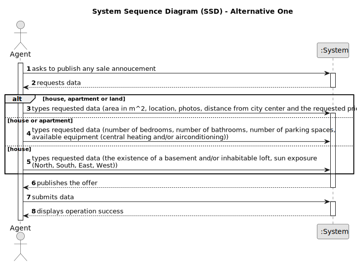

# US 002 - Publish any sale announcement on the system

## 1. Requirements Engineering

The agent will be responsible for setting the commissions and publishes the sale announcement. The announcement contains the type of property (apartment, house or land), the area in m^2, the location, the distance from the city center, the price and some photographs. If the property is a house or an apartment, the announcement also contains the number of bedrooms, the number of bathrooms, the number of parking spaces and the available equipment (central heating and/or airconditioning. In case the property is a house, the existence of a basement, an inhabitable loft, and sun exposure will be registered as well.

### 1.1. User Story Description

As an agent, I can publish any sale annoucement on the system, for example received through a phone call.

### 1.2. Customer Specifications and Clarifications

**From the specifications document:**

>	The announcement contains the type of property (apartment, house or land), the area in m^2, the location, the distance from the city center, the price and some photographs.

> If the property is a house or an apartment, the announcement also contains the number of bedrooms, the number of bathrooms, the number of parking spaces and the available equipment (central heating and/or airconditioning.

>   In case the property is a house, the existence of a basement, an inhabitable loft, and sun exposure will be registered as well.

**From the client clarifications:**

> **Question:** We are having a little issue defining what the sun exposure might be. We are not sure what it will be as a value. If it's a number that defines how much exposure the house has or if it is just a text saying if it has or hasn't sun exposure.
>
> **Answer:** Sun exposure will take the following values: North, South, Eat or West.

> **Question:** Is the phone call the only way the agent can receive the sale announcement? Or he can receive them via e-mail/letter/etc.
>
> **Answer:**  For now this is the only way.

> **Question:**  The act of publishing a sale announcement means that the agent is publishing a new property for sale in the system (receiving the information of the seller and publishing the new property for sale) or is it the buyer giving positive feedback to the agent with intent to buy the property(actually closing a sale, buying a property and de-listing said property)?
>
> **Answer:**  In US2 we get "As an agent, I can publish any sale announcement on the system, for example received through a phone call". Additional information related with this question is also avaliable in the project description.
>

> **Question:** What would be the attributes of the Owner and Agent?
>
> **Answer:** The Owner attributes are: the name, the citizen's card number, the tax number, the address, the email address and the contact
telephone number. The Agent is an employee of the company.

> **Question:** When a sale order arrives at the agent, what are the acceptance criteria that he (the agent) uses to accept or reject the order? Is there a possibility for an agent to refuse due to a lack of data on the property's characteristics of a property given by the owner? Or when the request arrives at the agent, are all the essential characteristics of the property in question already present?
>
> **Answer:** Yes.

> **Question:**  Is it necessary to publish the owner atributes on the sale announcement?
>
>  **Answer:** No.

> **Question:** If the comission is percentage[/value] what is the value? Is it the same for all agents?
> 
> **Answer:** There is no maximum and the minimum is 0. The commission is for the agency and for that given property.

> **Question:** If it's a property for lease is the comission value adjusted for the monthly value and contract duration? What is the value or method for calculating the comission?
>
> **Answer:** The commission is one value/percentage paid when the transaction is made.

> **Question:** Is it mandatory for the agent to input the commission value before publishing an announcement?
>
> **Answer:** Yes.

> **Question:** Are there only 2 types of commission or can the Administrator define more types of commission?
> 
>  **Answer:** For now we only have two types of commissions.

> **Question:** Another doubt that has emmerged is related to the identification of the owner of the property, isn't it required that the owner identifies themselves in the announcement ?
>
>  **Answer:** Info about the owner is not published.

> **Question:** In USS02 are all the criteria for publishing the sale of a property in the system mandatory, or is there any data that the owner can choose not to give? such as not saying the direction of sun exposure in the case of a house.
>
>  **Answer:** The number of bathrooms, the available equipment and the sun exposure are not mandatory. At least one photograph is required.

### 1.3. Acceptance Criteria

* **AC1:** All required fiels must be filled in.
* **AC2:** Task reference must have at least 5 alphanumeric chars.
* **AC3:** When creating a task with an already existing reference, the system must reject such operation and the user must have the change to modify the typed reference.

### 1.4. Found out Dependencies

* There is a dependency to "US004 Submit a request for listing a property sale or rent" since the agent should submit in the aplication the request fos listing a property sale or rent.

### 1.5 Input and Output Data

**Input Data:**

* Selected data:
  Type of property.

* Typed data:

| **_Apartment, house or land_** | **_Apartment or house_**                                     | **_House_**                                         |                                      
|:-------------------------------|:-------------------------------------------------------------|:----------------------------------------------------|
| Area in m^2                    | Number of bedrooms                                           | The existence of a basement and/or inhabitable loft | 
| Location                       | Number of bathrooms                                          | Sun exposure (North, South, East, West)             |
| Distance from city center      | Number of parking spaces                                     |
| Price                          | Available equipment (central heating and/or airconditioning) |

**Output Data:**

* (In)Successfully published sale annoucement.

### 1.6. System Sequence Diagram (SSD)

