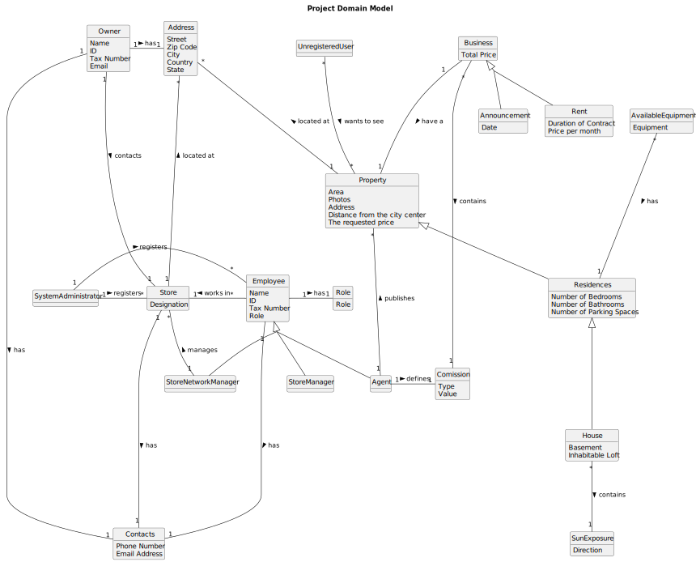

# Analysis

The construction process of the domain model is based on the client specifications, especially the nouns (for _concepts_) and verbs (for _relations_) used. 

## Rationale to identify domain conceptual classes ##
To identify domain conceptual classes, start by making a list of candidate conceptual classes inspired by the list of categories suggested in the book "Applying UML and Patterns: An Introduction to Object-Oriented Analysis and Design and Iterative Development". 

### _Conceptual Class Category List_ ###

**Business Transactions**

*

---

**Transaction Line Itemss**

*

---

**Product/Service related to a Transaction or Transaction Line Item**

*  

---

**Transaction Records**

*  

---  

**Roles of People or Organizations**

* 

---

**Places**

*  

---

** Noteworthy Events**

* 

---

**Physical Objects**

*

---

**Descriptions of Things**

*  

---

**Catalogs**

*  

---

**Containers**

*  

---

**Elements of Containers**

*  

---

**Organizations**

*  

---

**Other External/Collaborating Systems**

*  

---

**Records of finance, work, contracts, legal matters**

* 

---

**Financial Instruments**

*  

---

**Documents mentioned/used to perform some work/**

* 
---

###**Rationale to identify associations between conceptual classes**###

An association is a relationship between instances of objects that indicates a relevant connection and that is worth of remembering, or it is derivable from the List of Common Associations: 

+ **_A_** is physically or logically part of **_B_**
+ **_A_** is physically or logically contained in/on **_B_**
+ **_A_** is a description for **_B_**
+ **_A_** known/logged/recorded/reported/captured in **_B_**
+ **_A_** uses or manages or owns **_B_**
+ **_A_** is related with a transaction (item) of **_B_**
+ etc.

| **_Concept (A)_**   | **_Association_** | **_Concept (B)_** |                                       
|:--------------------|:------------------|------------------:|
| Agent               | is a              |          Employee |
| Agent               | publishes         |          Property |
| Agent               | defines           |         Comission |
| Announcement        | is a              |          Business |
| AvailableEquipment  | has               |        Residences |
| Business            | have a            |          Property |
| Business            | contains          |         Comission |
| Employee            | works in          |             Store |
| Employee            | has               |              Role |
| Employee            | has               |          Contacts |
| House               | is a              |        Residences |
| House               | contains          |       SunExposure |
| Owner               | contacts          |             Store |
| Owner               | has               |          Location |
| Owner               | has               |          Contacts |
| Property            | located at        |          Location |
| Rent                | is a              |          Business |
| Residences          | is a              |          Property |
| Store               | located at        |          Location |
| Store               | has               |          Contacts |
| StoreManager        | is a              |          Employee |
| StoreNetworkManager | is a              |          Employee |
| StoreNetworkManager | manages           |             Store |
| SystemAdministrator | registers         |             Store |
| SystemAdministrator | resgisters        |          Employee |
| UnregisteredUser    | wants to see      |          Property |

## Domain Model

**Do NOT forget to identify concepts atributes too.**

**Insert below the Domain Model Diagram in a SVG format**

