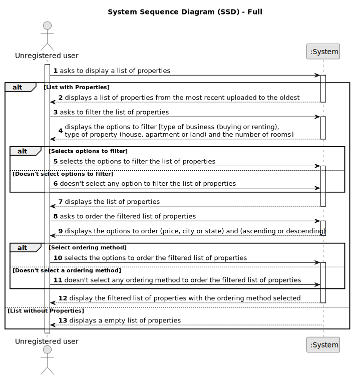

# US 001 - Display listed properties

## 1. Requirements Engineering

### 1.1. User Story Description

As an unregistered user, I want to display listed properties.

### 1.2. Customer Specifications and Clarifications

**From the specifications document:**

>   All registered information, except the agency commission, can be accessed by the client who intends to buy or rent the property; the client is, then, 
>   responsible for able to consult the properties by type, number of rooms, and sort by criteria such as price or the location where the property is located.

>	When the client decides to buy/rent the property, he sends a request for the purchase/lease of the property to the agent. After being appreciated by the agent, 
>   he accepts or rejects the order. If the request is accepted, the offer will not be shown again to clients using the application.

**From the client clarifications:**

> **Question:** Can a land be rented? **(Monday, 24th April, 2023 at 12:37)**
>
> **Answer:** Yes. Please read the Project Description carefully.

> **Question:** The order which the properties are sorted by default is an ascending (for price from lowest to
> highest and for parish from A to Z) or in a descending order? **(Saturday, 15th April, 2023 at 12:32)**
>
> **Answer:** The client should be able to sort (ascending or descending) properties by price, city and state. By default, the list should be shown with 
> the properties sorted by most recently added.

> **Question:** Does the "Land" property type, have specific attributes, that justify the creation of the "Land" concept? **(Saturday, 15th April, 2023 at 12:16)**
>
> **Answer:** The attributes of a land property type are described in the initial Project Description. I am a client, not a software engineering.

> **Question:** When sorting by price or location: 1) Does it mean ascending or descending? Most expensive to least expensive or vice-versa.
> By closest to furthest or vice-versa. 2) To filter between a range of price? 3) To filter the location of the property by city?
> **(Saturday, 15th April, 2023 at 12:13)**
>
> **Answer:** The client should be able to sort (ascending or descending) properties by price, city and state. I do not want the filters that you are suggesting.

> **Question:** Does a rent request includes a contract duration (minimum or defined)? **(Saturday, 15th April, 2023 at 12:07)**
>
> **Answer:** The caracteristics for a rental are the same as the ones for the sale of a property. The rent value is per month. Additionally,
> we have to define the contract duration. Ther is no minimum.

> **Question:** The one of the search criteria is "number of rooms". Is "Number of Bedrooms" or "Number of Bathrooms" or both?
> **(Wednesday, 29th March, 2023 at 18:09)**
>
> **Answer:** Number of Bedrooms.

> **Question:**  In a previous question, you answered that, regarding US001 filtering/sorting system, the client should be able to select
> (from a list) the type of business, the type of property, and the number of rooms. Does this apply too to the process of an owner submitting a request?
> Or does the owner has to type these characteristics? **(Wednesday, 29th March, 2023 at 17:11)**
>
> **Answer:** Yes.

> **Question:** When a unregistered user wants to list properties, the list given by the program is sorted by default with which criteria? For example the list
>   is shown with the properties sorted by most recently added? **(Tuesday, 28th March, 2023 at 17:23)**
>
> **Answer:** Thank you for your suggestion. By default, the list should be shown with the properties sorted by most recently added.

> **Question:** Can a user filter the properties list for example by a type but choosing multiple values? For example the users wants to see only properties
>   with 3 or 4 rooms. If this is possible, after filtering the list to show only the values chosen, he can sort by ascending/descending?
> **(Tuesday, 28th March, 2023 at 17:23)**
>
> **Answer:** The user should select only one value for each feature of the property. By default, the list should be shown with the properties sorted
>   by most recently added.

> **Question:** The property size, location and type are typed or selected in order to filter the results? **(Tuesday, 21st March, 2023 at 17:03)**
>
> **Answer:** I think you are asking about US1. The client should be able to select (from a list) the type of business, the type of property and the number of rooms.

> **Question:** The properties can be in sale and lease at the same time? **(Monday, 20th March, 2023 at 16:39)**
>
> **Answer:** No.

> **Question:** In the project's documentation it's mentioned that "All those who wish to use the application must be authenticated",
>   but in the US1 it's said that an unregistered user can see a list of properties. Can users who aren't authenticated do this?
> **(Monday, 20th March de 2023 at 12:28)**
>
> **Answer:** Non-authenticated users can only list properties.

> **Question:** When an unregistered user opens the application, are there already properties being listed? If the answer is "YES": then by default,
>   by which criteria are the properties listed? If the answer is "NO": is it mandatory for the user to choose an option (type, number of rooms)
>   or can he/her simply request to view a list of properties that will be automatically ordered, for example, by "most recent"?
> **(Sunday, 19th March, 2023 at 01:09)**
>
> **Answer:** I already clarified what the unregistered user will see and what he can do within the application. If the system does not contain
>   any properties, the system should show an empty list of properties.

> **Question:** An unregistered user can olny see sale announcements or he is able to contact the agency agents to make a purchase request?
> **(Friday, 17th March, 2023 at 20:40)**
>
> **Answer:** From the project description: "As an unregistered user, I want to display listed properties". For now this is the only functionality
>   of the system that the non-registered user can use.

> **Question:** In the project description it is stated that "the client is, then, responsible for being able to consult the properties by type,
>   number of rooms, and sort by criteria such as price or the parish where the property is located.". Is the client able to sort properties
>   by only these 4 criteria or is he able to sort properties by any of the properties' characteristics? **(Friday, 17th March, 2023 at 17:38)**
>
> **Answer:** The client should be able to select the type of business (renting or buying), the type of property and the number of rooms. Then, the client
>   should be able to sort properties by price or by parish where the property is located.
If the client does not select the type of business, the type of property and the number of rooms, the application should allow the client to sort
>   all properties that are on sale or on renting.

### 1.3. Acceptance Criteria

* **AC1:** The application should allow the client to sort all properties that are on sale or renting by price and/or location, even if the type of business, the type of property and the number of rooms are not specified.
* **AC2:** If the system does not contain any properties, the list of properties should be empty.
* **AC3:** If the user does not choose any type of property nor type of business, the list of properties should be listed from the most recent uploaded to the oldest.
* 

### 1.4. Found out Dependencies

* There is a direct dependency to US002 *Publish sale announcement on the System".

### 1.5 Input and Output Data

**Input Data:**

* Typed data:
  * None required

* Selected data:
  * The type of business (renting or buying);
  * The type of property;
  * The number of rooms;
  * Displaying listed properties;

**Output Data:**

* List of available properties with:
  * The type of property (apartment, house or land);
  * The area in m2;
  * The location;
  * The distance from the city centre;
  * The request price;
  * Photographs;
  * The number of bathrooms;
  * The number of parking spaces;
  * The available equipment;
  * Central heating and/or air conditioning;
  * The existence of a basement;
  * The existence of an inhabitable loft;
  * The sun exposure;

### 1.6. System Sequence Diagram (SSD)

#### Alternative One

#### Alternative Two

#### Alternative Three

#### Alternative Four

#### Alternative Five

#### Alternative Full

### 1.7 Other Relevant Remarks
