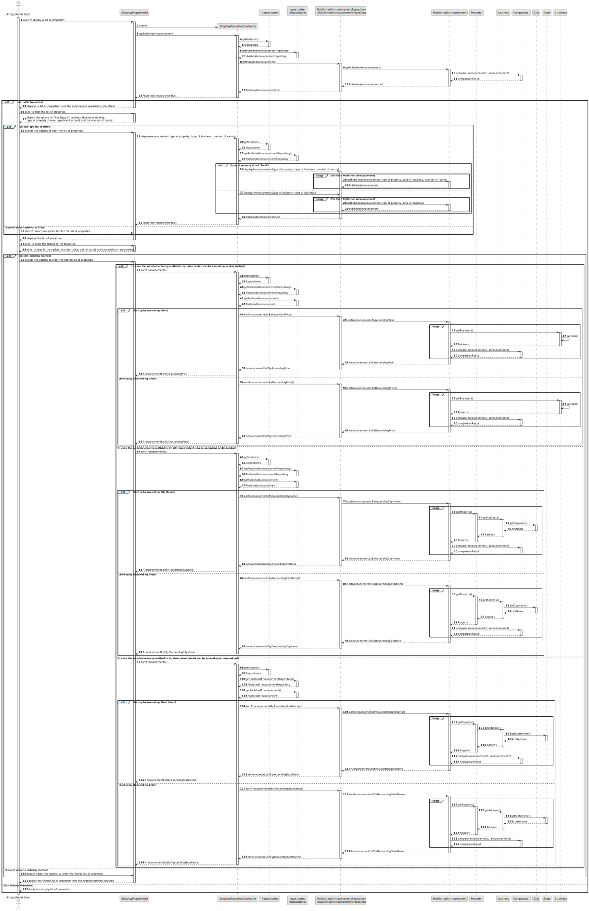
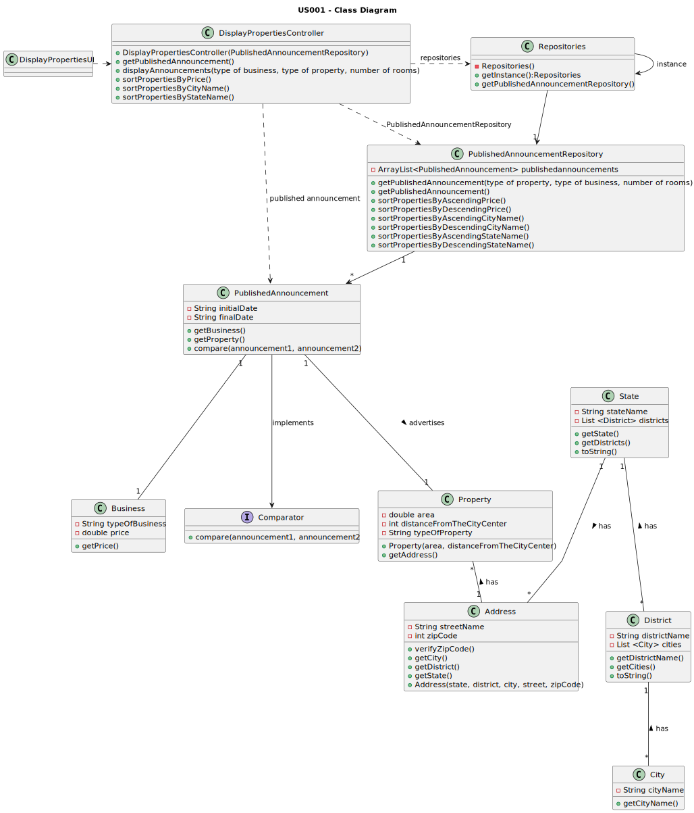

# US 001 - Display Listed Properties

## 3. Design - User Story Realization

### 3.1. Rationale

**SSD - Alternative 1 is adopted.**

|                                                                       Interaction ID                                                                       | Question: Which class is responsible for...                    | Answer                          | Justification (with patterns)                                                                                                                                                                                                                            |
|:----------------------------------------------------------------------------------------------------------------------------------------------------------:|:---------------------------------------------------------------|:--------------------------------|:---------------------------------------------------------------------------------------------------------------------------------------------------------------------------------------------------------------------------------------------------------|
|                                                       Step 1 : asks to display a list of properties                                                        | ...interacting with the actor?                                 | DisplayPropertiesUI             | Pure Fabrication: there is no reason to assign this responsibility to any existing class in the Domain Model. It is a user interface concern.                                                                                                            |
|                                                                                                                                                            | ...coordinating the US?                                        | DisplayPropertiesController     | Controller                                                                                                                                                                                                                                               |
|                                                                                                                                                            | ...obtaining the published annnouncements list?                | PublishedAnnounementRepository  | IE: The PublishedAnnounementRepository interacts with the user interface to obtain the list of properties. Pure Fabrication: there is no reason to assign this responsibility to any existing class in the Domain Model. It is a user interface concern. |
|                                     Step 2 : displays a list of properties from the most recent glossary to the oldest                                     | ...displaying the UI for the Unregistered User to select data? | DisplayPropertiesUI             | Pure Fabrication: there is no reason to assign this responsibility to any existing class in the Domain Model. It is a user interface concern.                                                                                                            |
|                                                       Step 3 : asks to filter the list of properties                                                       | ...UI-related class being instantiated?                        | DisplayPropertiesUI             | Pure Fabrication: there is no reason to assign this responsibility to any existing class in the Domain Model. It is a user interface concern.                                                                                                            |
| Step 4 : asks to specify the options to filter (type of business (buying or renting), type of property (house, apartment or land) and the number of rooms) | ...displaying the UI for the Unregistered User to select data? | DisplayPropertiesUI             | Pure Fabrication: there is no reason to assign this responsibility to any existing class in the Domain Model. It is a user interface concern.                                                                                                            |
|                                               Step 5 : selects the options to filter the list of properties                                                | ...validating the selected data?                               | DisplayPropertiesUI             | Pure Fabrication: there is no reason to assign this responsibility to any existing class in the Domain Model. It is a user interface concern.                                                                                                            |
|                                                                                                                                                            | ...obtaining the selected options?                             | PublishedAnnounementRepository  | IE: The PublishedAnnounementRepository interacts with the user interface to obtain the list of properties. Pure Fabrication: there is no reason to assign this responsibility to any existing class in the Domain Model. It is a user interface concern. |
|                                            Step 6 : doesn't select any options to filter the list of properties                                            | ...validating the selected data?                               | DisplayPropertiesUI             | Pure Fabrication: there is no reason to assign this responsibility to any existing class in the Domain Model. It is a user interface concern.                                                                                                            |
|                                                          Step 7 : displays the list of properties                                                          | ...displaying the list of properties?                          | DisplayPropertiesUI             | Pure Fabrication: there is no reason to assign this responsibility to any existing class in the Domain Model. It is a user interface concern.                                                                                                            |
|                                                   Step 8 : asks to order the filtered list of properties                                                   | ...UI-related class being instantiated?                        | DisplayPropertiesUI             | Pure Fabrication: there is no reason to assign this responsibility to any existing class in the Domain Model. It is a user interface concern.                                                                                                            |
|                              Step 9 : asks to specify the options to order (price, city or state) and ascending or descending                              | ...displaying the UI for the Unregistered User to select data? | DisplayPropertiesUI             | Pure Fabrication: there is no reason to assign this responsibility to any existing class in the Domain Model. It is a user interface concern.                                                                                                            |
|                                           Step 10 : selects the options to order the filtered list of properties                                           | ...validating the selected data?                               | DisplayPropertiesUI             | Pure Fabrication: there is no reason to assign this responsibility to any existing class in the Domain Model. It is a user interface concern.                                                                                                            |
|                                                                                                                                                            | ...obtaining the selected options?                             | PublishedAnnounementRepository  | IE: The PublishedAnnounementRepository interacts with the user interface to obtain the list of properties. Pure Fabrication: there is no reason to assign this responsibility to any existing class in the Domain Model. It is a user interface concern. |
|                                   Step 11 : doesn't select any ordering method to order the filtered list of properties                                    | ...validating the selected data?                               | DisplayPropertiesUI             | Pure Fabrication: there is no reason to assign this responsibility to any existing class in the Domain Model. It is a user interface concern.                                                                                                            |
|                                    Step 12 : displays the filtered list of properties with the ordering method selected                                    | ...displaying the list of properties?                          | DisplayPropertiesUI             | Pure Fabrication: there is no reason to assign this responsibility to any existing class in the Domain Model. It is a user interface concern.                                                                                                            |
|                                                       Step 13 : displays an empty list of properties                                                       | ...displaying the UI for the Unregistered User?                | DisplayPropertiesUI             | Pure Fabrication: there is no reason to assign this responsibility to any existing class in the Domain Model. It is a user interface concern.                                                                                                            |

### Systematization ##

According to the taken rationale, the conceptual classes promoted to software classes are:

* None

Other software classes (i.e. Pure Fabrication) identified:

* DisplayPropertiesUI
* DisplayPropertiesController
* PublishedAnnounementRepository

## 3.2. Sequence Diagram (SD)

### Alternative 1 - Full Diagram

This diagram shows the full sequence of interactions between the classes involved in the realization of this user story.

## 3.3. Class Diagram (CD)

