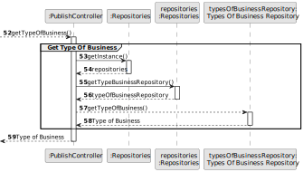
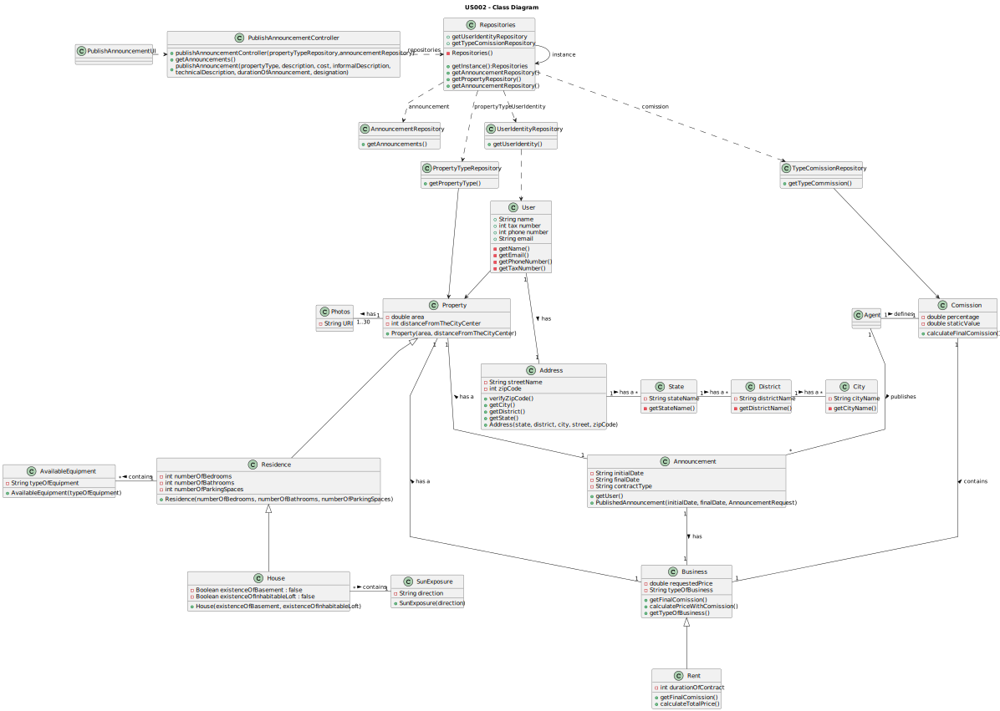

# US 002 - Publish any sale announcement on the system

## 3. Design

### 3.1. Rationale

| **_Interaction ID_**                                                                                                                                             | **_Which class is responsible for..._**                           | **_Answer_**              | **_Justification_**                                                   |                                   
|:-----------------------------------------------------------------------------------------------------------------------------------------------------------------|:------------------------------------------------------------------|:--------------------------|-----------------------------------------------------------------------|
| Step 1: asks to publish an announcement                                                                                                                          | ...UI-related class being instantiated?                           | PublishUI                 | Pure Fabrication                                                      |
| Step 2: requests User identity                                                                                                                                   | ... displaying the UI for the agent to input data?                | PublishUI                 | Pure Fabrication                                                      |
| Step 3: inserts the User email                                                                                                                                   | ... validating the input data?                                    | Validator                 | IE                                                                    |
|                                                                                                                                                                  | ... obtaining the owner identity?                                 | UserIdentityRepository    | IE, Pure Fabrication                                                  |
| Step 4: shows User information                                                                                                                                   | ... displaying the owner identification?                          | PublishUI                 | Pure Fabrication                                                      |
| Step 5: confirms User identity                                                                                                                                   | ... validating the confirmation?                                  | Validator                 | IE                                                                    |
| Step 6: list and request the property type                                                                                                                       | ... obtaining the property types?                                 | PropertyTypesRepository   | IE, Pure Fabrication                                                  |
| Step 7: chooses the property type                                                                                                                                | ... validating the input data?                                    | Validator                 | IE                                                                    |
|                                                                                                                                                                  | ... saving input data?                                            | PublishUI                 | Pure Fabrication                                                      |
| Step 8: requests property data                                                                                                                                   | ... displaying the UI for the agent to input data?                | PublishUI                 | Pure Fabrication                                                      |
| Step 9: types requested data (area in m^2, state, district, city, street, zip code and distance from city center)                                                | ... validating the input data?                                    | Validator                 | IE                                                                    |
|                                                                                                                                                                  | ... saving input data?                                            | AnnouncementRepository    | Creator: AnnouncementRepository records instances of the Announcement |
| Step 10: types requested data (number of bedrooms, number of bathrooms, number of parking spaces, available equipment (central heating and/or airconditioning))  | ... validating the input data?                                    | Validator                 | IE                                                                    |
|                                                                                                                                                                  | ... saving input data?                                            | AnnouncementRepository    | Creator: AnnouncementRepository records instances of the Announcement |
| Step 11: types requested data (the existence of a basement and/or inhabitable loft, sun exposure (North, South, East, West))                                     | ... validating the input data?                                    | Validator                 | IE                                                                    |
|                                                                                                                                                                  | ... saving input data?                                            | AnnouncementRepository    | Creator: AnnouncementRepository records instances of the Announcement |
| Step 12: saves all data and asks for photos of the property                                                                                                      | ... displaying the UI for the agent to input data?                | PublishUI                 | Pure Fabrication                                                      |
| Step 13: sends photos of the property                                                                                                                            | ... validating the input data?                                    | Validator                 | IE                                                                    |
|                                                                                                                                                                  | ... saving input data?                                            | AnnouncementRepository    | Creator: AnnouncementRepository records instances of the Announcement |
| Step 15: Asks for the Comission Type                                                                                                                             | ... obtaining the commission types?                               | TypesComissionRepository  | IE, Pure Fabrication                                                  |
| Step 16: chooses the Comission Type                                                                                                                              | ... validating the input data?                                    | Validator                 | IE                                                                    |
|                                                                                                                                                                  | ... saving input data?                                            | PublishUI                 | Pure Fabrication                                                      |
| Step 17: requests the comission data                                                                                                                             | ... displaying the UI for the agent to input data?                | PublishUI                 | Pure Fabrication                                                      |
| Step 18: inserts the percentage comission                                                                                                                        | ... validating the input data?                                    | Validator                 | IE                                                                    |
|                                                                                                                                                                  | ... saving input data?                                            | PublishUI                 | Pure Fabrication                                                      |
| Step 19: inserts the comission value                                                                                                                             | ... validating the input data?                                    | Validator                 | IE                                                                    |
|                                                                                                                                                                  | ... saving input data?                                            | PublishUI                 | Pure Fabrication                                                      |
| Step 20: Asks for the type of business and requested price                                                                                                       | ... obtaining the type of business?                               | TypesOfBusinessRepository | IE, Pure Fabrication                                                  |
| Step 21: types the requested data (Requested price)                                                                                                              | ... validating the input data?                                    | Validator                 | IE                                                                    |
|                                                                                                                                                                  | ... saving input data?                                            | AnnouncementRepository    | Creator: AnnouncementRepository records instances of the Announcement |
| Step 22: types the requested data (Requested fee and contract duration)                                                                                          | ... validating the input data?                                    | Validator                 | IE                                                                    |
|                                                                                                                                                                  | ... saving input data?                                            | AnnouncementRepository    | Creator: AnnouncementRepository records instances of the Announcement |
| Step 23: displays announcement details and requests confirmation                                                                                                 | ... displaying announcement details and requesting confirmation?  | PublishUI                 | Pure Fabrication                                                      |
| Step 24: confirm to publish the announcement                                                                                                                     | ... creating the announcement Object?                             | Announcemnt               | Creator                                                               |
|                                                                                                                                                                  | ... validating the input data?                                    | Validator                 | IE                                                                    |
| Step 25: displays operation success                                                                                                                              | ... displaying operation success?                                 | PublishUI                 | Pure Fabrication                                                      |
                                                                                                                                        
#### Systematization

The conceptual classes developed to software classes are, matching with the adopted rationale:
 * Validator
 * Announcement

Other software classes identified:
* PublishUI 
* AnnouncementRepository 
* UserIdentityRepository 
* PropertyTypeRepository
* TypesOfBusinessRepository
* TypesComissionRepository

### 3.2. Sequence Diagram (SD)

#### Full Diagram
This diagram displays the entire series of interactions between the classes involved in the realization of this user story.

#### Split Diagram

This diagram, which is divided into smaller diagrams to better describe the interactions between the classes, displays the same series of interactions between the classes involved in the realization of this user story.

##### Get User Information 

##### Get Type Of Property

##### Get Type Comission

##### Get Type Of Business

##### Creat Announcement

### 3.3. Class Diagram (CD)

