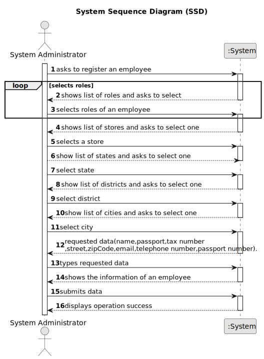

# US 03 - Register an employee

## 1. Requirements Engineering

### 1.1. User Story Description

As a system administrator, I want to register a new employee.

### 1.2. Customer Specifications and Clarifications

**From the specifications document:**

The company´s system administrator will be responsible for registering
all employees(specifiying the name, the citizen´s card number,the tax number,the adress,
the email adress, the contact telefone number and the agency to which it is assigned).

**From the client clarifications:**

> **Question:** When registering a new employee, all the required data (name, citizen's card number, etc...) have to be filled or exists not mandatory data?
>
> **Answer:** Required/Mandatory data that should be filled when registering an employee: name, the citizen's card number, the tax number, the email address, the contact telephone number and the agency to which it is assigned.

> **Question:** The system administrator cannot add an agent that already exists, the agent has two unique numbers that identify him (Tax number and Citizen's card number) which one should be used to identify the agent?
>
> **Answer:** The tax number.

> **Question:** Could you give an example of how the address should be written? How many alphanumeric characters should it have?
>
> **Answer:** "71 ST. NICHOLAS DRIVE, NORTH POLE, FAIRBANKS NORTH STAR, AK, 99705".\
> Street: 71 ST. NICHOLAS DRIVE;\
> City: NORTH POLE;\
> District: Fairbanks North Star (this is opcional); \
> State: AK;\
> Zipcode:99705;

> **Question:** Must the Tax number and Citizen's card number follow any convention? If so, which?
> 
> **Answer:** You should use the tax identification number used for tax purposes in the US.

> **Question:** How many digits does the contact telephone number for the employee need to have?
>
> **Answer:** An example phone number is (907) 488-6419

> **Question:** How many digits should we go forward for password length validation in your software? And please confirm required special characters, etc.
>
> **Answer:** The password should have seven characters in length including three capital letters and two digits and should be generated automatically

> **Question:**
When registering a new employee, should their email be their personal email or the company email?
If it is the company email, what should the email sufix be? For an example, the email address user@gmail.com has the sufix "gmail.com". Should we register an employee as user@company-name.com?
>
> **Answer:** The employee's email account is any email account provided by the employee.

>**Question:** When the System Administrator registers a new Employee, he should receive in his e-mail, the login ID and password. I wanted to know if we are supposed to actually send the credentials to the email, or if we have to approach this rhetorically and create for example a txt file with the information.
> 
>**Answer:** The credentials should be written to a local file named email.txt.

>**Question:** According to the statement, the administrator has to clarify the citizen's card number, but what card is it? In the US, there is no identification card, so is it referring to the passport?
>
>**Answer:** You are correct. The citizen card number should be replaced by the passport card number.

>**Question:** The administrator when registering a new employee will also have to specify the category/office that he will perfom (for example agent, store manager, store network manager)?
> 
>**Answer:** The administrator has to specify the role of the employee.

>**Question:** Can an employee be registered to more than one agency?
>
>**Answer:** No.

>**Question:**  To register an employee I need to allocate him with a branch. To register a branch I need an employee (to be local manger) but I can't create the employee because I have no branch and I can’t create the branch because I have no employee.
> 
>**Answer:** Thank you for identifying this issue. We already updated the project description. When a store is created in the system, the System Administrator should not set the Store Manager.
When registering a store, the System Administrator should introduce the following information: an ID, a designation/name, a location, a phone number and an e-mail address.

>**Question:** Does the System Administrator have permission to create, edit, delete, or just create new employee registrations?
>
>**Answer:**  For now, the System Administrator can only do what is specified in the Project Requirements.

>**Question:** Does the system administrator select the agency to which the employee is assigned and his role from a list? Or does he just type that data?
>
>**Answer:** The System Administrator should select.
 
>**Question:** Can an Agent work in more than 1 store (Multiple stores)?
>
>**Answer:** No.

>**Question:** Is the store manager also an agent ?
>
>**Answer:** No.

>**Question:** The network manager is the system admin ?
>
>**Answer:** No.  

>**Question:** There is only one manager for each store and only ONE system administrator ?
>
>**Answer:** Yes.

>**Question:** You have stated before that name, cc number, tax number, email address, phone number and the assigned agency of the employee are the mandatory requirements to register a new one, leaving out the employee's adress and role. This confused me, because it wasn't clear whether leaving out those two characteristics from the answer was intentional or not. Futhermore, the role of the employee seems like too much of an important piece of information to be left out. My request is, then, for you to state whether or not that was a conscious decision in your answer.
>
>**Answer:** The role is required.

>**Question:**  I have a question related to the output data: when the system administrator is registering a new employee are we free to display what we feel is important or should a specific message be shown? I was thinking of displaying whether the operation was successful or not, is that fine or should something else be displayed as well?
> 
>**Answer:** A good pratice is to show the information and ask for confirmation.

>**Question:**  It has been discussed previously that the passport number should be used as person identification, can we assume that everyone has one? If not can we use the social security number instead?
>
>**Answer:** You can assume that everyone has one.
 
>**Question:**Can a single employee have more than one role? This is, when a system administrator is registering an employee, can he/she select more than one role for that employee or is it limited to one role per employee?
> 
>**Answer:** An employee can have more than one role

### 1.3. Acceptance Criteria

* **AC1:** Required/Mandatory data that should be filled when registering an employee: name, the passport number, the tax number, the email address, the contact telephone number and the agency to which it is assigned and role.
* **AC2:** The tax identification number should be the one used for tax purposes in the US .
* **AC3:** The tax number should be used to identify an Employee.
* **AC4:** Everyone has a passport number.
* **AC5:** The password should have seven characters in length including three capital letters and two digits and should be generated automatically. 
* **AC6:** There is only one manager for each store and one administrator.
* **AC7:** An employee can´t be working in more than 1 store.
* **AC8:** The system administrator must select the role of the employee and the store assigned.
* **AC9** The employee's email account is any email account provided by the employee.
* **AC10** Employee can have more than one role.

### 1.4. Found out Dependencies

* There is a dependency to “US5 register a store” since the employee might be one working in one.
* There is a dependency to "US6 specify states districts and cities" since the employee and the store has an adress.

### 1.5 Input and Output Data

**Input Data:**

* Typed data:
    * a name,
    * a passport number,
    * a tax number,
    * an adress,
    * an email adress,
    * a telefone number,
    * a store,

**Output Data:**

* Registered a new employee
* (In)Success of the operation

### 1.6. System Sequence Diagram (SSD)

