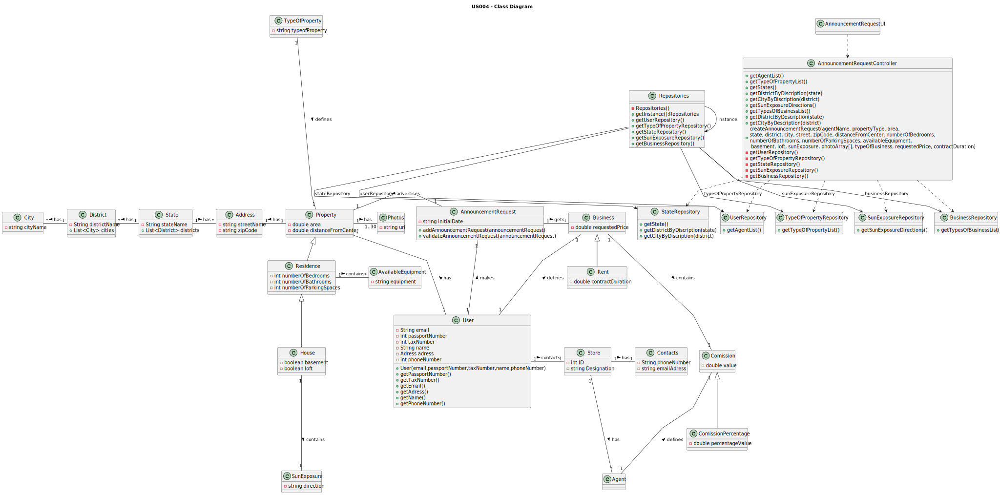

# US 04 - Submit a request for listing a property sale or rent

## 3. Design - User Story Realization 

### 3.1. Rationale

**SSD - Alternative 1 is adopted.**

| Interaction ID | Question: Which class is responsible for... | Answer               | Justification (with patterns)                                                                                 |
|:-------------  |:--------------------- |:---------------------|:--------------------------------------------------------------------------------------------------------------|
| Step 1  		 |	... interacting with the actor? | AnnouncementRequestUI         | Pure Fabrication: there is no reason to assign this responsibility to any existing class in the Domain Model. |
| 			  		 |	... coordinating the US? | AnnouncementRequestController | Controller                                                                                                    |
| 			  		 |	... instantiating a new Announcement? | User         | Creator (Rule 1): the user creates a new Announcement Request for their property.                                                         |
| 			  		 | ... knowing the user using the system?  | UserSession          | IE: cf. A&A component documentation.                                                                          |
|  		  		 |							 | repository         | IE: knows the UserRepository                                                                             |
| 			  		 | ...getting a list of possible agents?					 | UserRepository             | IE: a repository that manages Users should be responsible for the management of the Agents                                                                          |
| Step 2  		 | ...saving the inputted data?							 | AnnouncementRequestUI               |       Pure Fabrication                                                                                                        |
|   		 | 						 | repository               |       IE: knows the TypeOfPropertyRepository                                                                                                       |
|   		 |	......getting a list of types of properties? | TypeOfPropertyRepository                 | IE: a repository that manages Types of Properties should be responsible for the management of the Property types.                                                                |
| Step 3		  		 |   | repository          | IE: cf. A&A component documentation.                                                                          |
| 		  		 | ... obtaining the states list?  | StateRepository          | IE: knows the UserRepository                                                                          |
| 			  		 |							 | State             | IE: knows its own data (e.g. name)                                                                           |
| 		 |	...temporarily saving the inputted data? | AnnouncementRequestUI                 | Pure Fabrication                                                                |
|   		 |	 | StateRepository               | 	IE: has a list of districts for each state.                                                        |
|   		 |	 | District               | IE: knows its own data (e.g. name)                                                        |
| Step 4	 |	...temporarily saving the inputted data? | AnnouncementRequestUI                 | Pure Fabrication                                                   |
|  		 |			...knowing the property city?					 |             StateRepository         |         IE: has a list of cities for each district.                                                                                                    |              
|   		 |   | City                 | IE: knows its own data (e.g. name)                                                                                            |
| Step 5  		 |	| repository                 | IE: knows the SunExposureRepository                                                  |
| 	 |		...knowing the sun Exposure?					 |     SunExposureRepository                 |  IE: has a list of directions of the sun exposure.                                                                                                             |    
| Step 6  		 |	| repository                 | IE: knows the BusinessRepository                                                  |
| 	 |		...knowing the business list?					 |     BusinessRepository                 |  IE: has of type of business.                                                                                                             |           
| Step 7  		 |	... validating all data (local validation)? | AnnouncementRequest                 | IE: owns its data.                                                                                            | 
| 			  		 |	... saving the created Announcement? | AnnouncementRequest         | IE: owns all its requests.                                                                                       | 
| Step 8  		 |	... informing operation success?| AnnouncementRequestUI         | IE: is responsible for user interactions.                                                                     | 

### Systematization ##

According to the taken rationale, the conceptual classes promoted to software classes are: 

 * AnnouncementRequest

Other software classes (i.e. Pure Fabrication) identified: 

 * AnnouncementRequestUI  
 * AnnouncementRequestController

## 3.2. Sequence Diagram (SD)

### Alternative 1 - Full Diagram

This diagram shows the full sequence of interactions between the classes involved in the realization of this user story.

## 3.3. Class Diagram (CD)

