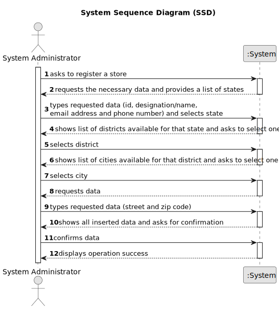

# US 005 - To register a store

## 1. Requirements Engineering

### 1.1. User Story Description

As a system administrator, I want to register a store.

### 1.2. Customer Specifications and Clarifications 

**From the specifications document:**

>	The company´s system administrator will be responsible for registering all (...) branches of the network (specifying the designation, the location, the email address and the contact telephone number).

**From the client clarifications:**

> **Question:** To register an employee I need to allocate him with a branch. To register a branch I need an employee (to be local manger) but I can't create the employee because I have no branch and I can’t create the branch because I have no employee. **Asked Friday, March 24 of 2023 at 09:47.**
>  
> **Answer:** Thank you for identifying this issue. We already updated the project description. When a store is created in the system, the System Administrator should not set the Store Manager. When registering a store, the System Administrator should introduce the following information: an ID, a designation/name, a location, a phone number and an e-mail address.

> **Question:** Could you please share how will the designation of new stores be made, is there a pattern perhaps? **Asked Thursday, March 23 of 2023 at 17:11**
>  
> **Answer:** There is no pattern. The System Administrator can introduce any designation/name. The designation/name should have at most forty characters.

> **Question:** Will the System Administrator be able to choose a location from a list of available locations (defined elsewhere in the application) or will he be able to submit any location he wants? **Asked Thursday, March 23 of 2023 at 17:11**
>  
> **Answer:** The System Administrator can submit any location.

> **Question:** Are the local managers restricted to their initial location or can they be re-registered/reassigned to other locations? **Asked Thursday, March 23 of 2023 at 17:11**
>  
> **Answer:** For now this is not a problem.

> **Question:** Does a store designation have to be detailed? If so, will the system administrator have to register the name, email, phone number or anything else? Does the location of a store have to be detailed as well? If yes, will the system administrator have to record the address, postcode or something else? To register the store manager, does the system administrator only register the manager's name? If not, will the system administrator have to register the manager as if he were an employee (except the agent he is assigned to)?  **Asked Thursday, March 23 of 2023 at 16:31**
>  
> **Answer:** When registering a store, the System Administrator should introduce the following information: an ID, a designation/name, a location, a local manager, a phone number and an e-mail address. The ID is an integer number. An example of the store location is: 71 ST. NICHOLAS DRIVE, NORTH POLE, FAIRBANKS NORTH STAR, AK, 99705. An example phone number is (907) 488-6419.

> **Question:** When a System Administrator (admin) makes a request to register a new employee or a new network branch (or any other alteration), does the System ask for the admin credentials (login, password)? **Asked Tuesday, March 21 of 2023 at 16:45**
>  
> **Answer:** The System Administrator should be logged in the application.

> **Question:** Lastly, can there be more than one admin? **Asked Tuesday, March 21 of 2023 at 16:45**
>  
> **Answer:** No.

### 1.3. Acceptance Criteria

* **AC1:** The System Administrator can introduce any designation/name,but it should have at most forty characters.
* **AC2:** The System Administrator can submit any location.
* **AC3:** The ID is an integer number. An example of the store location is: 71 ST. NICHOLAS DRIVE, NORTH POLE, FAIRBANKS NORTH STAR, AK, 99705. An example phone number is (907) 488-6419.
* **AC4:** There is just one System Administrator.
* **AC5:** All required fiels must be filled in.

### 1.4. Found out Dependencies

* There is a dependency to the US06 "As a system administrator, I want to specify states, districts and cities in the system." since the location is specified in this US and US07 "As an unregistered user, I want to register in the system to buy, sell or rent properties." since the System Administrator should be registered in the app.

### 1.5 Input and Output Data

**Input Data:**

* Typed data:
	* an id, 
	* a designation/name, 
	* a street,
	* a zip code,
	* an email address,
	* a phone number

* Selected data:
	* a state, 
	* a district, 
	* a city

**Output Data:**

* Registration of the store
* (In)Success of the operation

### 1.6. System Sequence Diagram (SSD)

### 1.7 Other Relevant Remarks
