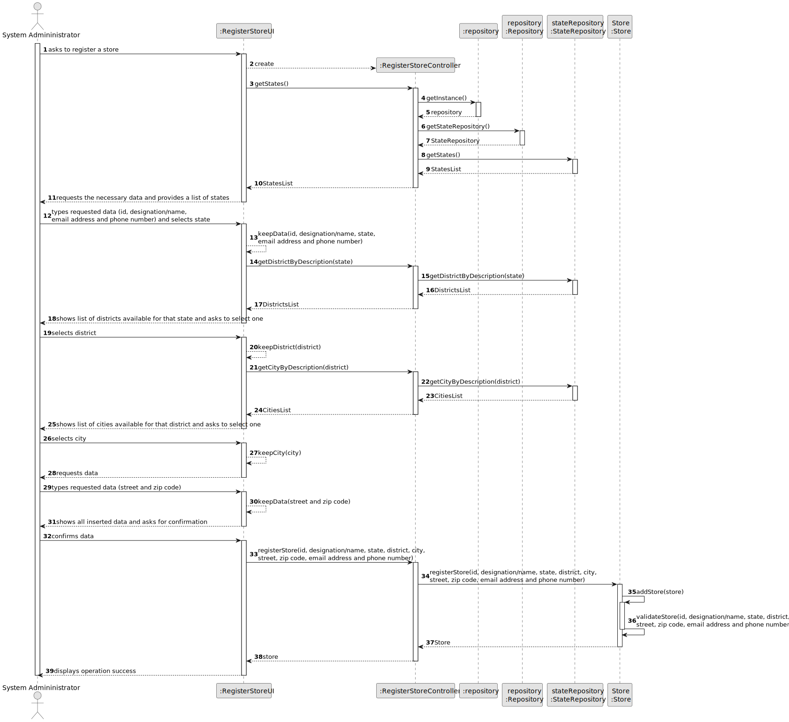

# US 005 - Register a store

## 3. Design - User Story Realization 

### 3.1. Rationale

**SSD - Alternative 1 is adopted.**

| Interaction ID | Question: Which class is responsible for... | Answer               | Justification (with patterns)                                                                                 |
|:-------------  |:--------------------- |:---------------------|:--------------------------------------------------------------------------------------------------------------|
| Step 1 		 |	... interacting with the actor? | RegisterStoreUI         | Pure Fabrication: there is no reason to assign this responsibility to any existing class in the Domain Model. |
| 			  		 |	... coordinating the US? | RegisterStoreController | Controller                                                                                                    |
| 			  		 |	... instantiating a new Store? | SystemAdministrator         | Creator (Rule 1): in the DM Store is created by the Admin.                                                          |
| 			  		 |							 | repository         | IE: knows the StateRepository                                                                             |
| 			  		 | ... obtaining the states list?  | StateRepository          | IE: cf. A&A component documentation.                                                                          |
| 			  		 |							 | State             | IE: knows its own data (e.g. name)                                                                           |
| Step 2		 |	...temporarily saving the inputted data? | RegisterStoreUI                 | Pure Fabrication                                                                |
|   		 |	 | StateRepository               | 	IE: has a list of districts for each state.                                                        |
|   		 |	 | District               | IE: knows its own data (e.g. name)                                                        |
| Step 3	 |	...temporarily saving the inputted data? | RegisterStoreUI                 | Pure Fabrication                                                   |
|  		 |			...knowing the store city?					 |             StateRepository         |         IE: has a list of cities for each district.                                                                                                    |              
|   		 |   | City                 | IE: knows its own data (e.g. name)                                                                                            | 
| Step 4			  		 |	... validating all data? | Store         | IE: store validates the necessary data.                                                                       | 
| Step 5 			  		 |	... saving the registered store?| repository         | E: repository is responsible for storing and retrieving data.                                                                                      | 
| Step 6  		 |	... informing operation success?| RegisterStoreUI         | IE: UI is responsible for showing messages to the user.                                                                    | 

### Systematization ##

According to the taken rationale, the conceptual classes promoted to software classes are: 

 * Store

Other software classes (i.e. Pure Fabrication) identified: 

 * RegisterStoreUI  
 * RegisterStoreController

## 3.2. Sequence Diagram (SD)

### Alternative 1 - Full Diagram

This diagram shows the full sequence of interactions between the classes involved in the realization of this user story.

## 3.3. Class Diagram (CD)

