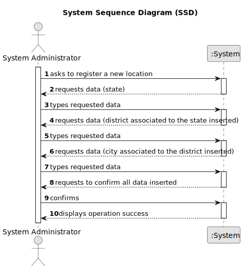

# US 006 - To specify states, districts and cities in the system

## 1. Requirements Engineering

### 1.1. User Story Description

As a system administrator, I want to specify states, districts and cities in the system.

### 1.2. Customer Specifications and Clarifications 

**From the specifications document:**

>	N/A.

**From the client clarifications:**

> **Note:** The addresses/locations that will be registered in our system do not include municipalities and parishes. Therefore, we rewrote US6. Please check the pdf file, available in moodle, that introduces the requirements for sprints A and B. Municipalities and parishes could be replaced by states and cities. **Thursday, March 30 of 2023 at 16:16**

> **Question:** As System Administrator, who wants to specify districts, municipalities and parishes, what specifically he wants to do? Create new locations? Control existent locations? **Asked Wednesday, March 22 of 2023 at 11:06**
> 
> **Answer:** The System Administrator wants to specify information in the system that can be used/selected to introduce the location. Remember that this is an extra US.

> **Question:** In user story 006, it says "As a system administrator, I want to specify districts, municipalities, and parishes in the system." What is the purpose of this function, how does the system administrator intend to use the ability to specify different locations? **Asked Thursday, March 23 of 2023 at 11:54**
>  
> **Answer:** The goal is to specify in the system information that can be used/selected to fill the location of the property. An example of the store location is: 71 ST. NICHOLAS DRIVE, NORTH POLE, FAIRBANKS NORTH STAR, AK, 99705. For instance, if the information about the existing US states is specified in the system, then the user only selects AK and does not need to write this information.

### 1.3. Acceptance Criteria

* **AC1:** All required fiels must be filled in.
* **AC2:** The district must be part of the state.
* **AC3:** The city must be a part of the district.
* **AC4:** The state, district and city cant already exist in the system.

### 1.4. Found out Dependencies

* There are no dependecies to other USs.

### 1.5 Input and Output Data

**Input Data:**

* Typed data:
	* a state, 
	* a district,
	* a city

**Output Data:**

* (In)Success of the operation

### 1.6. System Sequence Diagram (SSD)

### 1.7 Other Relevant Remarks
