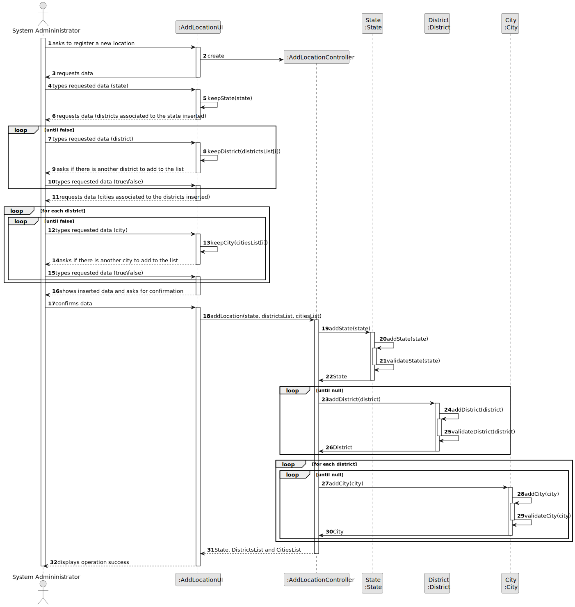

# US 006 - Specify states, districts and cities in the system

## 3. Design - User Story Realization 

### 3.1. Rationale

**SSD - Alternative 1 is adopted.**

| Interaction ID | Question: Which class is responsible for... | Answer               | Justification (with patterns)                                                                                 |
|:-------------  |:--------------------- |:---------------------|:--------------------------------------------------------------------------------------------------------------|
| Step 1  		 |	... interacting with the actor? | AddLocationUI         | Pure Fabrication: there is no reason to assign this responsibility to any existing class in the Domain Model. |
| 			  		 |	... coordinating the US? | AddLocationController | Controller                                                                                                    |
| 			  		 |	... instantiating a new Task? | SystemAdministrator         | Creator (Rule 1): in the DM Organization has a Task.                                                          |
| 			  		 |  ...temporarily saving the inputted data?  | AddLocationUI          | Pure Fabrication                                                                          |
| 			  		 |							 | State             | IE: knows its own data (e.g. stateName)                                                                           |
| Step 2  		 ...temporarily saving the inputted data?  | AddLocationUI          | Pure Fabrication                                                                          |
| 			  		 |							 | District             | IE: knows its own data (e.g. districtName)                                                                           |
| Step 3  		 ...temporarily saving the inputted data?  | AddLocationUI          | Pure Fabrication                                                                          |
| 			  		 |							 | City             | IE: knows its own data (e.g. cityName)                                                                           |           
| Step 7  		 |	... validating all data (local validation)? | State                 | IE: owns its data.                                                                                            | 
| 			  		 |	... saving the state? | State         | IE: knows all its states.                                                                                      | 
|   		 |	... validating all data (local validation)? | District                 | IE: owns its data.                                                                                            | 
| 			  		 |	... saving the districts? | District         | IE: knows all its districts.                                                                                      |
|   		 |	... validating all data (local validation)? | City                 | IE: owns its data.                                                                                            | 
| 			  		 |	... saving the cities? | City         | IE: knows all its cities.                                                                                      |   

### Systematization ##

According to the taken rationale, the conceptual classes promoted to software classes are: 

 * State
 * District
 * City

Other software classes (i.e. Pure Fabrication) identified: 

 * AddLocationUI  
 * AddLocationController

## 3.2. Sequence Diagram (SD)

### Alternative 1 - Full Diagram

This diagram shows the full sequence of interactions between the classes involved in the realization of this user story.

## 3.3. Class Diagram (CD)

