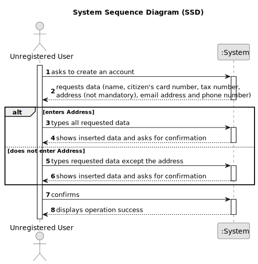

# US 007 - Register in the system to buy, sell or rent properties

## 1. Requirements Engineering

### 1.1. User Story Description

As an unregistered user, I want to register in the system to buy, sell or rent properties.

### 1.2. Customer Specifications and Clarifications 

**From the specifications document:**

>	All those who wish to use the application must be authenticated with a password of seven alphanumeric characters, including three capital letters and two digits.

**From the client clarifications:**

> **Date:** Wednesday, April 12 of 2023
>
> **Asked at:** 10:17
>
> **Question:** Does the user also receive the password via email or can he choose a password when registering?
>  
> **Answer:** The owner can choose a password when registering.

>
> **Asked at:** 11:19
>
> **Question:** When an unregistered user wants to register a new account in the system, the set of parameters that are asked are the following: name, citizen card number, tax number, email, phone number, and password. Do you want any extra parameters/requirements to be asked or just the ones specified above? If so, which ones are mandatory?
>  
> **Answer:** The Owner attributes are: the name, the citizen's card number, the tax number, the address, the email address and the contact telephone number. The address of the owner is not mandatory.

> **Date:** Friday, April 14 of 2023
>
> **Asked at:** 19:13
>
> **Question:** It was previously stated that an unregistered user could do a property listing request. However, with the introduction of US007, I want to clarify and make sure that now a user needs to be registered in order to buy, sell or rent properties, or if they can still do it unregistered. 
>  
> **Answer:** In Sprint B we introduce US7 and now, in US4, the owner needs to be registered in the system to submit a request for listing. You should update all artifacts to include this change.

> **Date:** Monday, April 17 of 2023
>
> **Asked at:** 10:52
>
> **Question:** According to the the statement, the administrator has to clarify the citizen's card number, but what card is it? In the US, there is no identification card, so is it referring to the passport? 
>  
> **Answer:** You are correct. The citizen card number should be replaced by the passport card number.

> **Date:** Tuesday, April 18 of 2023
>
> **Asked at:** 18:14
>
> **Question:** When registering a user, should the application ask if they are registering as a client or an Owner? 
>  
> **Answer:** No. When registering a user, in US7, we are registering a user that can buy, sell or rent properties. After registering, when this user logins in the system, the user should have access to both owner and client functionalities.

> **Date:** Wednesday, April 19 of 2023
>
> **Asked at:** 11:54
>
> **Question:** In a question earlier you presented the owner attributes. Does the client have different attributes? 
>  
> **Answer:** A owner is also a client of the Real Estate USA company. The attributes are the same. This distinction between owner and client intends to make an association with the type of business. The Owner sells and provides properties for renting and the client buys and rents properties. Again, when the user (registered in US7) logins in the system, the user should have access to both owner and client functionalities.

> **Date:** Thursday, April 20 of 2023
>
> **Asked at:** 08:45
>
> **Question:** When a user registers in the system, does it need to specify for which transactional activities or all registered users can buy sell and rent?
>  
> **Answer:** All registered users can buy sell and rent.
>
> **Question:** After the users fills all the required information, is the user automatically registered in the system, or is there any other role that will review and approve the user registration?
>  
> **Answer:** The system should automatically validate the registration.
>
> **Asked at:** 11:50
>
> **Question:** When a user starts a registration, does the application need to validate if the data is valid (for example: blank text box, email without @, etc)?
>  
> **Answer:** Data validation is always a good practice.

### 1.3. Acceptance Criteria

* **AC1:** The owner can choose a password when registering.
* **AC2:** The address of the owner is not mandatory.
* **AC2:** The password should be composed of seven alphanumeric characters, including three capital letters and two digits.

### 1.4. Found out Dependencies

* There are no dependencies to other US.

### 1.5 Input and Output Data

**Input Data:**

* Typed data:
	* a username,
	* a password,
	* a name,
	* a passport card number,
	* a tax number,
	* an address,
	* an email address,
	* a phone number

**Output Data:**

* Registration of the user
* (In)Success of the operation

### 1.6. System Sequence Diagram (SSD)

