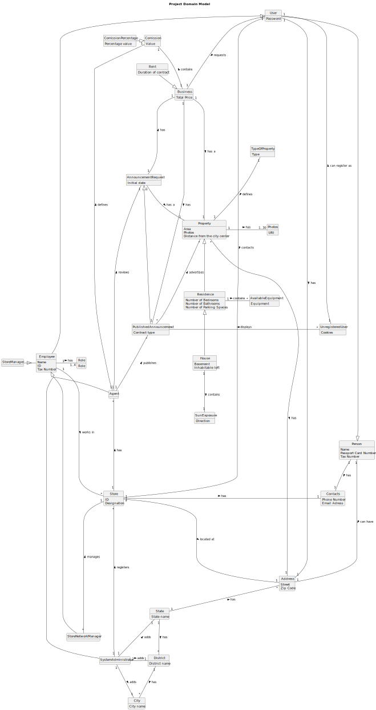

# Analysis

The construction process of the domain model is based on the client specifications, especially the nouns (for _concepts_) and verbs (for _relations_) used. 

## Rationale to identify domain conceptual classes ##
To identify domain conceptual classes, start by making a list of candidate conceptual classes inspired by the list of categories suggested in the book "Applying UML and Patterns: An Introduction to Object-Oriented Analysis and Design and Iterative Development". 

### _Conceptual Class Category List_ ###

**Business Transactions**

* Business
* Rent
* Comission
* Announcement

---

**Transaction Line Itemss**

* Property
* Business
* Comission

---

**Product/Service related to a Transaction or Transaction Line Item**

* Property
* Announcement

---

**Transaction Records**

*  

---  

**Roles of People or Organizations**

* Agent
* Employee
* StoreManager
* StoreNetworkManager
* System Administrator
* Owner
* Unregistered User

---

**Places**

* Location
* Store
* Residences
* Property
* House

---

**Noteworthy Events**

* Rent
* Business

---

**Physical Objects**

* House
* Residence
* Store
* Property

---

**Descriptions of Things**

*  Sun Exposure
* AvailableEquipment
* Address

---

**Catalogs**

*  

---

**Containers**

*  Employee
*  Residence

---

**Elements of Containers**

* 

---

**Organizations**

*  Real Estate USA (Company)

---

**Other External/Collaborating Systems**

*  

---

**Records of finance, work, contracts, legal matters**

* 

---

**Financial Instruments**

*  Comission

---

**Documents mentioned/used to perform some work/**

* Contacts
---

###**Rationale to identify associations between conceptual classes**###

An association is a relationship between instances of objects that indicates a relevant connection and that is worth of remembering, or it is derivable from the List of Common Associations: 

+ **_A_** is physically or logically part of **_B_**
+ **_A_** is physically or logically contained in/on **_B_**
+ **_A_** is a description for **_B_**
+ **_A_** known/logged/recorded/reported/captured in **_B_**
+ **_A_** uses or manages or owns **_B_**
+ **_A_** is related with a transaction (item) of **_B_**
+ etc.

| **_Concept (A)_**   | **_Association_** | **_Concept (B)_** |                                       
|:--------------------|:------------------|------------------:|
| Agent               | reviews           | AnnouncementRequest |
| Agent               | defines           | Comission         |
| Agent               | is a              | Employee          |
| Agent               | publishes         | PublishedAnnouncement |
| AnnouncementRequest | has               | Business          |
| AnnouncementRequest | has a             | Property          |
| Business            | contains          | Comission         |
| Business            | has a             | PublishedAnnouncement |
| ComissionPercentage | is a              | Comission         |
| District            | has               | City              |
| Employee            | has               | Role              |
| Employee            | works in          | Store             |
| Employee            | is a              | User              |
| House               | is a              | Residence         |
| House               | contains          | SunExposure       |
| Person              | can have          | Address           |
| Person              | has               | Contacts          |
| Property            | has               | Address           |
| Property            | has               | Photos            |
| PublishAnnouncement | advertises        | AnnouncementRequest |
| PublishAnnouncement | is a              | AnnouncementRequest |
| Rent                | is a              | Business          |
| Residence           | contains          | AvailableEquipment |
| Residence           | is a              | Property          |
| State               | has               | Address           |
| State               | has               | District          |
| Store               | located at        | Address           |
| Store               | has               | Agent             |
| Store               | has               | Contacts          |
| StoreManager        | is a              | Employee          |
| StoreNetworkManager | is a              | Employee          |
| StoreNetworkManager | manages           | Store             | 
| SystemAdministrator | adds              | City              |  
| SystemAdministrator | adds              | District          |      
| SystemAdministrator | is a              | Employee          |
| SystemAdministrator | adds              | State             |
| SystemAdministrator | registers         | Store             |
| TypeOfProperty      | defines           | Property          |  
| User                | requests          | Business          |
| User                | is a              | Person            |
| User                | has               | Property          |
| User                | contacts          | Store             |
| UnregisteredUser    | can register as   | User              |
| UnregisteredUser    | displays          | PublishedAnnouncement |
|                     |                   |                   |         

## Domain Model

**Do NOT forget to identify concepts atributes too.**

**Insert below the Domain Model Diagram in a SVG format**

