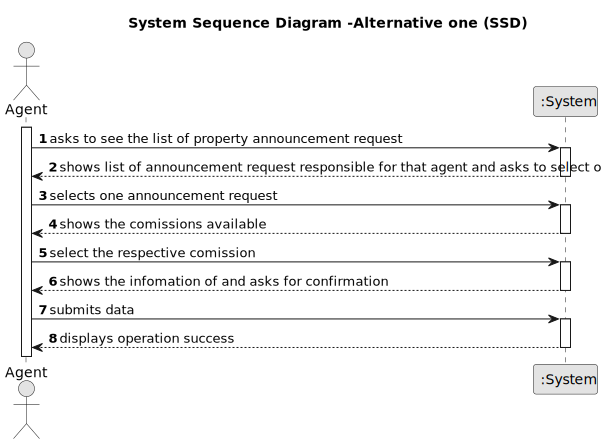

# US 008 - See the list of property announcement requests 

## 1. Requirements Engineering

### 1.1. User Story Description

As an agent, I intend to see the list of property announcement requests made to myself, so that i can post the announcement

### 1.2. Customer Specifications and Clarifications 

**From the specifications document:**

>	The real estate agent reviews advertisement requests, registers the information in the system and
publishes the offer so that it is visible to all clients who visit the agency and use the application

**From the client clarifications:**

> **Question:**  When displaying the property announcement requests in the system to the agent besides them being ordered from most recent to oldest is there a need to display the specific day where the requests were published?
>
> **Answer:** The list of property announcement requests should be sorted by the date they were created, with the most recent requests appearing first. The system should show the date when the property announcement requests was made.
> 
> **Date:** Thursday, 4 de May de 2023 às 09:39

> **Question:** Can the agent select multiple requests at the same time?
>  
> **Answer:** No. The agent can only post one announcement at a time.
> 
> **Date:** Thursday, 4 de May de 2023 às 10:59

> **Question:**  Regarding US008, can the agent decline an announcement request?
> 
> **Answer:** Yes. The agent must include a message justifying the rejection.
> 
> **Date:** Tuesday, 9 de May de 2023 às 16:22

> **Question:** : Is the owner responsible to assigning the property to an agent or there are other ways to do that?
>
> **Answer:** In US8 we get "As an agent, I intend to see the list of property announcement requests made to myself, so that I can post the announcement". In this US the agent is the actor.
>
> **Date:** Tuesday, 16 de May de 2023 às 17:56

> **Question:** Does the customer have any say in setting the commission (agree or deny, eg: commission too high so I withdraw the ad request) or is the commission solely set by the agent without customer approval?
>
> **Answer:** The agent should, firstly, set the commission and then publishes the offer in the system. The sale price (the USD value that is shown in the announcement) should include the commission value (owner requested price + commission) and should not show the commission. The commission is only specified when the agent accepts the request.
>
> **Date:** Friday, 19 de May de 2023 às 21:49

> **Question:** Do the agent have to insert the commission after accepting the request from the request list?
> 
> **Answer:** The agent should, firstly, set the commission and then publishes the offer in the system. The sale price (the USD value that is shown in the announcement) should include the commission value (owner requested price + commission) and should not show the commission. The commission is only specified when the agent accepts the request.
>
> **Date:** Friday, 19 de May de 2023 às 22:16

> **Question:** Does the request once its declined by the agent be deleted from the request list?
>
> **Answer:** The announce request should not be shown again to the agent. We never delete information from our system.
>
> **Date:** Friday, 19 de May de 2023 às 22:21

> **Question:** besides the creation of a message justifiyng the rejection should a message or an email be sent to the client.
>
> **Answer:** The system should also send the message to the owner by e-mail.
>
> **Date:** Friday, 19 de May de 2023 às 22:29

> **Question:** About US08, since as an agent I intend to see the advertisement requests made to me in order to publish the chosen advertisement after consulting the list, why should there be an option to reject it since the previously chosen advertisement had already the intention of being published.The rejection operation shouldn't be described as another feature?
>
> **Answer:** I want to check all property announcement requests and have the option to accept or reject any announcement request. The property owner is a human being and can make errors like any other human being...
>
> **Date:** Friday, 19 de May de 2023 às 22:37

### 1.3. Acceptance Criteria

* **AC1:** The list of property announcement requests should be sorted by the date they were created, with the most recent requests appearing first.
* **AC2:** An announcement is posted when a request is accepted. The list of requests should be refreshed, and that request should not be shown again.
* **AC3:** The agent should, firstly, set the commission and then publishes the offer in the system.
* **AC4:** An agent can decline an announcement request.
* **AC4:** Once the offer its declined the announcement request should not be shown again to the agent.
* **AC5:** The system should also send the message to the owner by e-mail.
* **AC6:** The agent can only post one announcement at a time.

### 1.4. Found out Dependencies

* There is a dependency to "US004 Submit a request for listing a property sale or rent" since the announcement request should  previously be already on created.
* There is a dependency to "US006 Specify states, districts and cities in the system" since a property has an adress.
* There is a dependency to "US002 Publish any sale announcement on the system"

### 1.5 Input and Output Data

**Input Data:**

* Typed data:
	* a comission
    * a message justification
	
* Selected data:
	* Classifying task category 

**Output Data:**

* List of existing Announcement Requests
* List of existing Comissions
* (In)Success of the operation

### 1.6. System Sequence Diagram (SSD)

**Other alternatives might exist.**

#### Full

#### Alternative One

#### Alternative One

