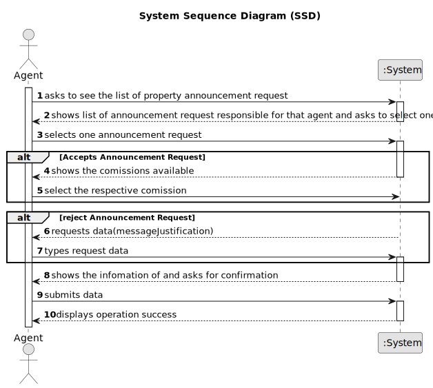

# US 008 - See the list of property announcement requests 

## 1. Requirements Engineering

### 1.1. User Story Description

As an agent, I intend to see the list of property announcement requests made to myself, so that i can post the announcement

### 1.2. Customer Specifications and Clarifications 

**From the specifications document:**

>	The real estate agent reviews advertisement requests, registers the information in the system and
publishes the offer so that it is visible to all clients who visit the agency and use the application

**From the client clarifications:**

> **Question:** When displaying the property announcement requests in the system to the agent besides them being ordered from most recent to oldest is there a need to display the specific day where the requests were published?
>
> **Answer:** Monetary data (e.g. estimated cost of a task) is indicated in POTs (virtual currency internal to the platform).
> 
> **Date:** Thursday, 4 de May de 2023 às 09:39

> **Question:** Can the agent select multiple requests at the same time?
>  
> **Answer:** Duration is estimated in days.
> 
> **Date:** Thursday, 4 de May de 2023 às 10:59

### 1.3. Acceptance Criteria

* **AC1:** The list of property announcement requests should be sorted by the date they were created, with the most recent requests appearing first.
* **AC2:** An announcement is posted when a request is accepted. The list of requests should be refreshed, and that request should not be shown again.

### 1.4. Found out Dependencies

* There is a dependency to "US004 Submit a request for listing a property sale or rent" since the announcement request should  previously be already on created.
* There is a dependency to "US006 Specify states, districts and cities in the system" since a property has an adress.
* There is a dependency to "US002 Publish any sale announcement on the system"

### 1.5 Input and Output Data

**Input Data:**

* Typed data:
	* a comission
	
* Selected data:
	* Classifying task category 

**Output Data:**

* List of existing Announcement Requests
* List of existing Comissions
* (In)Success of the operation

### 1.6. System Sequence Diagram (SSD)

**Other alternatives might exist.**

#### Alternative One

### 1.7 Other Relevant Remarks

* The created task stays in a "not published" state in order to distinguish from "published" tasks.