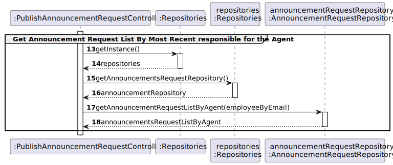
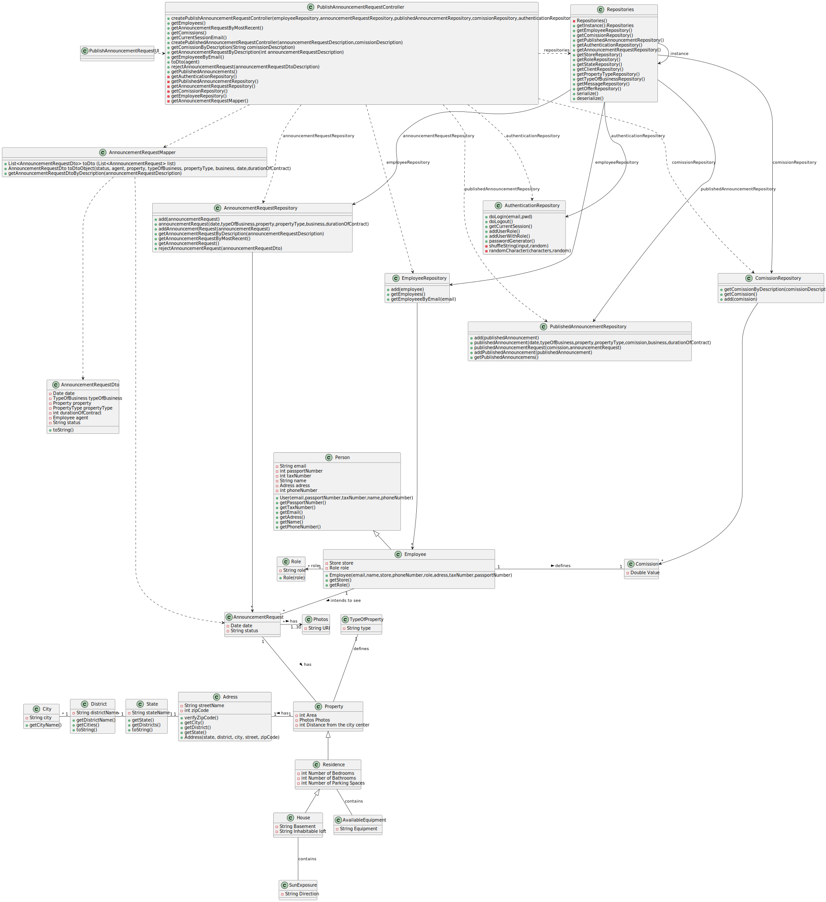

# US 006 - To create a Task 

## 3. Design - User Story Realization 

### 3.1. Rationale

**SSD - Alternative 1 is adopted.**

| Interaction ID                                                                                 | Question: Which class is responsible for...                                                        | Answer                               | Justification (with patterns)                                                                                 |
|:-----------------------------------------------------------------------------------------------|:---------------------------------------------------------------------------------------------------|:-------------------------------------|:--------------------------------------------------------------------------------------------------------------|
| Step 1(asks to see the list of property announcement request)                                  | ... interacting with the actor?                                                                    | PublishAnnouncementRequestUI         | Pure Fabrication: there is no reason to assign this responsibility to any existing class in the Domain Model. |
|                                                                                                | ... coordinating the US?                                                                           | PublishAnnouncementRequestController | Controller                                                                                                    |
|                                                                                                | ...knowing and obtaining the email of the agent responsible for that announcement request?         | User session                         | IE: knows/has the users on the system                                                                         |
|                                                                                                | ...obtaining the employee by email?                                                                | EmployeeRepository                   | IE:knows/has the employees                                                                                    |
|                                                                                                | ...obtaining the announcement request list?                                                        | AnnouncementRequestRepository        | IE: knows/has its own AnnouncementRequests,Pure Fabrication                                                   |
|                                                                                                | ...obtaining the announcement request Dto list                                                     | AnnouncementRequestMapper            | IE:Kowns/has its own AnnouncementRequestDto,Pure Fabrication,High coesion Low Coupling                        |
|                                                                                                | ...obtaining the announcement request list?                                                        | AnnouncementRequestRepository        | IE: knows/has its own Employees,Pure Fabrication                                                              |
| Step 2: (shows list of announcement request responsible for that agent and asks to select one) | ...displaying the list of announcements?                                                           | PublishAnnouncementRequestUI         | Pure Fabrication                                                                                              |
|                                                                                                | ...obtaining the comission list?                                                                   | ComissionRepository                  | Information Expert,Pure Fabrication                                                                           |
| Step 3: (selects the announcement request)                                                     | ...validating selected data?  ...temporarily keeping the announcement request description? | PublishAnnouncementRequestUI         | Pure Fabrication                                                                                              |
| Step 4: (shows the information of the announcement request selected and asks for confirmation) | ...display all the information before submitting?                                                  | PublishAnnouncementRequestUI         | Pure Fabrication                                                                                              |
| Step 5: (submits data)                                                                         | ...obtaining and creating the announcement request Dto by description                              | AnnouncementRequestMapper            | IE,Creator                                                                                                    |
|                                                                                                | ...obtaining and creating the comission by description                                             | ComissionRepository                  | IE,Creator                                                                                                    |
|                                                                                                | ...creating the publish announcement                                                               | PublishAnnouncementRepository        | IE,Creator                                                                                                    |
|                                                                                                | ...validating the data locally(mandatory data)?                                                    | PublishAnnouncement                  | IE                                                                                                            |
|                                                                                                | ...adding to a collection and globally validating duplicated records                       | PublishAnnouncementRepository        | IE                                                                                                            |
| Step 6: (shows opperation success)                                                             | ...informing operation success?                                                                    | PublishAnnouncementRequestUI         | Pure Fabrication                                                                                              |

### Systematization ##

According to the taken rationale, the conceptual classes promoted to software classes are: 

 * PublishAnnouncement

Other software classes (i.e. Pure Fabrication) identified: 

 * PublishAnnouncementRequestUI
 * PublishAnnouncementRequestController
 * AnnouncementRequestMapper

## 3.2. Sequence Diagram (SD)

### Alternative 1 - Full Diagram

This diagram shows the full sequence of interactions between the classes involved in the realization of this user story.

### Alternative 2 - Split Diagram

This diagram shows the same sequence of interactions between the classes involved in the realization of this user story, but it is split in partial diagrams to better illustrate the interactions between the classes.

It uses interaction ocurrence.

**Get Comission Partial SD**

**Create Published Announcement Partial SD**

**Get Announcement Request Partial SD**

**Get Announcement Request List By Most Recent Partial SD**

**Get Announcement Request Dto List Patial SD**

**Get Comission List Partial SD**

**Get Employee By Email Partial SD**

## 3.3. Class Diagram (CD)

