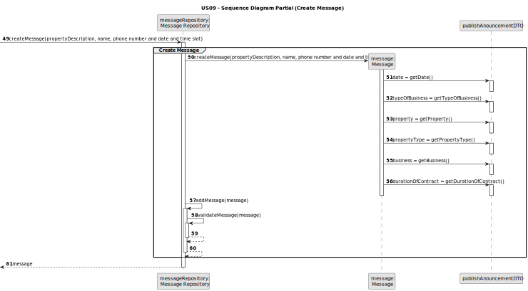

# US 09 - As a client, I want to leave a message to the agent to schedule a visit to a property of my interest.

## 3. Design - User Story Realization 

### 3.1. Rationale

| **_Interaction ID_**                                                                                                      | **_Which class is responsible for..._**                         | **_Answer_**                    | **_Justification_**                                                                                                                           |                                   
|:--------------------------------------------------------------------------------------------------------------------------|:----------------------------------------------------------------|:--------------------------------|-----------------------------------------------------------------------------------------------------------------------------------------------|
| Step 1: asks to schedule a visit                                                                                          | ... interacting with the actor?                                 | SendMessageUI                   | Pure Fabrication: there is no reason to assign this responsibility to any existing class in the Domain Model. It is a user interface concern. |
|                                                                                                                           | ... coordinating the US?                                        | SendMessageController           | Controller                                                                                                                                    | 
|                                                                                                                           | ... UI-related class being instantiated?                        | SendMessageUI                   | Pure Fabrication                                                                                                                              |
| Step 2: shows a list of properties sorted from the most recent entries to the oldest                                      | ... obtaining the list of properties?                           | PublishedAnnouncementRepository | IE: knows all it's data , Pure Fabrication                                                                                                    |
| Step 3: selects a property of his interest                                                                                | ... validating the input data?                                  | SendMessageUI                   | Pure Fabrication                                                                                                                              |
|                                                                                                                           | ... saving input data?                                          | MessageRepository               | Creator: MessageRepository records instances of the Published Announcement, and records them.                                                 |
| Step 4: requests the name, phone number and preferred \ndate and time slot (from x hour to y hour) for the property visit | ... displaying the UI for the client to input data?             | SendMessageUI                   | Pure Fabrication                                                                                                                              |
|                                                                                                                           | ... validating the input data?                                  | SendMessageUI                   | Pure Fabrication                                                                                                                              |
| Step 5: submits the requested data                                                                                        | ... saving input data?                                          | MessageRepository               | Creator                                                                                                                                       |
| Step 6: asks to confirm the submitted data                                                                                | ... displaying the message details and requesting confirmation? | SendMessageUI                   | Pure Fabrication                                                                                                                              |
| Step 7: confirms the submitted data                                                                                       | ... creating the message Object?                                | Message                         | Creator: the object create has its own data.                                                                                                  |
|                                                                                                                           | ... validating the input data?                                  | SendMessageUI                   | Pure Fabrication                                                                                                                              |
| Step 8: registers the information and shows a success message                                                             | ... displaying operation success?                               | SendMessageUI                   | Pure Fabrication                                                                                                                              |

#### Systematization

The conceptual classes developed to software classes are, matching with the adopted rationale:
* Message

Other software classes identified:
* MessageUI
* PublishedAnnouncementRepository
* UserRepository
* MessageRepository

### 3.2. Sequence Diagram (SD)

#### Full Diagram
This diagram displays the entire series of interactions between the classes involved in the realization of this user story.

#### Split Diagram

This diagram, which is divided into smaller diagrams to better describe the interactions between the classes, displays the same series of interactions between the classes involved in the realization of this user story.

##### Get Properties

##### Create Message

### 3.3. Class Diagram (CD)

