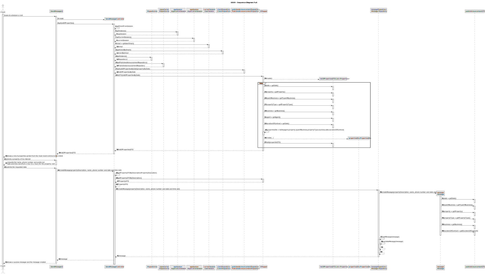
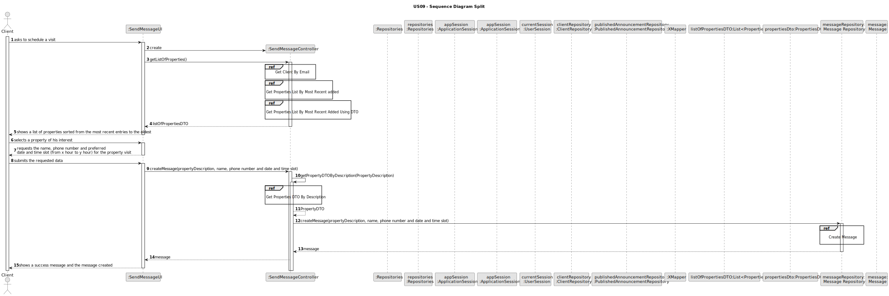
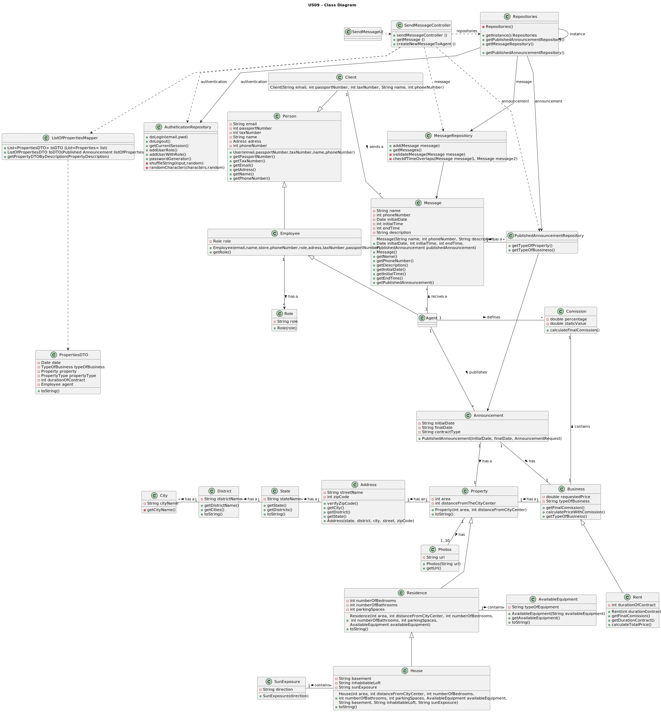

# US 09 - As a client, I want to leave a message to the agent to schedule a visit to a property of my interest.

## 3. Design - User Story Realization 

### 3.1. Rationale

| **_Interaction ID_**                                                                                                                                            | **_Which class is responsible for..._**                          | **_Answer_**              | **_Justification_**                                                                                                                                                             |                                   
|:----------------------------------------------------------------------------------------------------------------------------------------------------------------|:-----------------------------------------------------------------|:--------------------------|---------------------------------------------------------------------------------------------------------------------------------------------------------------------------------|
| Step 1: asks to publish an announcement                                                                                                                         | ... interacting with the actor?                                  | PublishUI                 | Pure Fabrication: there is no reason to assign this responsibility to any existing class in the Domain Model. It is a user interface concern.                                   |
|                                                                                                                                                                 | ... coordinating the US?                                         | PublishController         | Controller                                                                                                                                                                      | 
|                                                                                                                                                                 | ... UI-related class being instantiated?                         | PublishUI                 | Pure Fabrication: there is no reason to assign this responsibility to any existing class in the Domain Model. It is a user interface concern.                                   |
| Step 2: requests User identity                                                                                                                                  | ... displaying the UI for the agent to input data?               | PublishUI                 | Pure Fabrication: there is no reason to assign this responsibility to any existing class in the Domain Model. It is a user interface concern.                                   |
| Step 3: inserts the User email                                                                                                                                  | ... validating the input data?                                   | PublishUI                 | Pure Fabrication: there is no reason to assign this responsibility to any existing class in the Domain Model. It is a user interface concern.                                   |
|                                                                                                                                                                 | ... obtaining the owner identity?                                | UserIdentityRepository    | IE: the UserIdentityRepository interacts with the user interface to obtain the owner identity , Pure Fabrication: there is no corresponding domain object in the domain model.  |
| Step 4: shows User information                                                                                                                                  | ... displaying the owner identification?                         | PublishUI                 | Pure Fabrication: there is no reason to assign this responsibility to any existing class in the Domain Model. It is a user interface concern.                                   |
| Step 5: confirms User identity                                                                                                                                  | ... validating the confirmation?                                 | PublishUI                 | Pure Fabrication: there is no reason to assign this responsibility to any existing class in the Domain Model. It is a user interface concern.                                   |
| Step 6: list and request the property type                                                                                                                      | ... obtaining the property types?                                | PropertyTypesRepository   | IE: the PropertyTypesRepository interacts with the user interface to obtain the property types , Pure Fabrication: there is no corresponding domain object in the domain model. |
| Step 7: chooses the property type                                                                                                                               | ... validating the input data?                                   | PublishUI                 | Pure Fabrication: there is no reason to assign this responsibility to any existing class in the Domain Model. It is a user interface concern.                                   |
|                                                                                                                                                                 | ... saving input data?                                           | PublishUI                 | Pure Fabrication: there is no reason to assign this responsibility to any existing class in the Domain Model. It is a user interface concern.                                   |
| Step 8: requests property data                                                                                                                                  | ... displaying the UI for the agent to input data?               | PublishUI                 | Pure Fabrication: there is no reason to assign this responsibility to any existing class in the Domain Model. It is a user interface concern.                                   |
| Step 9: types requested data (area in m^2, state, district, city, street, zip code and distance from city center)                                               | ... validating the input data?                                   | PublishUI                 | Pure Fabrication: there is no reason to assign this responsibility to any existing class in the Domain Model. It is a user interface concern.                                   |
|                                                                                                                                                                 | ... saving input data?                                           | AnnouncementRepository    | Creator: AnnouncementRepository records instances of the Announcement, and records them.                                                                                        |
| Step 10: types requested data (number of bedrooms, number of bathrooms, number of parking spaces, available equipment (central heating and/or airconditioning)) | ... validating the input data?                                   | PublishUI                 | Pure Fabrication: there is no reason to assign this responsibility to any existing class in the Domain Model. It is a user interface concern.                                   |
|                                                                                                                                                                 | ... saving input data?                                           | AnnouncementRepository    | Creator: AnnouncementRepository records instances of the Announcement, and records them.                                                                                        |
| Step 11: types requested data (the existence of a basement and/or inhabitable loft, sun exposure (North, South, East, West))                                    | ... validating the input data?                                   | PublishUI                 | Pure Fabrication: there is no reason to assign this responsibility to any existing class in the Domain Model. It is a user interface concern.                                   |
|                                                                                                                                                                 | ... saving input data?                                           | AnnouncementRepository    | Creator: AnnouncementRepository records instances of the Announcement, and records them.                                                                                        |
| Step 12: saves all data and asks for photos of the property                                                                                                     | ... displaying the UI for the agent to input data?               | PublishUI                 | Pure Fabrication: there is no reason to assign this responsibility to any existing class in the Domain Model.                                                                   |
| Step 13: sends photos of the property                                                                                                                           | ... validating the input data?                                   | PublishUI                 | Pure Fabrication: there is no reason to assign this responsibility to any existing class in the Domain Model. It is a user interface concern.                                   |
|                                                                                                                                                                 | ... saving input data?                                           | AnnouncementRepository    | Creator: AnnouncementRepository records instances of the Announcement, and records them.                                                                                        |
| Step 15: Asks for the Comission Type                                                                                                                            | ... obtaining the commission types?                              | TypesComissionRepository  | IE: knows all its data, Pure Fabrication.                                                                                                                                       |
| Step 16: chooses the Comission Type                                                                                                                             | ... validating the input data?                                   | PublishUI                 | Pure Fabrication: there is no reason to assign this responsibility to any existing class in the Domain Model. It is a user interface concern.                                   |
|                                                                                                                                                                 | ... saving input data?                                           | PublishUI                 | Pure Fabrication: there is no reason to assign this responsibility to any existing class in the Domain Model.                                                                   |
| Step 17: requests the comission data                                                                                                                            | ... displaying the UI for the agent to input data?               | PublishUI                 | Pure Fabrication: there is no reason to assign this responsibility to any existing class in the Domain Model.                                                                   |
| Step 18: inserts the percentage comission                                                                                                                       | ... validating the input data?                                   | PublishUI                 | Pure Fabrication: there is no reason to assign this responsibility to any existing class in the Domain Model. It is a user interface concern.                                   |
|                                                                                                                                                                 | ... saving input data?                                           | PublishUI                 | Pure Fabrication: there is no reason to assign this responsibility to any existing class in the Domain Model.                                                                   |
| Step 19: inserts the comission value                                                                                                                            | ... validating the input data?                                   | PublishUI                 | Pure Fabrication: there is no reason to assign this responsibility to any existing class in the Domain Model. It is a user interface concern.                                   |
|                                                                                                                                                                 | ... saving input data?                                           | PublishUI                 | Pure Fabrication: there is no reason to assign this responsibility to any existing class in the Domain Model.                                                                   |
| Step 20: Asks for the type of business and requested price                                                                                                      | ... obtaining the type of business?                              | TypesOfBusinessRepository | IE: knows all it's data.                                                                                                                                                        |
| Step 21: types the requested data (Requested price)                                                                                                             | ... validating the input data?                                   | PublishUI                 | Pure Fabrication: there is no reason to assign this responsibility to any existing class in the Domain Model. It is a user interface concern.                                   |
|                                                                                                                                                                 | ... saving input data?                                           | AnnouncementRepository    | Creator: AnnouncementRepository records instances of the Announcement, and records them.                                                                                        |
| Step 22: types the requested data (Requested fee and contract duration)                                                                                         | ... validating the input data?                                   | PublishUI                 | Pure Fabrication: there is no reason to assign this responsibility to any existing class in the Domain Model. It is a user interface concern.                                   |
|                                                                                                                                                                 | ... saving input data?                                           | AnnouncementRepository    | Creator: AnnouncementRepository records instances of the Announcement, and records them.                                                                                        |
| Step 23: displays announcement details and requests confirmation                                                                                                | ... displaying announcement details and requesting confirmation? | PublishUI                 | Pure Fabrication: there is no reason to assign this responsibility to any existing class in the Domain Model.                                                                   |
| Step 24: confirm to publish the announcement                                                                                                                    | ... creating the announcement Object?                            | Announcement              | Creator: the object create has its own data.                                                                                                                                    |
|                                                                                                                                                                 | ... validating the input data?                                   | PublishUI                 | Pure Fabrication: there is no reason to assign this responsibility to any existing class in the Domain Model. It is a user interface concern.                                   |
| Step 25: displays operation success                                                                                                                             | ... displaying operation success?                                | PublishUI                 | Pure Fabrication: there is no reason to assign this responsibility to any existing class in the Domain Model.                                                                   |

#### Systematization

The conceptual classes developed to software classes are, matching with the adopted rationale:
* Message

Other software classes identified:
* MessageUI
* PublishedAnnouncementRepository
* UserRepository
* MessageRepository

### 3.2. Sequence Diagram (SD)

#### Full Diagram
This diagram displays the entire series of interactions between the classes involved in the realization of this user story.

#### Split Diagram

This diagram, which is divided into smaller diagrams to better describe the interactions between the classes, displays the same series of interactions between the classes involved in the realization of this user story.

##### Get User Information

##### Get Properties

##### Create Message

### 3.3. Class Diagram (CD)

