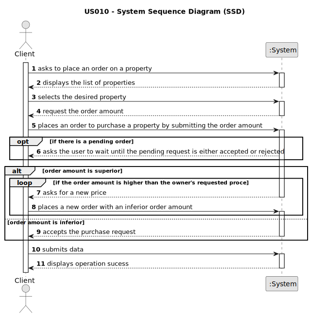

# US 0010 - Place an order to purchase the property, submitting the order amount

## 1. Requirements Engineering

### 1.1. User Story Description

As a client, I place an order to purchase the property, submitting the order
amount.

### 1.2. Customer Specifications and Clarifications 

**From the specifications document:**

> (...)

> (...)

**From the client clarifications:**

> **Question:** (...)
>  
> **Answer:** (...)

> **Question:** (...)
>  
> **Answer:** (...)

### 1.3. Acceptance Criteria

* **AC1:** The order amount submitted by the client must be equal to or lower than
the price set by the owner for the property.
* **AC2:** If the order amount submitted by the client has already been posted for
the property (by another request from this client or any other client), the
system must state that on the screen and the order placed previously should be
considered first when selling the property.
* **AC3:** A client can only submit a new order to purchase the same property after
the previous one is declined.

### 1.4. Found out Dependencies

* (...)

### 1.5 Input and Output Data

**Input Data:**

* Typed data:
	* (...)
	
* Selected data:
	* (...)

**Output Data:**

* (...)
* (...)

### 1.6. System Sequence Diagram (SSD)

**Other alternatives might exist.**

#### Alternative One

### 1.7 Other Relevant Remarks

* (...)