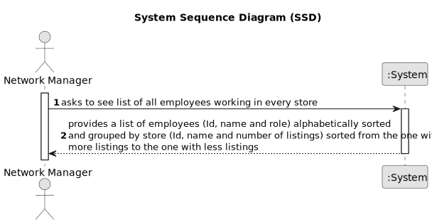

# US 13 - To list all employees working in every store of the network 

## 1. Requirements Engineering

### 1.1. User Story Description

As a network manager, I want to list all employees working in every store of the network.

### 1.2. Customer Specifications and Clarifications 

**From the specifications document:**

>	N\A 

**From the client clarifications:**

> **Date:** Thursday, May 4 of 2023
>
> **Question:** Do you want a list where the header is ID, the name of the store, and the total number of listings that the store has?
>  
> **Answer:** Yes.
>
> **Asked at:** 13:43
>

### 1.3. Acceptance Criteria

* **AC1:** The list of employees should be alphabetically sorted and grouped by store.
* **AC2:** Stores should be sorted according to their property listings, from the one with more listings to the one with less listings.
* **AC3:** Each store should state how many property listings it has.

### 1.4. Found out Dependencies

* There is a dependency to US03 "As a system administrator, I want to register a new employee." since at least one employee must be registered in a store.

* There is a dependency to US05 "As a system administrator, I want to register a store." since at least a store must be registered in the system.

* There is a dependency to US07 " As an unregistered user, I want to register in the system to buy, sell or rent properties." since the Network Manager should be registered in the app.

### 1.5 Input and Output Data

**Input Data:**

* Typed data:
	* n/a
	
* Selected data:
	* n/a

**Output Data:**

* List of existing stores (sorted by most listing) and employees (alphabetically sorted)
* (In)Success of the operation

### 1.6. System Sequence Diagram (SSD)

**Other alternatives might exist.**

#### Alternative One

### 1.7 Other Relevant Remarks

* N/a