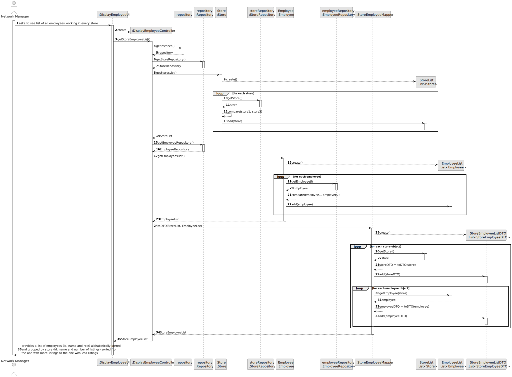

# US 13 - To list all employees working in every store of the network 

## 3. Design - User Story Realization 

### 3.1. Rationale

**SSD - Alternative 1 is adopted.**

| Interaction ID | Question: Which class is responsible for... | Answer               | Justification (with patterns)                                                                                 |
|:-------------  |:--------------------- |:---------------------|:--------------------------------------------------------------------------------------------------------------|
| Step 1  		 |	... interacting with the actor? | DisplayEmployeeUI          | Pure Fabrication: there is no reason to assign this responsibility to any existing class in the Domain Model. |
| 			  		 |	... coordinating the US? | DisplayEmployeeController | Controller                                                                                                    |
| 			  		 |							 | repository         | IE: knows the StoreRepository                                                                               |
| 			  		 |	... obtaining the stores list?						 | StoreRepository         | IE: cf. A&A component documentation.                                                                             |
| 			  		 |							 | Store         | IE: knows/has its own data (e.g. id)                                                                               |
| 			  		 |							 | repository         | IE: knows the EmployeeRepository                                                                               |
| 			  		 |	... obtaining the employee list?						 | EmployeeRepository         | IE: cf. A&A component documentation.                                                                             |
| 			  		 |							 | Employee             | IE: knows its own data (e.g. email)                                                                           | 
| 			  		 |	.. creating a DTO for the store and employee data?						 | StoreEmployeeMapper             | Pure Fabrication: Data Transfer Object (DTO): StoreEmployeeMapper is responsible for creating the StoreEmployeeDTO from the store and employee objects.                                                                           | 
| 			  		 |	... storing the store and employee data?						 | StoreList, EmployeeList             | Pure Fabrication: Lists: StoreList and EmployeeList store the store and employee objects respectively, obtained from the repositories.                                                                           | 
| 			  		 |	... providing the final list of store-employee DTOs?						 | StoreEmployeeList             | Pure Fabrication: List: StoreEmployeeList stores the final list of StoreEmployeeDTOs after mapping the store and employee data.                                                                         | 

### Systematization ##

According to the taken rationale, the conceptual classes promoted to software classes are: 

 * Store
 * Employee

Other software classes (i.e. Pure Fabrication) identified: 

 * DisplayEmployeeUI  
 * DisplayEmployeeController
 * StoreEmployeeMapper
 * StoreEmployeeList

## 3.2. Sequence Diagram (SD)

### Alternative 1 - Full Diagram

This diagram shows the full sequence of interactions between the classes involved in the realization of this user story.

### Alternative 2 - Full Diagram

This diagram shows the full sequence of interactions between the classes involved in the realization of this user story.

### Alternative 1 - Split Diagram

This diagram shows the same sequence of interactions between the classes involved in the realization of this user story, but it is split in partial diagrams to better illustrate the interactions between the classes.

It uses interaction ocurrence.

**Get Stores List Partial SD**

**Get Employees List Partial SD**

**To DTO**

## 3.3. Class Diagram (CD)

