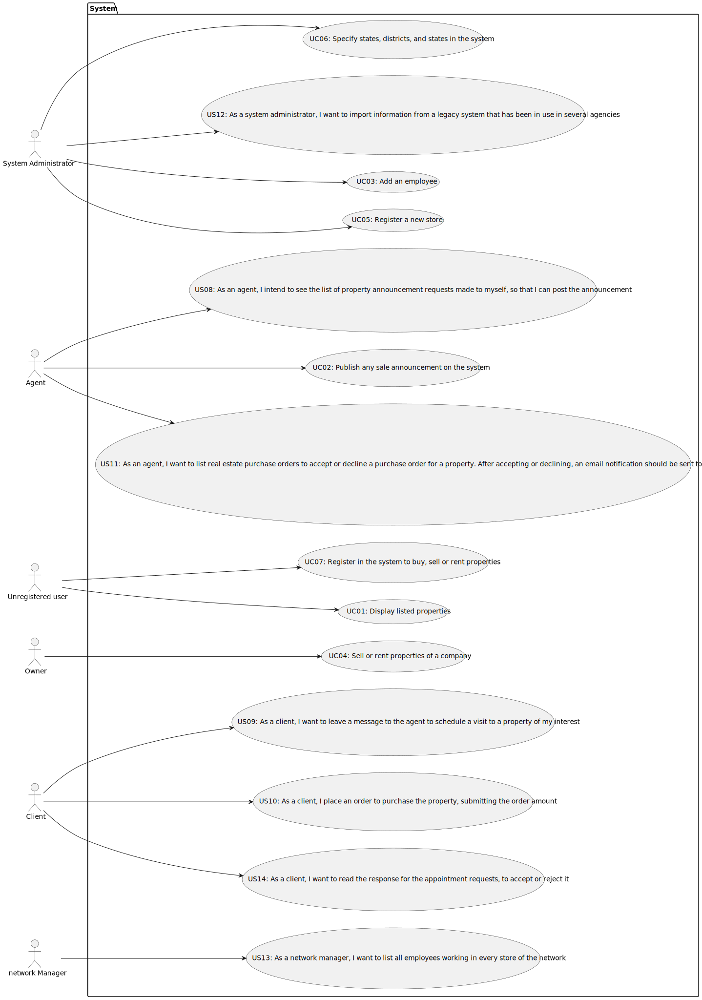

# Use Case Diagram (UCD)

**In the scope of this project, there is a direct relationship of _1 to 1_ between Use Cases (UC) and User Stories (US).**

However, be aware, this is a pedagogical simplification. On further projects and curricular units might also exist _1 to
N **and/or** N to 1 relationship between US and UC.

**Insert below the Use Case Diagram in a SVG format**

**For each UC/US, it must be provided evidences of applying main activities of the software development process (
requirements, analysis, design, tests and code). Gather those evidences on a separate file for each UC/US and set up a
link as suggested below.**

# Use Cases / User Stories

| UC/US  | Description                                                                                              |                   
|:-------|:---------------------------------------------------------------------------------------------------------|
| US 008 | [As an agent, I intend to see the list of property announcement requests made to myself, so that I can post the announcement](../../US08/01.requirements-engineering/Readme.md) |
| US 009 | [As a client, I want to leave a message to the agent to schedule a visit to a property of my interest](../../US09/01.requirements-engineering/Readme.md)                                                                                      |
| US 010 | [As a client, I place an order to purchase the property, submitting the order amount](../../US10/01.requirements-engineering/Readme.md)                                                      |
| US 011 | [As an agent, I want to list real estate purchase orders to accept or decline a purchase order for a property. After accepting or declining, an email notification should be sent to the customer](../../US11/01.requirements-engineering/Readme.md)                                                      |
| US 012 | [As a system administrator, I want to import information from a legacy system that has been in use in several agencies](../../US12/01.requirements-engineering/Readme.md) |
| US 013 | [As a network manager, I want to list all employees working in every store of the network](../../US13/01.requirements-engineering/Readme.md)                                                                                      |

