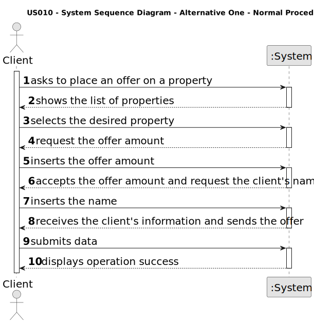
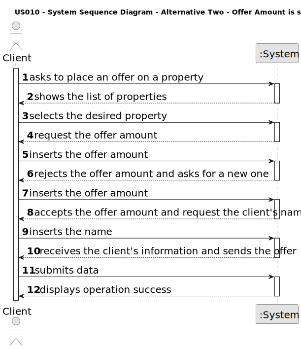
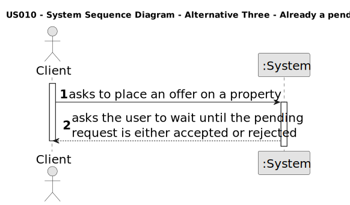
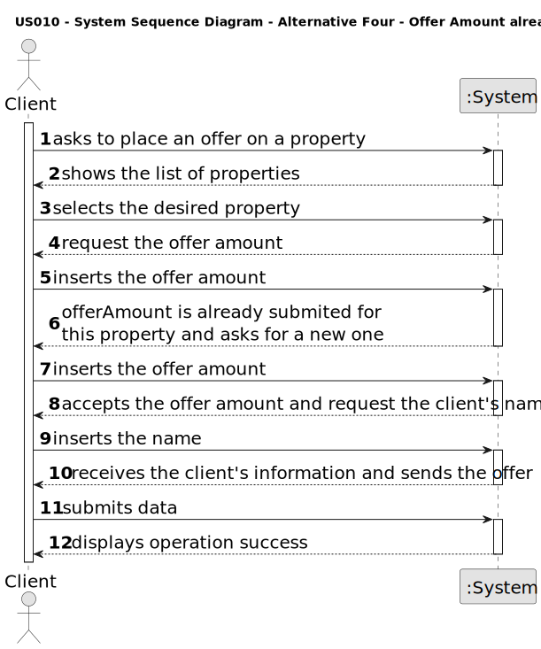
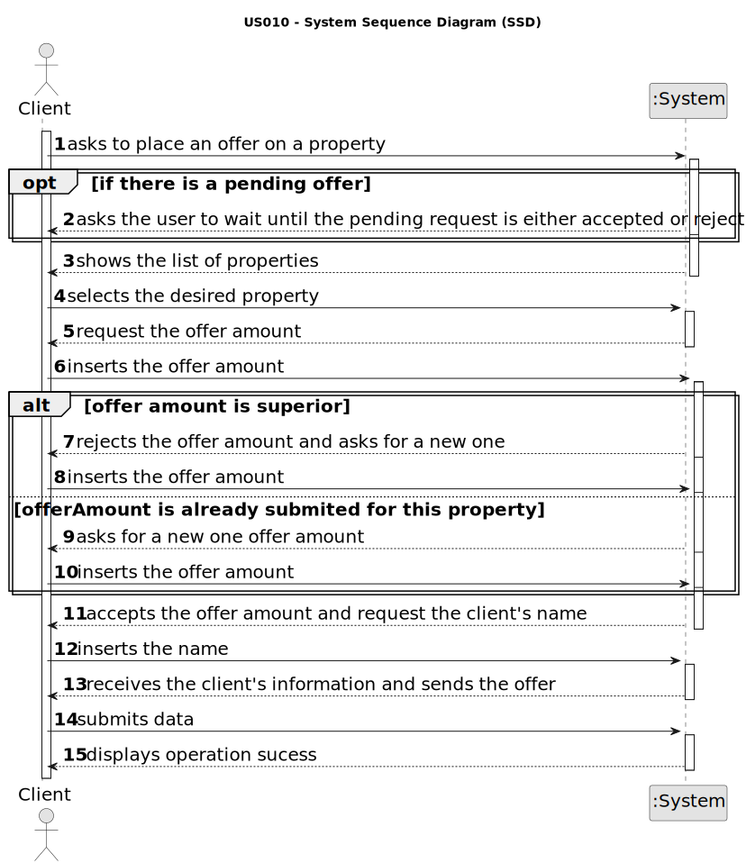

# US 0010 - Place an order to purchase the property, submitting the order amount

## 1. Requirements Engineering

### 1.1. User Story Description

As a client, I place an order to purchase the property, submitting the order amount.

### 1.2. Customer Specifications and Clarifications 

**From the specifications document:**

> When the client decides to buy/rent the property, he sends a request for the purchase/lease of the property to the agent. 
> After being appreciated by the agent, he accepts or rejects the order. If the request is accepted, the offer will not be shown 
> again to clients using the application.

**From the client clarifications:**

> **Question:** What data is required, in addition to the order value, so that a client can place an order to purchase a property?
>
>  **Answer:** Only the order amount.
>
> **Date:** 2nd May, 2023

> **Question:** When the client intends to place a purchase order, should the list of properties (announcements) be presented 
> initially and then asked to select a property?
>
>  **Answer:** The system should show a list of properties to the client.
>
> **Date:**  3rd May, 2023

> **Question:**  In US10, can the client remove an offer they made at any point, in order to replace it with a different one?
>
>  **Answer:** No.
>
> **Date:** 3rd May, 2023

> **Question:** If a client makes an order of equal or lower value to a previous one, the older order will be considered first. 
> The system should state this on the screen, but should this information be shown to the client, the agent, or both?
>
>  **Answer:** Please check who is the ator of this Us and check again the acceptance criteria of this US.
>
> **Date:** 3rd May, 2023

> **Question:** Should this User Story be implemented as an addition to US001 (Users can display properties, and select one 
> to make an order), or should it be completely separate, with a separate section of the app dedicated to it?
>
>  **Answer:** To place an order the actor should be registered in the system.
>
> **Date:** 3rd May, 2023

> **Question:** To order a purchase of a property, should the client be able to filter the properties by type of property, city, 
> district....so that it's easier to find the wanted property, or should the system show the entire list of properties to sale?
>
>  **Answer:** The system should show a list of properties to the client. Filtering is a useful feature of the system, please 
> prepare a user friendly and effective filtering to show the properties to the client.
>
> **Date:** 5th May, 2023

> **Question:** When showing the other order on the screen, what data should be shown (eg client name, published date, order status)?
>
>  **Answer:** If the order amount submitted by the client has already been posted for the property (by another request from this 
> client or any other client), the system must state that on the screen. The system should show the message "The order amount 
> submitted has already been posted for this property. Please contact the agent that is responsible for this property.".
>
> **Date:** 5th May, 2023

> **Question:**  Let's suppose the client doesn't want to filter the properties. That means there will be shown both "sale" and "rent" 
> announcements to him. If he later wants to sort them by price (ascending or descending), how does the comparison between a property 
> for sale with a 200 000$ price (e.g.) and a property for rent with a 800$ monthly price (e.g.) and a 12 months contract duration (e.g.) should be?
> 
>  **Answer:**  If the actor does not chooses to filter properties by type of business (sale or rent), the property sale price and the 
> property rent monthly price should used for sorting the properties.
>
> **Date:** 19th May, 2023

### 1.3. Acceptance Criteria

* **AC1:** The order amount submitted by the client must be equal to or lower than the price set by the owner for the property.
* **AC2:** If the order amount submitted by the client has already been posted for the property (by another request from this client or any other client), the
system must state that on the screen and the order placed previously should be considered first when selling the property.
* **AC3:** A client can only submit a new order to purchase the same property after the previous one is declined.

### 1.4. Found out Dependencies

* There is a dependency to "US011 - I want to list real estate purchase orders to accept or decline a purchase order for a property" since a client can't put up more than 
* one offer for a property. If a client's proposal ends up being refused by the agent, then, the client can make another offer.

### 1.5 Input and Output Data

**Input Data:**

* Typed data:

	* Offer Amount
    * Client's Name
	

* Selected data:

	* Published Announcement

**Output Data:**

* List of properties (for the client to choose one).
* Message indicating that the offer was accepted in the system (in this case, if the price is equal or lower to the price set by the owner).
* Message indicating that the offer was not accepted in the system (in this case, if the price is higher to the price set by the owner).
* Message indicating that the offer was accepted in the system but there are other offers that are equal or higher in value.
* Message indicating that the offer was accepted in the system successfully.
* Message indicating that the offer was not accepted because the client has already an active offer and that he needs to wait before making a new one.

### 1.6. System Sequence Diagram (SSD)

**Other alternatives might exist.**

#### Alternative One

#### Alternative Two

#### Alternative Three

#### Alternative Four

#### Full

### 1.7 Other Relevant Remarks
