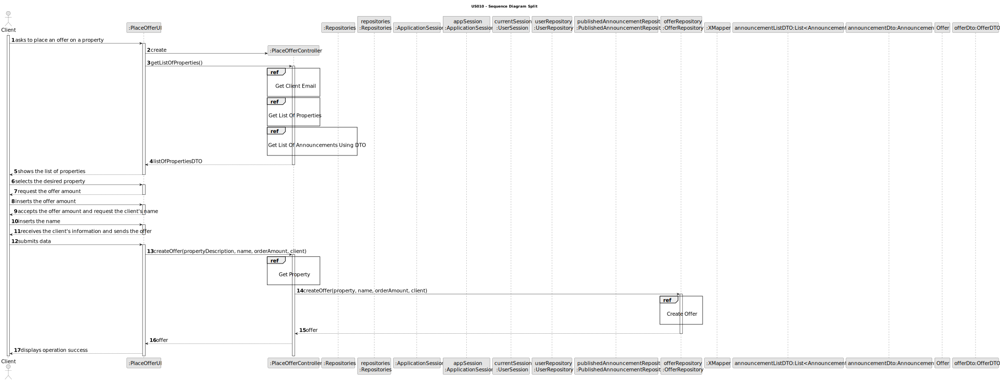
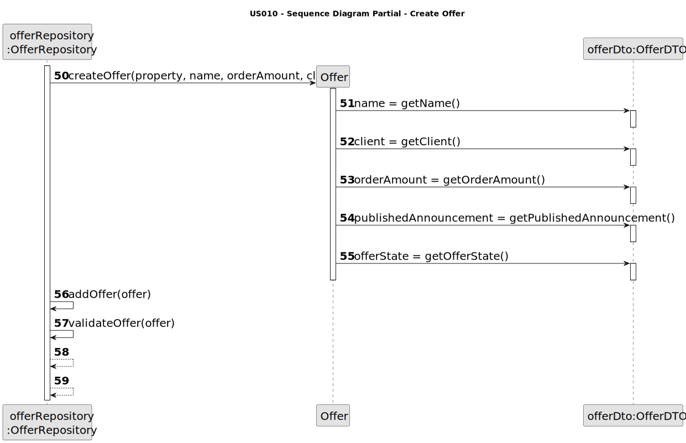
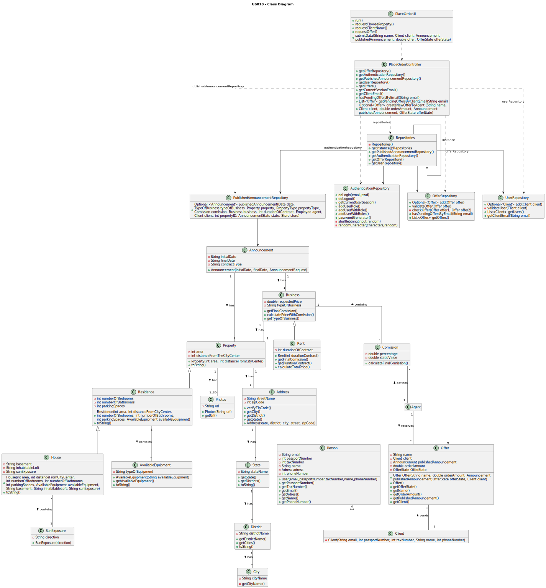

# US 010 - Place an order to purchase the property, submitting the order amount 

## 3. Design - User Story Realization 

### 3.1. Rationale

**SSD - Alternative 1 is adopted.**

| Interaction ID                                                                 | Question: Which class is responsible for...             | Answer                          | Justification (with patterns)                                                                                                                 |
|:-------------------------------------------------------------------------------|:--------------------------------------------------------|:--------------------------------|:----------------------------------------------------------------------------------------------------------------------------------------------|
| Step 1 : asks to place an offer on a property                                  | ...interacting with the actor?                          | PlaceOrderUI                    | Pure Fabrication: there is no reason to assign this responsibility to any existing class in the Domain Model. It is a user interface concern. |
|                                                                                | ...coordinating the US?                                 | PlaceOrderController            | Controller                                                                                                                                    |
|                                                                                | ...UI-related class being instantiated?                 | PlaceOrderUI                    | Pure Fabrication                                                                                                                              |
| Step 2 : shows the list of properties                                          | ...obtaining the list of properties?                    | PublishedAnnouncementRepository | IE: knows all it's data, Pure Fabrication                                                                                                     |
| Step 3 : selects the desired property                                          | ...validating selected data?                            | PlaceOrderUI                    | Pure Fabrication                                                                                                                              |
|                                                                                | ...saving selected data?                                | (...)                           | (...)                                                                                                                                         |
| Step 4 : request the offer amount                                              | ...displaying the UI for the client to input the data?  | PlaceOrderUI                    | Pure Fabrication                                                                                                                              |
| Step 5 : places an offer to purchase a property by submitting the offer amount | ...validating the input data?                           | PlaceOrderUI                    | Pure Fabrication                                                                                                                              |
|                                                                                | ...temporarily keeping the input data?                  | PlaceOrderUI                    | Pure Fabrication                                                                                                                              |
| Step 6 : shows an offer to purchase a property                                 | ...display all the offer information before submitting? | PlaceOrderUI                    | PureFabrication                                                                                                                               |
| Step 8 : submits data                                                          | ...creating the offer Object?                           | OfferRepository                 | Creator: the object create has its own data.                                                                                                  |
|                                                                                | ...                                                     | (...)                           | (...)                                                                                                                                         |
|                                                                                | ...                                                     | (...)                           | (...)                                                                                                                                         |
|                                                                                | ...                                                     | (...)                           | (...)                                                                                                                                         |
|                                                                                | ...                                                     | (...)                           | (...)                                                                                                                                         |
|                                                                                | ...                                                     | (...)                           | (...)                                                                                                                                         |
|                                                                                | ...validating the data locally(mandatory data)?         | Offer                           | IE: knows its own data                                                                                                                        |
|                                                                                | ...validating all data (global validation)?             | OfferRepository                 | IE: knows all Offer instances                                                                                                                 |
| Step 9 : displays operation success                                            | ...displaying operation success?                        | PlaceOrderUI                    | PureFabrication                                                                                                                               |

### Systematization ##

According to the taken rationale, the conceptual classes promoted to software classes are: 

 * (...)
 * Offer

Other software classes (i.e. Pure Fabrication) identified: 

 * PlaceOrderUI  
 * PlaceOrderController

## 3.2. Sequence Diagram (SD)

### Alternative 1 - Full Diagram

This diagram shows the full sequence of interactions between the classes involved in the realization of this user story.

### Alternative 2 - Split Diagram

This diagram shows the same sequence of interactions between the classes involved in the realization of this user story, but it is split in partial diagrams to better illustrate the interactions between the classes.

It uses interaction ocurrence.

**Create Offer**

**Get Client Email**

**Get List Of Properties**

**Get List Of Properties Using DTO**

**Get Property**

## 3.3. Class Diagram (CD)

