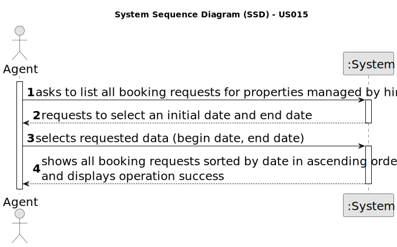

# US 015 - As an agent, I intend to list all booking requests for properties managed by me.

## 1. Requirements Engineering

### 1.1. User Story Description

As an agent, I intend to list all booking requests for properties managed by me.

### 1.2. Customer Specifications and Clarifications 

**From the specifications document:**

>	After consulting a list of properties, the client can request to schedule a visit to the real estate agent for a specific property to verify its conditions. The agent receives the request, checks the availability and sends the response. If the customer accepts the order, it is automatically scheduled in the system.

**From the client clarifications:**

> **Question:** Booking is a slightly vague word. Our team wants clarifications on what type of requests the word encompasses (visit requests being our strongest guess, but we are not sure).
> 
>  **Answer:** 
>
> **Date:** 29 de May de 2023

> **Question:** Are the "booking requests" mentioned in the US015 description the same thing as the "message [...] to schedule a visit to a property of my interest" in US009? Or are they different requests entirely?
>
>  **Answer:**
>
> **Date:** 29 de May de 2023

> **Question:** US015's AC1 states that "The list of requests must be shown for a specific period (begin date, end date)". As such, our team would like to know if you want this time period to be selected or typed, and in which format it should be in.
>
>  **Answer:**
>
> **Date:** 30 de May de 2023

> **Question:** US015's AC2 states that "The list of requests must be sorted by date in ascending order. The sorting algorithm to be used by the application must be defined through a configuration file. At least two sorting algorithms should be available."
As such, the team would like to know if this requirement will be part of the user's interaction with this US, or if it's just there for flexibility purposes. By that we mean to ask if the client will be able to chose which sorting method they want to apply, even if the end result will always be the same, or if we will provide those methods but chose which one is actually going to sort the list, without the client's awareness, as all they did was ask to see the list and the program showed them the end result.
If we are to chose which one of the methods will be used, should we chose the most efficient one? It seems like a no brainer question, but we would still like to make sure we are following your vision for the program.
>
>  **Answer:**
>
> **Date:** 30 de May de 2023

> **Question:**
In the AC2, what do you mean by "The sorting algorithm to be used by the application must be defined through a configuration file."? Does the user select which algorithm to use?
>
>  **Answer:** 
>
> **Date:** 30 de May de 2023

### 1.3. Acceptance Criteria

* **AC1:** The list of requests must be shown for a specific period (begin date, end date).
* **AC2:** The list of requests must be sorted by date in ascending order. The sorting algorithm to be used by the application must be defined through a configuration file. At least two sorting algorithms should be available.
* **AC3:** When an Agent responds to a booking request the list of booking requests should be updated to not show this request.

### 1.4. Found out Dependencies

* There is a dependency to "US009 As a client, I want to leave a message to the agent to schedule a visit to a property of my interest." since at least a message must exist to list the booking requests.
* There is a dependency to "US002 As an agent, I can publish any sale annoucement on the system, for example received through a phone call." and in "US008 As an agent, I intend to see the list of property announcement requests made to myself, so that I can post the announcement" because in these US an agent is associated with each property / announcement.

### 1.5 Input and Output Data

**Input Data:**

* Typed data:
	* Begin Date
    * End Date
	
* Selected data:
	* N/a

**Output Data:**

* List of booking requestes to select
* (In)Success of the operation

### 1.6. System Sequence Diagram (SSD)

**Other alternatives might exist.**

#### Alternative One

### 1.7 Other Relevant Remarks

* The created task stays in a "not published" state in order to distinguish from "published" tasks.