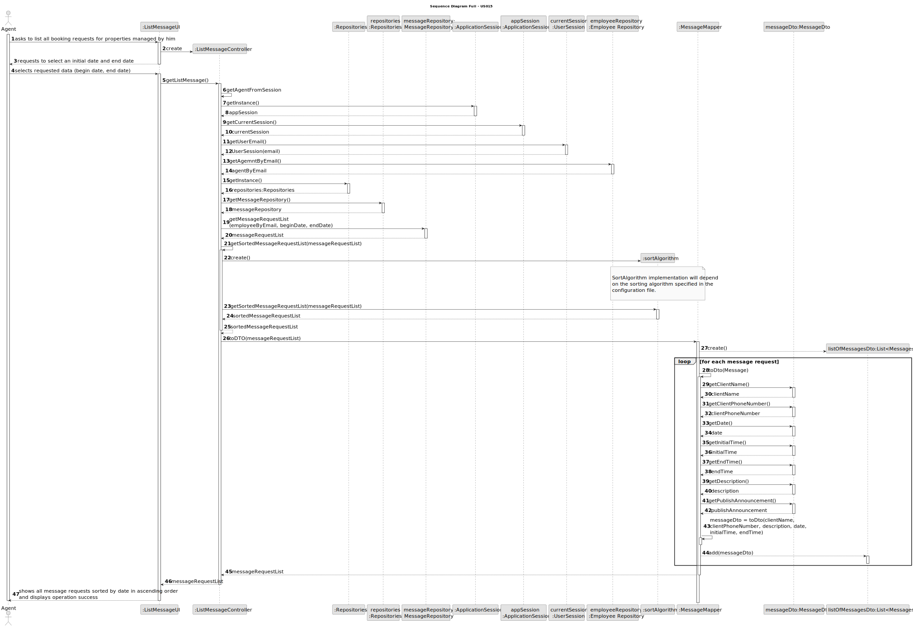
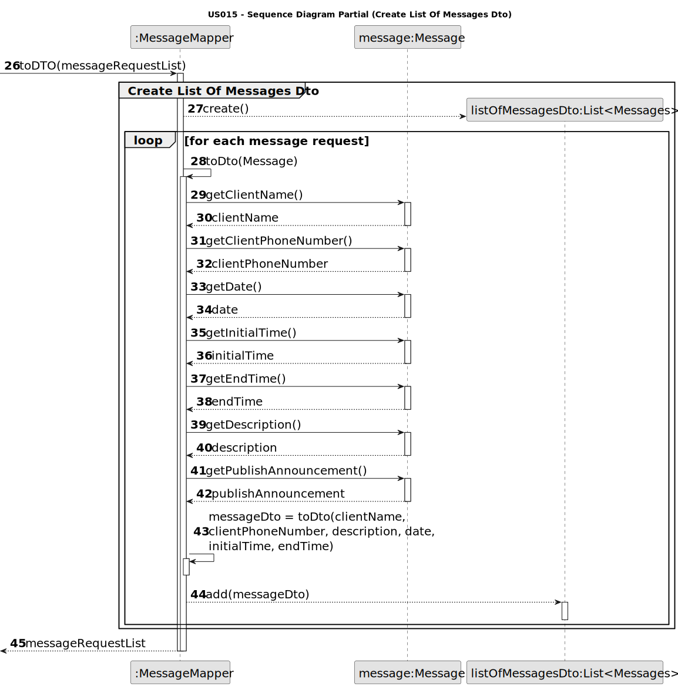
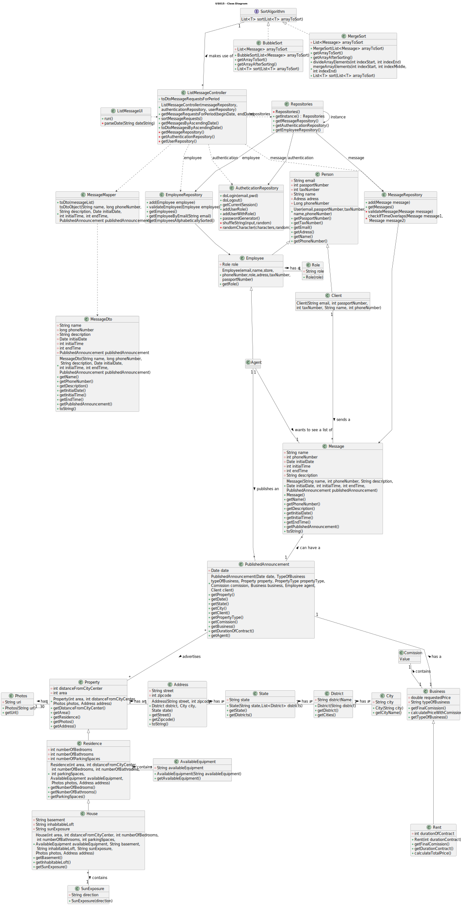

# US 015 - As an agent, I intend to list all booking requests for properties managed by me.

## 3. Design - User Story Realization 

### 3.1. Rationale

**SSD - Alternative 1 is adopted.**

| Interaction ID                                                                                      | Question: Which class is responsible for...                 | Answer                | Justification (with patterns)                                                                                 |
|:----------------------------------------------------------------------------------------------------|:------------------------------------------------------------|:----------------------|:--------------------------------------------------------------------------------------------------------------|
| Step 1: asks to list all booking requests for properties managed by him                             | ... interacting with the actor?                             | ListMessageUI         | Pure Fabrication: there is no reason to assign this responsibility to any existing class in the Domain Model. |
|                                                                                                     | ... coordinating the US?                                    | ListMessageController | Controller                                                                                                    |
| Step 2: requests to select an initial date and end date                                             | ... displaying the UI for the agent to input data?          | ListMessageUI         | Pure Fabrication                                                                                              | 
| Step 3: selects requested data (begin date, end date)                                               | ... validating and temporarily keeping the selected data?   | ListMessageUI         | IE:knows/has its own data                                                                                     |
|                                                                                                     | ... knowing and obtaining the email of the agent logged in? | UserSession           | IE: knows/has its own data                                                                                    |
|                                                                                                     | ... obtaining the agent by email?                           | EmployeeRepository    | IE:knows/has its own data                                                                                     |
|                                                                                                     | ... obtaining the messages list?                            | MessageRepository     | IE: knows/has its own data,Pure Fabrication                                                                   |
|                                                                                                     | ... sorting the Messages List?                              | SortAlgorithm         | Protected Variations and Polymorphism                                                                         |
|                                                                                                     | ... creating the message Dto list?                          | MessageMapper         | IE:knows/has its own data, High Cohesion Low Coupling                                                         |
|                                                                                                     | ... obtaining the messages description?                     | MessageDto            | IE: knows/has its own data                                                                                    |
| Step 4: shows all message requests sorted by date in ascending order and displays operation success | ... displaying the list of messages requests?               | ListMessageUI         | Pure Fabrication                                                                                              |

### Systematization ##

According to the taken rationale, the conceptual classes promoted to software classes are: 

Other software classes (i.e. Pure Fabrication) identified: 

 * ListMessageUI  
 * ListMessageController
 * EmployeeRepository
 * MessageRepository
 * ListMessageDto
 * SortAlgorithm
 * Message Mapper

## 3.2. Sequence Diagram (SD)

### Alternative 1 - Full Diagram

This diagram shows the full sequence of interactions between the classes involved in the realization of this user story.

### Alternative 2 - Split Diagram

This diagram shows the same sequence of interactions between the classes involved in the realization of this user story, but it is split in partial diagrams to better illustrate the interactions between the classes.

It uses interaction ocurrence.

**Get Agent By Email**

**Get Message Request List**

**Create Sort Algorithm**

**Create List Of Messages Dto**

## 3.3. Class Diagram (CD)

