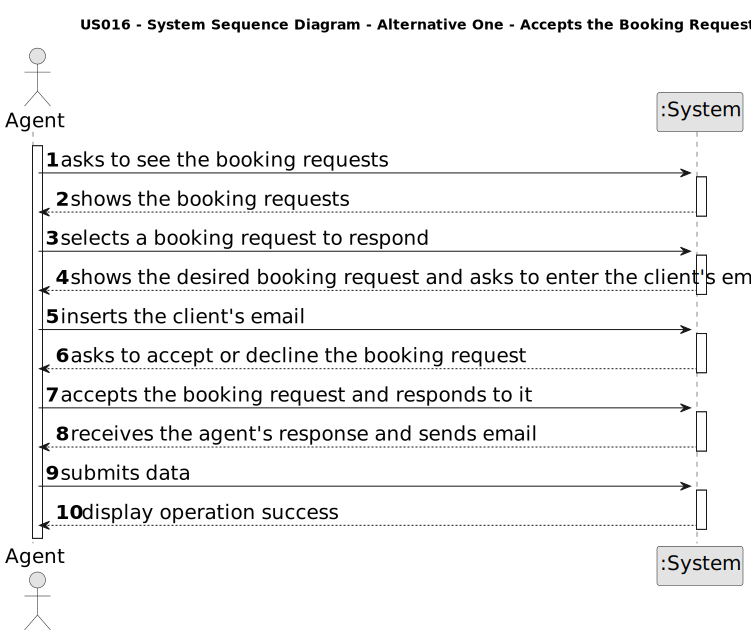

# US 016 - When viewing a booking request, I want to respond to the user that scheduled the visit.

## 1. Requirements Engineering

### 1.1. User Story Description

As an agent, when viewing a booking request, I want to respond to the user that scheduled the visit.

### 1.2. Customer Specifications and Clarifications 

**From the specifications document:**

> (...)

**From the client clarifications:**

> **Question:** 
>
>  **Answer:**
>
> **Date:** **()**

> **Question:**
>
>  **Answer:**
>
> **Date:** **()**

> **Question:**
>
>  **Answer:**
>
> **Date:** **()**

> **Question:**
>
>  **Answer:**
>
> **Date:** **()**

### 1.3. Acceptance Criteria

* **AC1:** The response is sent by email.
* **AC2:** Different email services can send the message. These services must be configured using a configuration file to enable using different platforms (e.g.: gmail, DEI's email service, etc.)
* **AC3:** The response should include the name and phone number of the responsible Agent.
* **AC4:** The response should include the property identification and location.

### 1.4. Found out Dependencies

* (...)

### 1.5 Input and Output Data

**Input Data:**

* Typed data:
	* (...)
	
* Selected data:
	* (...)

**Output Data:**

* (...)

### 1.6. System Sequence Diagram (SSD)

**Other alternatives might exist.**

#### Alternative One

#### Alternative Two

(...)

### 1.7 Other Relevant Remarks

* N\A