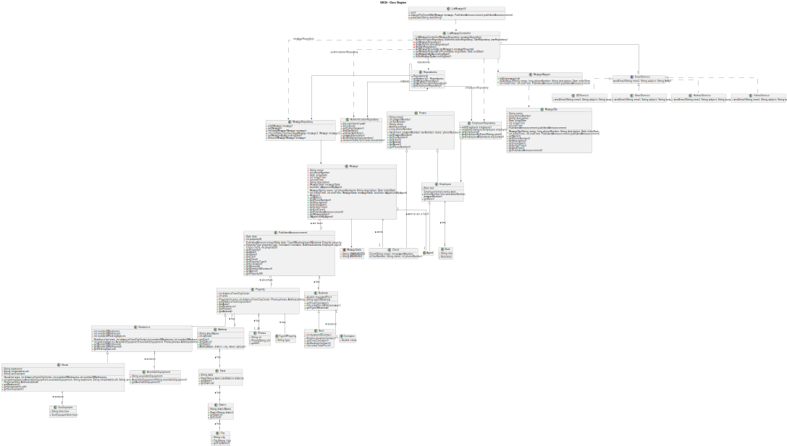

# US 006 - To create a Task 

## 3. Design - User Story Realization 

### 3.1. Rationale

**SSD - Alternative 1 is adopted.**

| Interaction ID                                           | Question: Which class is responsible for... | Answer               | Justification (with patterns)                                                                                      |
|:---------------------------------------------------------|:--------------------------------------------|:---------------------|:-------------------------------------------------------------------------------------------------------------------|
| Step 1 : asks to see the schedule requests               |                                             |                      |                                                                                                                    |
|                                                          |                                             |                      |                                                                                                                    |
|                                                          |                                             |                      |                                                                                                                    |
| Step 2 : shows the schedule requests                     |                                             |                      |                                                                                                                    |
|                                                          |                                             |                      |                                                                                                                    |
|                                                          |                                             |                      |                                                                                                                    |
| Step 3 : selects the desired schedule request to respond |                                             |                      |                                                                                                                    |
|                                                          |                                             |                      |                                                                                                                    |
|                                                          |                                             |                      |                                                                                                                    |
| Step 4 : shows the desired schedule request              |                                             |                      |                                                                                                                    |
|                                                          |                                             |                      |                                                                                                                    |
|                                                          |                                             |                      |                                                                                                                    |
| Step 5 : submits data                                    |                                             |                      |                                                                                                                    |
|                                                          |                                             |                      |                                                                                                                    |
|                                                          |                                             |                      |                                                                                                                    |
| Step 6 : display operation success                       |                                             |                      |                                                                                                                    |
|                                                          |                                             |                      |                                                                                                                    |
|                                                          |                                             |                      |                                                                                                                    |

### Systematization ##

According to the taken rationale, the conceptual classes promoted to software classes are: 

 * (...)

Other software classes (i.e. Pure Fabrication) identified: 

 * ListMessageUI  
 * ListMessageController
 * MessageRepository

## 3.2. Sequence Diagram (SD)

### Alternative 1 - Full Diagram

This diagram shows the full sequence of interactions between the classes involved in the realization of this user story.

### Alternative 2 - Split Diagram

This diagram shows the same sequence of interactions between the classes involved in the realization of this user story, but it is split in partial diagrams to better illustrate the interactions between the classes.

It uses interaction ocurrence.

### Alternative 3 - Partial Diagrams

**Send Email**

**Update Message Request**

## 3.3. Class Diagram (CD)

