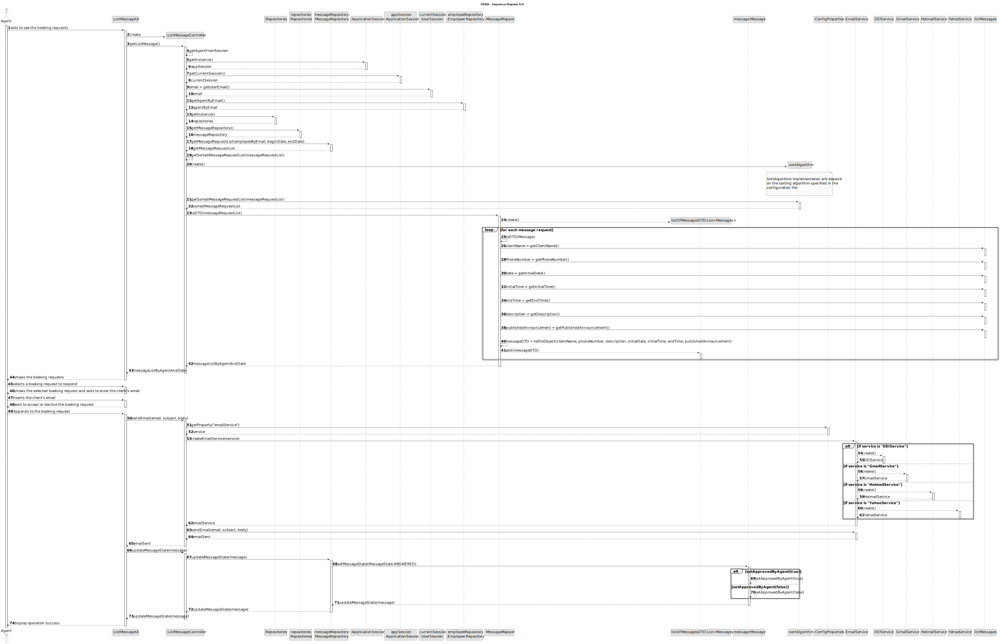
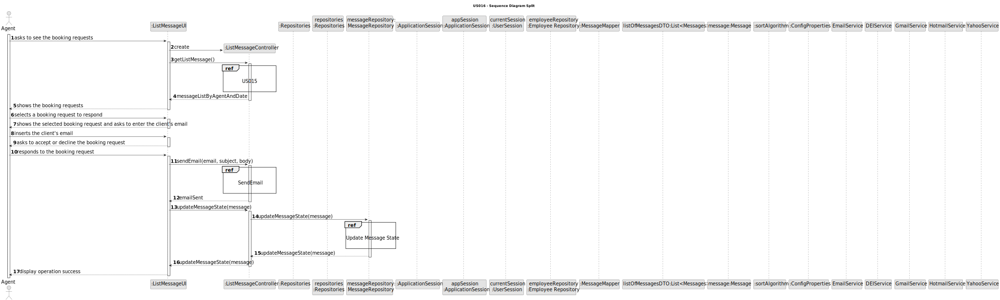

# US 006 - To create a Task 

## 3. Design - User Story Realization 

### 3.1. Rationale

**SSD - Alternative 1 is adopted.**

| Interaction ID                                                                   | Question: Which class is responsible for...                 | Answer                | Justification (with patterns)                                                                                 |
|:---------------------------------------------------------------------------------|:------------------------------------------------------------|:----------------------|:--------------------------------------------------------------------------------------------------------------|
| Step 1 : asks to see the booking requests                                        | ...interacting with the actor?                              | ListMessageUI         | Pure Fabrication: there is no reason to assign this responsibility to any existing class in the Domain Model. |
|                                                                                  | ...coordinating the US?                                     | ListMessageController | Controller                                                                                                    |
|                                                                                  | ...displaying the UI for the agent to input data?           | ListMessageUI         | Pure Fabrication                                                                                              |
|                                                                                  | ...validating and temporarily keeping the selected data?    | ListMessageUI         | IE: has methods of validation.                                                                                |
|                                                                                  | ...knowing and obtaining the email of the agent logged in?  | UserSession           | IE: knows/has its own data                                                                                    |
|                                                                                  | ...obtaining the agent by email?                            | EmployeeRepository    | IE: knows/has its own data                                                                                    |
|                                                                                  | ...obtaining the message list?                              | MessageRepository     | IE: knows/has its own data, Pure Fabrication                                                                  |
|                                                                                  | ...sorting the message list?                                | SortAlgorithm         | Protected Variations and Polymorphism                                                                         |
|                                                                                  | ...creating the message DTO list?                           | MessageMapper         | IE: knows/has its own data, High Coesion, Low Coupling                                                        |
|                                                                                  | ...obtaining the message description?                       | MessageDto            | IE: knows/has its own data                                                                                    |
| Step 2 : shows the booking requests                                              | ...displaying the list of message requests?                 | ListMessageUI         | Pure Fabrication                                                                                              |
| Step 3 : selects the desired booking request to respond                          | ...displaying the UI for the agent to input data?           | ListMessageUI         | Pure Fabrication                                                                                              |
|                                                                                  | ...selecting the message?                                   | ListMessageUI         | IE: The UI component is responsible for capturing user input (selected message).                              |
|                                                                                  | ...validating and temporarily keeping the inputted data?    | Utils                 | IE: has methods of validation.                                                                                |
| Step 4 : shows the selected booking request and asks to enter the client's email | ...displaying the selected message?                         | ListMessageUI         | Pure Fabrication                                                                                              |
| Step 5 : inserts the client's email                                              | ...displaying the UI for the agent to input data?           | ListMessageUI         | Pure Fabrication                                                                                              |
|                                                                                  | ...validating and temporarily keeping the inputted data?    | Utils                 | IE: has methods of validation.                                                                                |
| Step 6 : asks to accept or decline the booking request                           | ...displaying the selected message?                         | ListMessageUI         | Pure Fabrication                                                                                              |
| Step 7 : responds to the booking request                                         | ...displaying the UI for the agent to input data?           | ListMessageUI         | Pure Fabrication                                                                                              |
|                                                                                  | ...sending the email to the client?                         | EmailService          | Protected Variations and Adapter Pattern                                                                      |
|                                                                                  | ...sending the message status (accepted) to the controller? | ListMessageUI         | IE: The UI component is responsible for capturing user input (message status).                                |
|                                                                                  | ...changing the status of the selected offer?               | Message               | IE: Message owns the message status and can change it.                                                        |
|                                                                                  | ...updating the message status in the repository?           | MessageRepository     | IE: MessageRequest has access to and manages message status.                                                  |
|                                                                                  | ...removing the message from the repository?                | ListMessageController | Controller                                                                                                    |
| Step 8 : display operation success                                               | ...displaying the operation success message to the agent?   | ListMessageUI         | IE: The UI component is responsible for displaying information to the agent  .                                |

### Systematization ##

According to the taken rationale, the conceptual classes promoted to software classes are: 

 * Message

Other software classes (i.e. Pure Fabrication) identified: 

 * ListMessageUI  
 * ListMessageController
 * MessageRepository
 * EmployeeRepository
 * EmailService

## 3.2. Sequence Diagram (SD)

### Alternative 1 - Full Diagram

This diagram shows the full sequence of interactions between the classes involved in the realization of this user story.

### Alternative 2 - Split Diagram

This diagram shows the same sequence of interactions between the classes involved in the realization of this user story, but it is split in partial diagrams to better illustrate the interactions between the classes.

It uses interaction ocurrence.

### Alternative 3 - Partial Diagrams

**Send Email**

**Update Message Request**

## 3.3. Class Diagram (CD)

