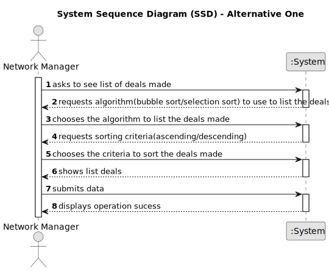

# US 17 - To list all deals made

## 1. Requirements Engineering

### 1.1. User Story Description

As a network manager, I want to list all deals made

### 1.2. Customer Specifications and Clarifications

**From the client clarifications:**

> **Question:** What should be the default order of the deals when displaying them to the network manager?
>
> **Answer:** The default is to sort deals from the most recent ones to the oldest ones.
>
> **Date:** Monday, 29 de May de 2023 às 14:13

> **Question:** In this User Story it is requested that "All deals made" are listed. Are these deals just accepted purchase requests, or are declined purchase requests also included?
>  
> **Answer:** A deal takes place when the proposed purchase/renting is accepted.
> 
> **Date:** Monday, 29 de May de 2023 às 14:50

> **Question:** According to the project description "The manager of the network intends to analyze the performance of each of the branches and the global behavior of the network daily." With this sentence, it is implied that the Network manager has access to all data regarding the deals made in each agency.
> 
> Now, in the requirements document that was provided the US017's description is "As a network manager, I want to list all deals made.".
> 
> Can you confirm that we are analyzing the deals made in all the branches all together?
> 
> **Answer:** Yes, we are analyzing the deals made in all the branches all together.
>
> **Date:** Thursday, 1 de June de 2023 às 12:42

> **Question:** According to previous answers, you have stated that in US017 we must sort the deals made by the properties area and follow a given sorting order chosen by the Network Manager (Ascending/Descending).
>
> Regarding the Algorithms, is it supposed to be one for each sorting order, or must both algorithms present both sorting orders?
>
> **Answer:** The two algorithms can be used for both sorting orders
> 
> **Question:** We have to present information about the deal, but is it necessary to display any information about the agent/agency that oversees the deal?
>
> **Answer:** Yes, show the store ID and the store name.
>
> **Date:**  Wednesday, 7 de June de 2023 às 10:44

### 1.3. Acceptance Criteria

* **AC1:** The actor should be able to sort all properties by property area (square feet)
  in descending/ascending order.
* **AC2:** Two sorting algorithms should be implemented (to be chosen manually by
  the network manager).
* **AC3:** Worst-case time complexity of each algorithm should be documented in the
  application user manual that must be delivered with the application (in the
  annexes, where algorithms should be written in pseudocode).

### 1.4. Found out Dependencies

* There is a dependency to "US10 Place an order to purchase a property" since at least the offer must exist.
* There is a dependency to "US11 Accept or decline a purchase order for a property." since this refers to the deals.

### 1.5 Input and Output Data

**Input Data:**

* Typed data:
	* a sorting criteria,
	
* Selected data:
	* Classifying task category 

**Output Data:**

* List of deals made
* (In)Success of the operation

### 1.6. System Sequence Diagram (SSD)

**Other alternatives might exist.**

#### Alternative One

