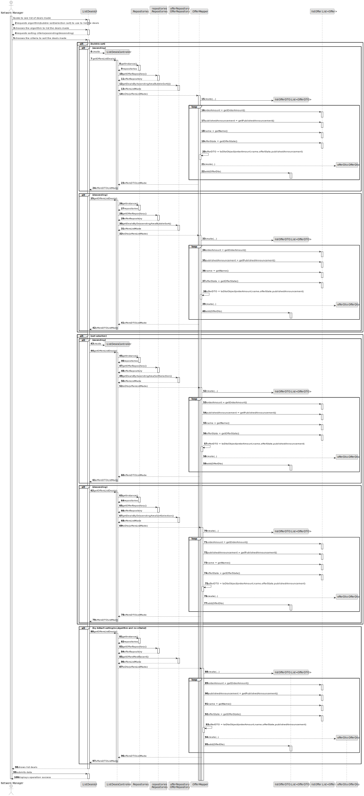
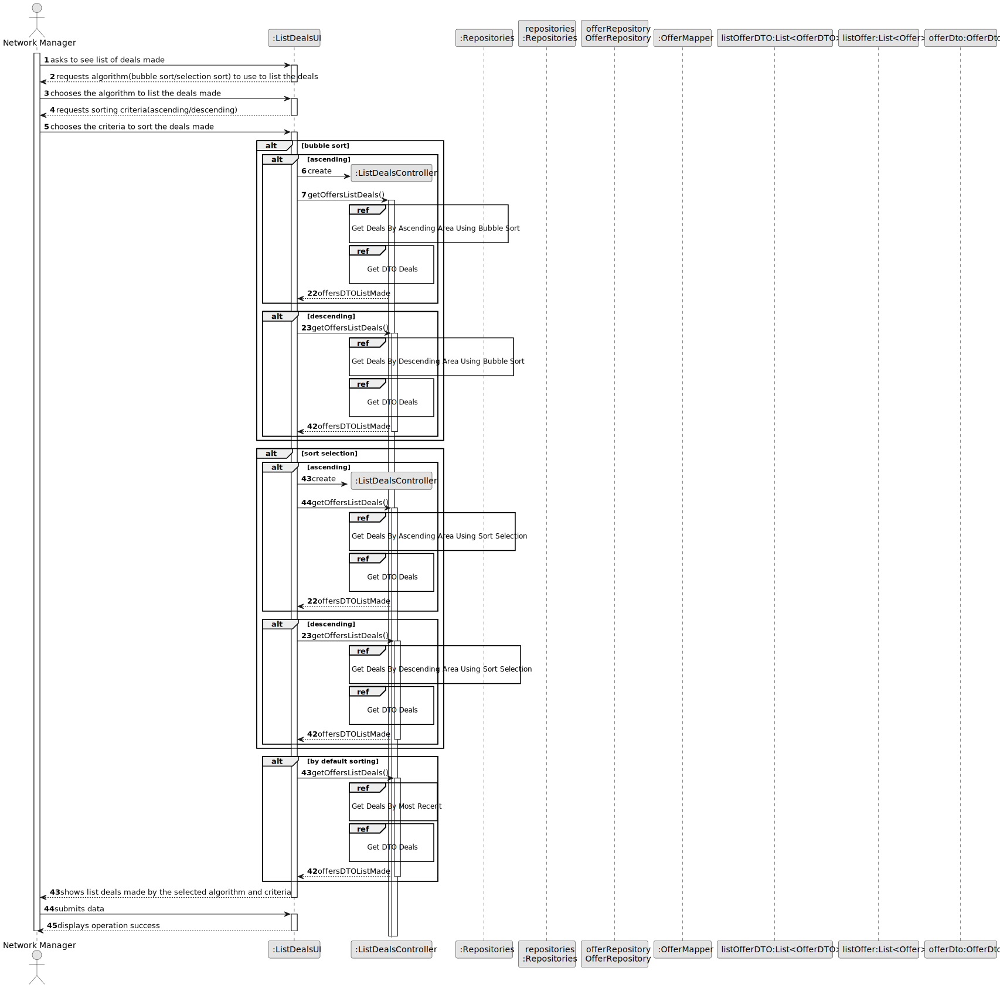
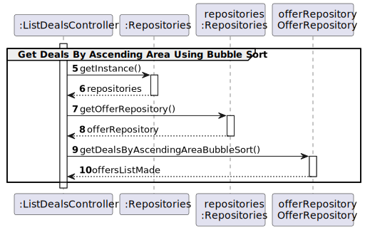
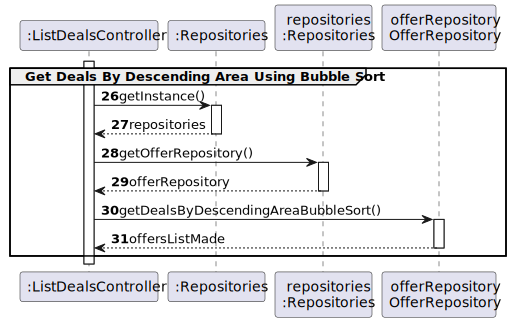
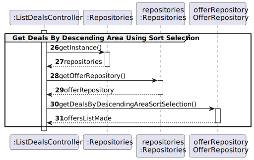
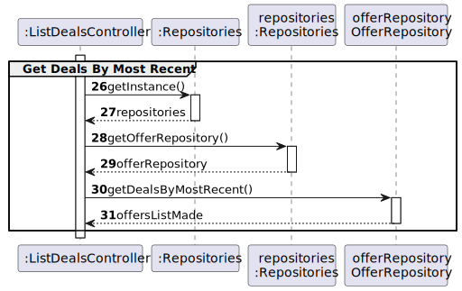
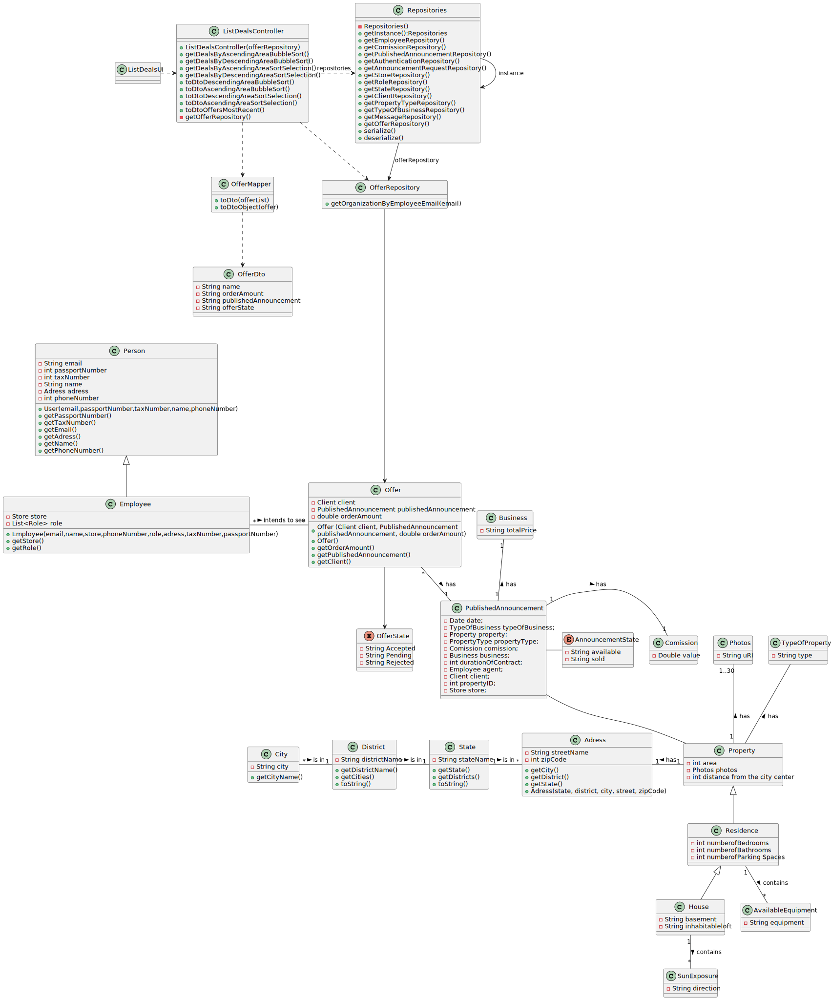

# US 006 - To create a Task 

## 3. Design - User Story Realization 

### 3.1. Rationale

**SSD - Alternative 1 is adopted.**

| Interaction ID                                                                 | Question: Which class is responsible for...                                            | Answer                        | Justification (with patterns)                                                                                 |
|:-------------------------------------------------------------------------------|:---------------------------------------------------------------------------------------|:------------------------------|:--------------------------------------------------------------------------------------------------------------|
| Step 1(asks to see the list of deals made)                                     | ... interacting with the actor?                                                        | ListDealsUI                   | Pure Fabrication: there is no reason to assign this responsibility to any existing class in the Domain Model. |
|                                                                                | ... coordinating the US?                                                               | ListDealsController           | Controller                                                                                                    |
| Step 2: requests algorithm(bubble sort/selection sort) to use to list the deal | ...displaying the UI for the actor to input data?                                      | ListDealsUI                   | Pure Fabrication                                                                                              |
| Step 3: (chooses the algorithm to list the deals made)                         | ...validating selected data?  ...temporarily keeping the criteria description? | ListDealsUI                   | Pure Fabrication                                                                                              |
| Step 4: (requests sorting criteria(ascending/descending))                      | ...displaying the UI for the actor to input data?                                      | ListDealsUI                   | Pure Fabrication                                                                                              |
| Step 5: chooses the criteria to sort the deals made                            | ...validating selected data?  ...temporarily keeping the criteria description? | ListDealsUI                   | Pure Fabrication                                                                                              |
|                                                                                | ...obtaining the List of Deals Dto list                                                | OfferMapper                   | IE:Kowns/has its own DealsDto,Pure Fabrication,High coesion Low Coupling                                      |
| Step 6: (shows list deals made by the selected algorithm and criteria)         | ...obtaining and creating the announcement request Dto by description                  | OfferMapper                   | IE,Creator                                                                                                    |
|                                                                                | ...validating the data locally(mandatory data)?                                        | PublishAnnouncement           | IE                                                                                                            |
|                                                                                | ...adding to a collection and globally validating duplicated records           | PublishAnnouncementRepository | IE                                                                                                            |
| Step 7: (submits data)                                                         | ...informing operation success?                                                        | PublishAnnouncementRequestUI  | Pure Fabrication                                                                                              |
| Step 8: (displays operation sucess)                                            | ...informing operation success?                                                        | PublishAnnouncementRequestUI  | Pure Fabrication                                                                                              |

### Systematization ##

According to the taken rationale, the conceptual classes promoted to software classes are: 

 * Offer

Other software classes (i.e. Pure Fabrication) identified: 

* ListDealsUI
* ListDealsController
* OfferMapper

## 3.2. Sequence Diagram (SD)

### Alternative 1 - Full Diagram

This diagram shows the full sequence of interactions between the classes involved in the realization of this user story.

### Alternative 2 - Split Diagram

This diagram shows the same sequence of interactions between the classes involved in the realization of this user story, but it is split in partial diagrams to better illustrate the interactions between the classes.

It uses interaction ocurrence.

**Get Deals By Ascending Area Using Bubble Sort SD**

**Get Deals By Ascending Area Using Sort Selection SD**

**Get Deals By Descending Area Using Bubble Sort**

**Get Deals By Descending Area Using Sort Selection**

**Get Deals By Most Recent**

**Get DTO Deals**

## 3.3. Class Diagram (CD)

