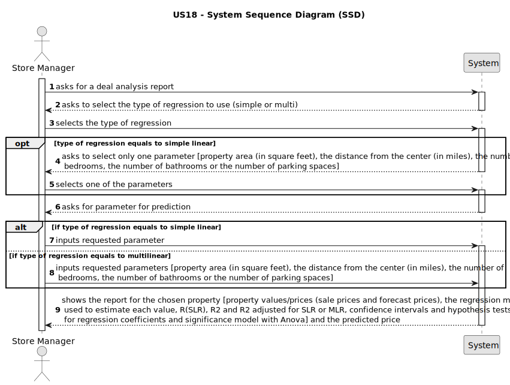

# US 18 - To analyse the deals made

## 1. Requirements Engineering

### 1.1. User Story Description

: As a store manager, I intend to analyse the deals (only sale of houses and
apartments) made. In particular, I intend to compare property sale values with the
forecast values. The prediction of the value of the business/property must be
estimated based on the characteristics of the property and using linear and
multilinear regression algorithms. 

### 1.2. Customer Specifications and Clarifications 

**From the specifications document:**

>	N\A.

**From the client clarifications:**

> **Date:** Thursday, May 4 of 2023
>
> **Question:** Do you want a list where the header is ID, the name of the store, and the total number of listings that the store has?
>  
> **Answer:** Yes.
>
> **Asked at:** 13:43
>

### 1.3. Acceptance Criteria

* **AC1:** The goal of this US is to forecast property sale prices (only for houses and apartments) using information from the property area (in square feet), the distance from the center (in miles), the number of bedrooms, the number of bathrooms and the number of parking spaces features of each property. In this study, simple linear and a multi-linear regression models should be developed to find the linear relationship between: 1- each independent variable and the dependent variable; 2- all independent variables and the dependent variable. As the application is under development it is not possible to generate all data required for the analysis. Therefore, and to simulate a production system, we made available in moodle a CSV file (generated by the legacy system) containing information required for this study. The regression analysis should be documented in the application user manual (in the annexes) that must be delivered with the application. The report should include property values/prices (sale prices and forecast prices), the regression model used to estimate each value, R(SLR), R2 and R2 adjusted for SLR and MLR, confidence intervals and hypothesis tests for regression coefficients and significance model with Anova.
* **AC2:** All houses and apartments business registered in the system should be used to fit the regression models.
* **AC3:** The system should enable the actor to select each regression model and
should present the price estimates using the selected model. Moreover, the system should show the selected regression model and all required statistics. 
* **AC4:** To implement this US the org.apache.commons.math4.stat package
(https://commons.apache.org/proper/commons-math/userguide/stat.html) should be used.

### 1.4. Found out Dependencies

* There is a dependency to US11 "As an agent, I want to list real estate purchase orders to accept or decline a purchase order for a property. After accepting or declining, an email notification should be sent to the customer." since offers need to be accepted in order to close a deal.

### 1.5 Input and Output Data

**Input Data:**

* Typed data:
	* N/A
	
* Selected data:
	* Regression model
	* Parameter for SimpleLinear Model

**Output Data:**

* Repport
* Prediction price
* (In)Success of the operation

### 1.6. System Sequence Diagram (SSD)

**Other alternatives might exist.**

#### Alternative One

### 1.7 Other Relevant Remarks

* N/A.