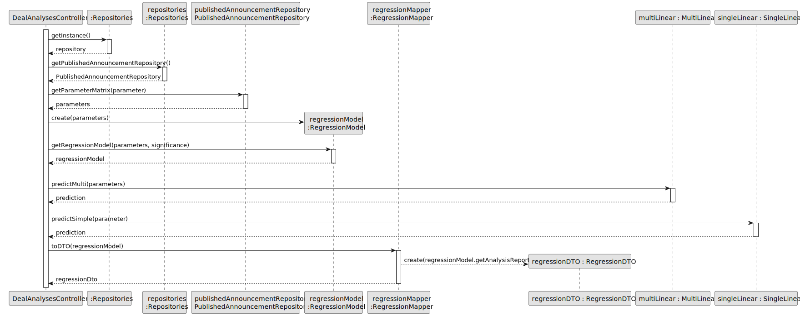
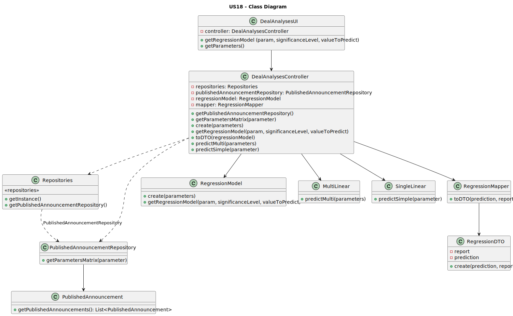

# US 18 - To analyse the deals made

## 3. Design - User Story Realization 

### 3.1. Rationale

**SSD - Alternative 1 is adopted.**

| Interaction ID | Question: Which class is responsible for...                | Answer                         | Justification (with patterns)                                                                                     |
|:-------------- |:---------------------------------------------------------- |:------------------------------- |:------------------------------------------------------------------------------------------------------------------ |
| Step 1         | ...interacting with the actor?                               | DealAnalysesUI                 | Pure Fabrication: the UI is responsible for interacting with the Store Manager.                                     |
|                | ...coordinating the US?                                      | DealAnalysesController         | Controller                                                                                                        |
|                | ...obtaining the deal analysis report?                        | DealAnalysesController         | Controller: the controller coordinates the retrieval and processing of the deal analysis report.                  |
|                | ...obtaining the published announcement repository?           | PublishedAnnouncementRepository | IE: the controller knows the PublishedAnnouncementRepository and retrieves it when needed.                      |
|                | ...obtaining the parameters for simple linear regression?     | PublishedAnnouncementRepository | IE: the controller uses the PublishedAnnouncementRepository to retrieve the necessary parameters.                |
|                | ...obtaining the parameters for multilinear regression?       | PublishedAnnouncementRepository | IE: the controller uses the PublishedAnnouncementRepository to retrieve the necessary parameters.                |
|                | ...creating a regression model?                               | RegressionModel                | IE: the controller creates a RegressionModel based on the retrieved parameters.                                     |
|                | ...obtaining the regression model?                            | RegressionModel                | IE: the controller gets the RegressionModel for further processing.                                                |
|                | ...creating a regression DTO?                                 | RegressionMapper               | Pure Fabrication: the RegressionMapper is responsible for creating the RegressionDTO from the RegressionModel.     |
|                | ...providing the regression DTO to the UI?                    | DealAnalysesController         | Controller: the controller provides the RegressionDTO to the UI for display.                                       |
|                | ...displaying the deal analysis report?                       | DealAnalysesUI                 | Pure Fabrication: the UI is responsible for displaying the deal analysis report.                                   |
|                | ...asking if the manager wants a prediction price?            | DealAnalysesUI                 | Pure Fabrication: the UI asks the manager if they want a prediction price.                                        |
|                | ...requesting the parameter for prediction?                   | DealAnalysesUI                 | Pure Fabrication: the UI requests the parameter from the manager.                                                  |
|                | ...predicting the property price using multilinear regression?| MultiLinear                    | IE: the controller uses the MultiLinear class to predict the property price based on the provided parameters.      |
|                | ...predicting the property price using simple linear regression? | SingleLinear                | IE: the controller uses the SingleLinear class to predict the property price based on the provided parameter.        |
|                | ...creating a regression DTO?                                 | RegressionMapper               | Pure Fabrication: the RegressionMapper is responsible for creating the RegressionDTO from the RegressionModel.     |
|                | ...providing the regression DTO to the UI?                    | DealAnalysesController         | Controller: the controller provides the RegressionDTO to the UI for display.                                       |
|                | ...displaying the predicted property price?                   | DealAnalysesUI                 | Pure Fabrication: the UI displays the predicted property price.                                                    |
|                | ...creating a regression DTO?                                 | RegressionDTO                  | Data Transfer Object (DTO): the RegressionDTO represents the data for the deal analysis report or prediction.    |
|                | ...mapping the regression model to a DTO?                     | RegressionMapper               | Data Mapper: the RegressionMapper maps the RegressionModel to a RegressionDTO.                                     |
|                | ...retrieving the published announcement repository?           | :Repositories                  | Singleton: the Singleton pattern ensures there is only one instance of the Repositories object available.           |
|                | ...retrieving the published announcement repository?           | repositories                    | IE: the controller knows the Repositories object and retrieves the PublishedAnnouncementRepository from it.       |

### Systematization ##

According to the taken rationale, the conceptual classes promoted to software classes are: 

 * Organization
 * Task

Other software classes (i.e. Pure Fabrication) identified: 

 * CreateTaskUI  
 * CreateTaskController

## 3.2. Sequence Diagram (SD)

### Alternative 1 - Full Diagram

This diagram shows the full sequence of interactions between the classes involved in the realization of this user story.

### Alternative 2 - Split Diagram

This diagram shows the same sequence of interactions between the classes involved in the realization of this user story, but it is split in partial diagrams to better illustrate the interactions between the classes.

It uses interaction ocurrence.

**Get Report Partial SD**

**Predict Multi Linear Partial SD**

**Predict Single Linear Partial SD**

## 3.3. Class Diagram (CD)

