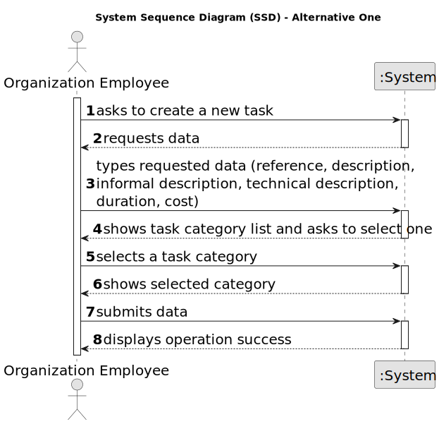
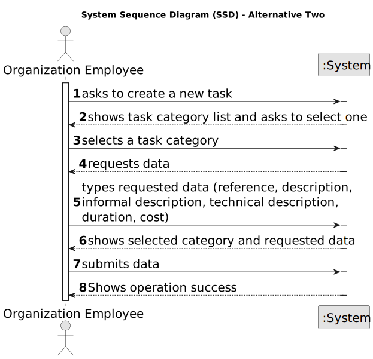

# US 006 - To create a Task 

## 1. Requirements Engineering

### 1.1. User Story Description

As an organization employee, I want to create a new task in order to be further published.

### 1.2. Customer Specifications and Clarifications 

**From the specifications document:**

>	Each task is characterized by having a unique reference per organization, a designation, an informal and a technical description, an estimated duration and cost as well as the its classifying task category. 

>	As long as it is not published, access to the task is exclusive to the employees of the respective organization. 

**From the client clarifications:**

> **Question:**  In US019, our team had some doubts regarding the information that is going to be analyzed. According to many MDISC teachers, we are only supposed to process the information within a CSV file chosen by the network manager. However, in the US description and acceptance criteria there isn't any mention of this, implying that we need to use all the information that's registered in our system. This situation also applies to MATCP, seeing the regression models, according to subject teachers, also should be generated using the CSV file information.
Additionally, if it is only supposed to be the CSV file information, can we ask for the file path of it?
>  
> **Answer:** In USs 17, 18 and 19, the network manager and the store manager should be able to explore/analyze ALL deals that are registered in the system.
To develop the work required by MATCP and MDISC courses, you should have a clean/empty system and you should load the CSV file that is already available in moodle (please the link "CSV file generated by the legacy system to be explored in US17, US18 and US19" available in moodle).
> 
> **Date:** Friday, 2 de June de 2023 às 12:21
> 

> **Question:** Monetary data is expressed in any particular currency?
>  
> **Answer:** Monetary data (e.g. estimated cost of a task) is indicated in POTs (virtual currency internal to the platform).

### 1.3. Acceptance Criteria

* **AC1:** All required fiels must be filled in.
* **AC2:** Task reference must have at least 5 alphanumeric chars.
* **AC3:** When creating a task with an already existing reference, the system must reject such operation and the user must have the change to modify the typed reference.

### 1.4. Found out Dependencies

* There is a dependency to "US003 Create a task category" since at least a task category must exist to classify the task being created.

### 1.5 Input and Output Data

**Input Data:**

* Typed data:
	* a reference, 
	* a designation, 
	* an informal description
	* a technical description
	* an estimated duration
	* an estimated cost
	
* Selected data:
	* Classifying task category 

**Output Data:**

* List of existing task categories
* (In)Success of the operation

### 1.6. System Sequence Diagram (SSD)

**Other alternatives might exist.**

#### Alternative One

#### Alternative Two

### 1.7 Other Relevant Remarks

* The created task stays in a "not published" state in order to distinguish from "published" tasks.