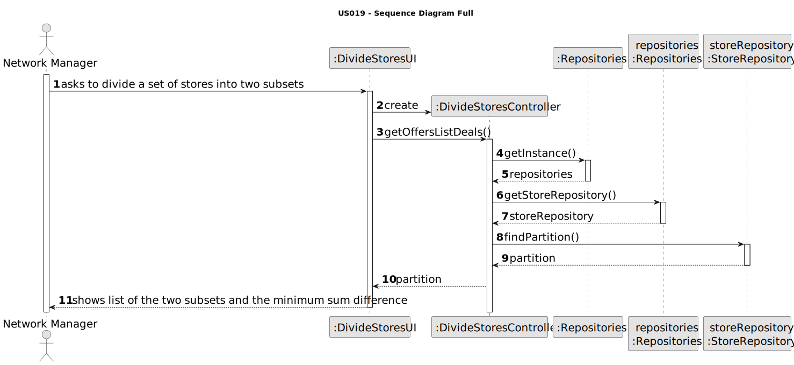
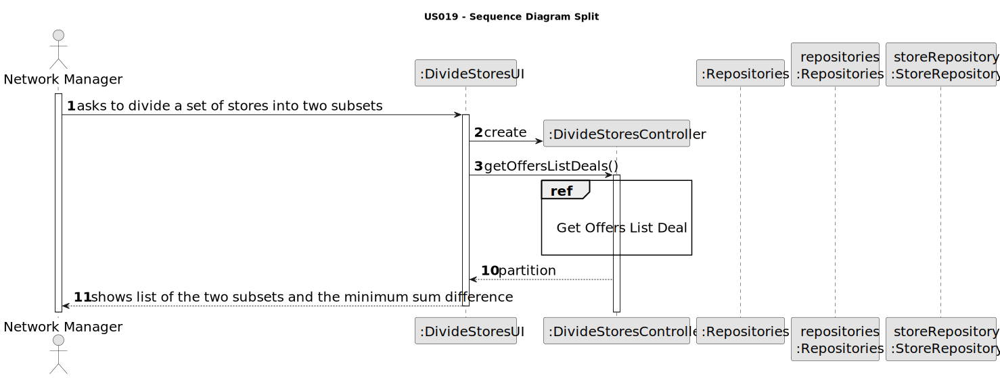
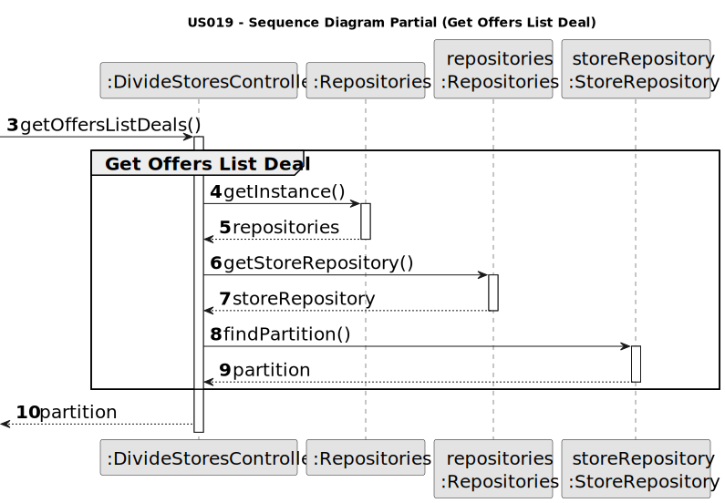
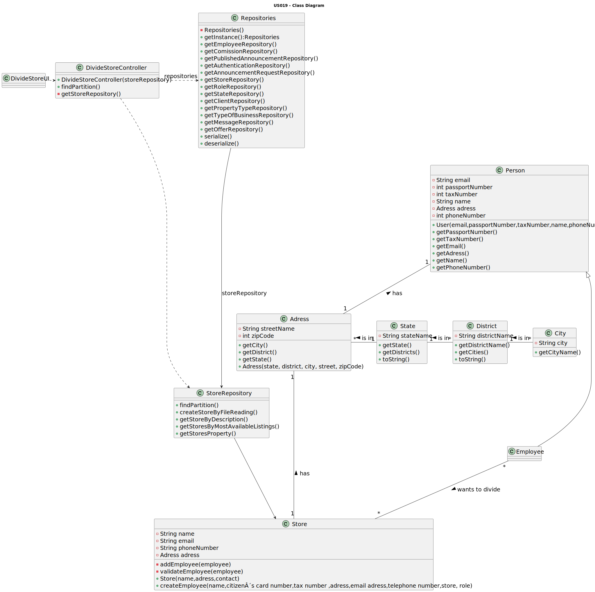

# US 006 - To create a Task 

## 3. Design - User Story Realization 

### 3.1. Rationale

**SSD - Alternative 1 is adopted.**

| Interaction ID                                                       | Question: Which class is responsible for...                    | Answer                 | Justification (with patterns)                                                                                 |
|:---------------------------------------------------------------------|:---------------------------------------------------------------|:-----------------------|:--------------------------------------------------------------------------------------------------------------|
| Step 1: asks to divide a set of stores into two subsets              | ... interacting with the actor?                                | DivideStoresUI         | Pure Fabrication: there is no reason to assign this responsibility to any existing class in the Domain Model. |
|                                                                      | ... coordinating the US?                                       | DivideStoresController | Controller                                                                                                    |
|                                                                      | ... obtaining the subsets generated and the minimum difference | StoreRepository        | IE:knows its own data                                                                                         |
| Step 2: shows list of the two subsets and the minimum sum difference | ...displaying the UI for the actor to input data?              | ListDealsUI            | Pure Fabrication                                                                                              |

### Systematization ##

According to the taken rationale, the conceptual classes promoted to software classes are: 

Other software classes (i.e. Pure Fabrication) identified: 

 * DivideStoresUI 
 * DivideStoresController
 * StoreRepository

## 3.2. Sequence Diagram (SD)

### Alternative 1 - Full Diagram

This diagram shows the full sequence of interactions between the classes involved in the realization of this user story.

### Alternative 2 - Split Diagram

This diagram shows the same sequence of interactions between the classes involved in the realization of this user story, but it is split in partial diagrams to better illustrate the interactions between the classes.

It uses interaction ocurrence.

**Get Offers List Deal**

## 3.3. Class Diagram (CD)

