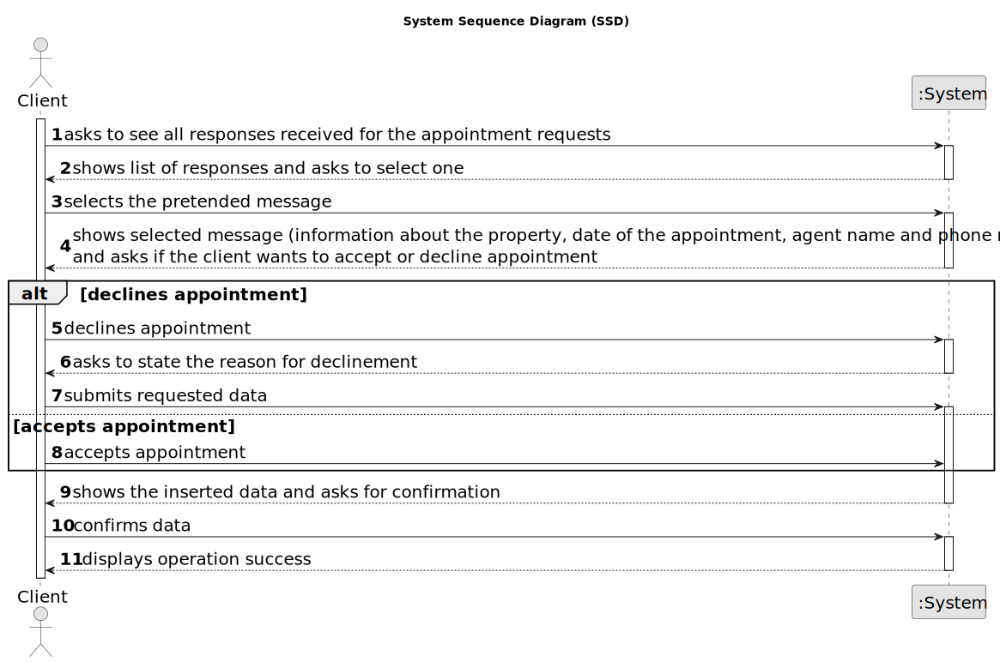

# US 20 - To read the response for the appointment request, to accept or reject it. 

## 1. Requirements Engineering

### 1.1. User Story Description

As a client, I want to read the response for the appointment request, to accept or reject it.

### 1.2. Customer Specifications and Clarifications 

**From the specifications document:**

>	N\A

**From the client clarifications:**

> **Date:** Wednesday, May 31 of 2023
>
> **Question:** The reason for declining the appointment should be selected from predefined options or entered as free text?
>  
> **Answer:** The message should be entered as free text.
>
> **Asked at:** 10:09

> **Date:** Thursday, June 1 of 2023
>
> **Question:** When the agent rejects the visit request it doesn't make sense for the client to accept or reject that. What should be the options for the client in that case?
>  
> **Answer:** When the agent rejects the visit, the client should only acknowledge that he is aware of the agent's answer.
>
> **Asked at:** 14:23

> **Date:** Friday, June 2 of 2023
>
> **Question:** According to AC1, the agent must be notified when the message is displayed to the client. Should he receive an email?
>  
> **Answer:** The agent must be notified by email when the message is displayed to the client.
>
> **Asked at:** 10:39
>
> **Question:** Should the response for the booking request be displayed in the console? Or is it implied that the client saw the response in the email and knows what is being handled?
>  
> **Answer:** The agent must be notified by email when the message is displayed to the client.
>
> **Asked at:** 13:27

> **Date:** Thursday, June 8 of 2023
>
> **Question:** Which email address sents a message to the agent when the client visualizes the agent's response to the booking request?
>  
> **Answer:** In US20 there is no e-mail being sent to the client. The client reads the agent response using the application.
>
> **Asked at:** 19:17
>
> **Question:** But the agent is informed by email when the client visualizes his response. Which email adress sends that message to the agent?
>  
> **Answer:** The client e-mail.
>
> **Asked at:** 15:23
>

### 1.3. Acceptance Criteria

* **AC1:** The agent must be notified when the message is displayed to the client.
* **AC2:** The appointment request must provide information about the property and the date of the appointment.
* **AC3:** When the appointment is rejected, the client must specify the reason.
* **AC4:** The appointment request must provide the agent name and phone number.

### 1.4. Found out Dependencies

* There is a dependency to US07 "As an unregistered user, I want to register in the system to buy, sell or rent properties." since the Client should be registered in the app.

* There is a dependency to US09 "As a client, I want to leave a message to the agent to schedule a visit to a property of my interest." since there is a need of having a message in order to have a response.

* There is a dependency to US16 "As an agent, when viewing a booking request, I want to respond to the user that scheduled the visit." since there is a need of having a response from the agent.

### 1.5 Input and Output Data

**Input Data:**

* Typed data:
	* a reason for declining
	
* Selected data:
	* Message
	* Accept or reject

**Output Data:**

* List of responses
* (In)Success of the operation

### 1.6. System Sequence Diagram (SSD)

**Other alternatives might exist.**

#### Alternative One

### 1.7 Other Relevant Remarks

* N\A