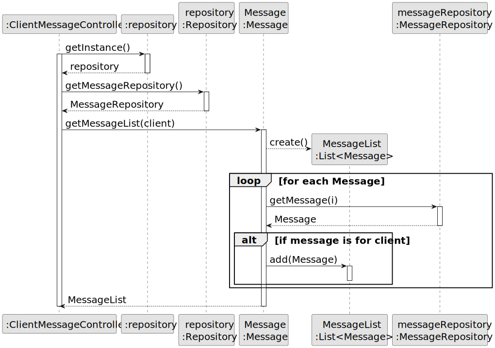

# US 20 - To read the response for the appointment request, to accept or reject it. 

## 3. Design - User Story Realization 

### 3.1. Rationale

**SSD - Alternative 1 is adopted.**

| Interaction ID | Question: Which class is responsible for... | Answer                    | Justification (with patterns)                                                                                       |
|:-------------- |:---------------------------------------- |:------------------------ |:--------------------------------------------------------------------------------------------------------------------|
| Step 1         | ... interacting with the actor?          | ClientMessageUI          | Pure Fabrication: there is no reason to assign this responsibility to any existing class in the Domain Model.      |
|                | ... coordinating the US?                | ClientMessageController  | Controller                                                                                                          |
|                |                                        | repository               | IE: knows the MessageRepository                                                                                       |
|                | ... obtaining the messages list?         | MessageRepository        | IE: cf. A&A component documentation.                                                                                |
|                | ... creating DTOs for the messages?      | MessageMapper             | Pure Fabrication: Data Transfer Object (DTO): MessageMapper is responsible for creating the MessageDTO from the Message objects. |
|                | ... storing the message DTOs?            | MessageDtos               | Pure Fabrication: Lists: MessageDtos store the MessageDTOs obtained from the MessageMapper.                           |
|                | ... sending visualized emails?           | ClientMessageController   | Controller                                                                                                          |
|                | ... representing the message data?        | MessageDTO                | Pure Fabrication: Data Transfer Object (DTO): MessageDTO represents the data of a message to be displayed or processed. |
 

### Systematization ##

According to the taken rationale, the conceptual classes promoted to software classes are: 

 * Message

Other software classes (i.e. Pure Fabrication) identified: 

 * ClientMessageUI  
 * ClientMessageController
 * MessageDtos

## 3.2. Sequence Diagram (SD)

### Alternative 1 - Full Diagram

This diagram shows the full sequence of interactions between the classes involved in the realization of this user story.

### Alternative 2 - Split Diagram

This diagram shows the same sequence of interactions between the classes involved in the realization of this user story, but it is split in partial diagrams to better illustrate the interactions between the classes.

It uses interaction ocurrence.

**Get Message List For Client Partial SD**

**Message toDto**

## 3.3. Class Diagram (CD)

