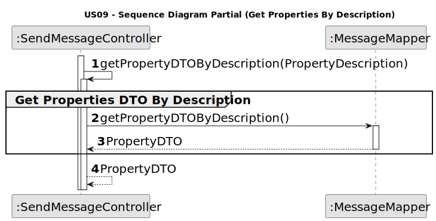
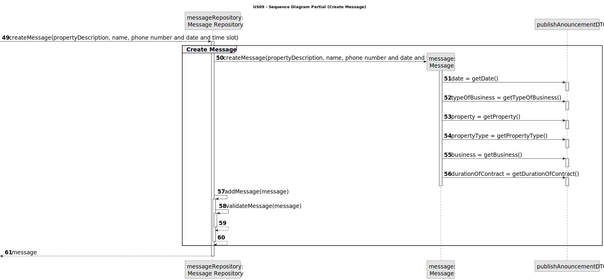
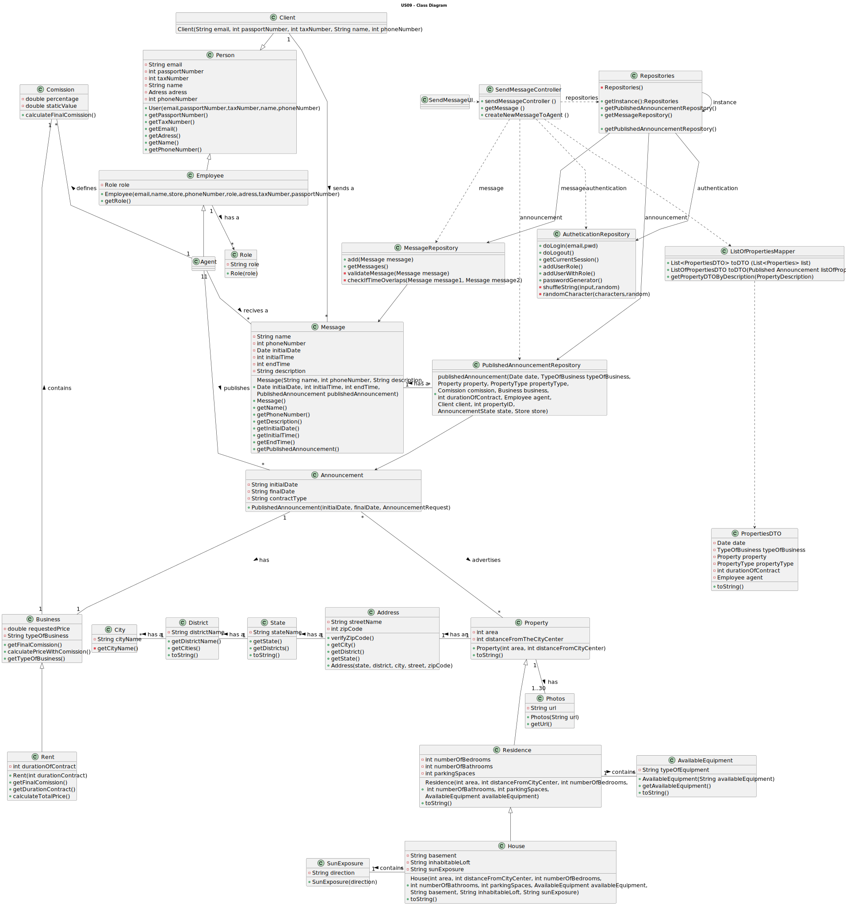

# US 09 - As a client, I want to leave a message to the agent to schedule a visit to a property of my interest.

## 3. Design - User Story Realization 

### 3.1. Rationale

| **_Interaction ID_**                                                                 | **_Which class is responsible for..._**                                                | **_Answer_**                    | **_Justification_**                                                                                           |                                   
|:-------------------------------------------------------------------------------------|:---------------------------------------------------------------------------------------|:--------------------------------|---------------------------------------------------------------------------------------------------------------|
| Step 1: asks to schedule a visit                                                     | ... interacting with the actor?                                                        | SendMessageUI                   | Pure Fabrication: there is no reason to assign this responsibility to any existing class in the Domain Model. |
|                                                                                      | ... coordinating the US?                                                               | SendMessageController           | Controller                                                                                                    |
|                                                                                      | ...knowing and obtaining the email of the client loged in?                             | User session                    | IE: knows/has its own data                                                                                    |
|                                                                                      | ...obtaining the client by email?                                                      | ClientRepository                | IE:knows/has its own data                                                                                     |
|                                                                                      | ...obtaining the property list?                                                        | PublishedAnnouncementRepository | IE: knows/has its own data,Pure Fabrication                                                                   |
|                                                                                      | ...obtaining the property Dto list                                                     | ListOfPropertiesMapper          | IE:Kowns/has its own data,Pure Fabrication,High coesion Low Coupling                                          |
|                                                                                      | ...obtaining the property list?                                                        | PublishedAnnouncementRepository | IE: knows/has its own data,Pure Fabrication                                                                   |
| Step 2: shows a list of properties sorted from the most recent entries to the oldest | ...displaying the list of properties?                                                  | SendMessageUI                   | Pure Fabrication                                                                                              |
| Step 3: selects a property of his interest                                           | ...validating selected data?  ...temporarily keeping the property description? | SendMessageUI                   | Pure Fabrication                                                                                              |
| Step 4: submits the requested data                                                   | ...obtaining and creating the list of properties Dto by description                    | PublishedAnnouncementMapper     | IE,Creator                                                                                                    |
|                                                                                      | ...creating the message                                                                | MessageRepository               | IE,Creator                                                                                                    |
|                                                                                      | ...validating the data?                                                                | Message                         | IE                                                                                                            |
|                                                                                      | ...adding to a collection and globally validating duplicated records           | MessageRepository               | IE                                                                                                            |
| Step 6: shows a success message and the message created                              | ...sending a success message?                                                          | SendMessageUI                   | Pure Fabrication                                                                                              |

#### Systematization

The conceptual classes developed to software classes are, matching with the adopted rationale:
* Message

Other software classes identified:
* MessageUI
* PublishedAnnouncementRepository
* MessageRepository
* ListOfPropertiesMapper

### 3.2. Sequence Diagram (SD)

#### Full Diagram
This diagram displays the entire series of interactions between the classes involved in the realization of this user story.

#### Split Diagram

This diagram, which is divided into smaller diagrams to better describe the interactions between the classes, displays the same series of interactions between the classes involved in the realization of this user story.

##### Get Client

##### Get Properties By Description

##### Get Properties List By Most Recent Added

##### Get Properties List By Most Recent Added Using DTO

##### Create Message

### 3.3. Class Diagram (CD)

