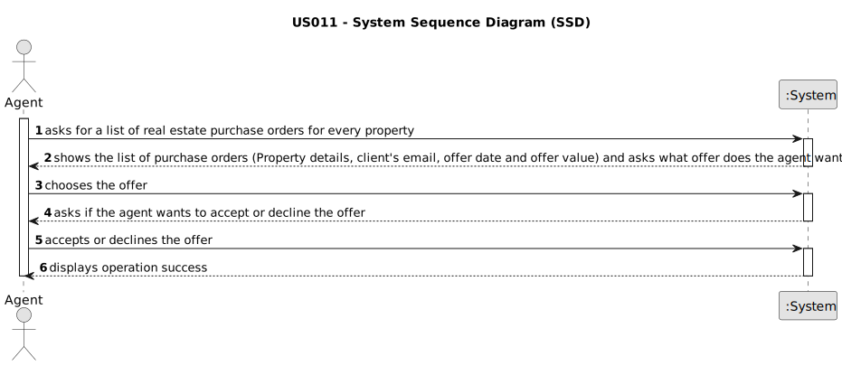

# US 11 - To list real estate purchase orders to accept or decline a purchase order for a property

## 1. Requirements Engineering

### 1.1. User Story Description

As an agent, I want to list real estate purchase orders to accept or decline a purchase order for a property. After accepting or declining, an email notification should be sent to the customer.

### 1.2. Customer Specifications and Clarifications 

**From the specifications document:**

>	N\A

**From the client clarifications:**

> **Date:** Wednesday, May 3 of 2023
>
> **Question:** When the agent declines an order, she has to be removed from the list and system?
>  
> **Answer:** The order should be removed from the list but not from the system.
>
> **Asked at:** 11:58
>
> **Date:** Thursday, May 4 of 2023
>
> **Question:** When the agent wants to list real estate purchase orders, does he/she list all of them at once or can a property be chosen to list the purchase orders that are related to that specific property?
>  
> **Answer:** The properties should be sorted from the oldest to the most recent one. For each property, the list of purchase orders should be sorted by the amount offered, the highest offer must appear first.
>
> **Asked at:** 08:52
>
> **Date:** Saturday, May 6 of 2023
>
> **Question:** Regarding US011 should we provide all the property characteristics to assist agents in choosing the appropriate purchase order?  If so, is it required to display the amount established by the property owner?
>  
> **Answer:** Yes. Yes.
>
> **Asked at:** 16:27
>
> **Date:** Saturday, May 13 of 2023
>
> **Question:** Is it convenient to give the ability to filter the properties by their attributes when the agent is listing them?
>  
> **Answer:** No. We always have a low number of purchase orders. Please check AC1.
>
> **Asked at:** 17:34
>
> **Date:** Monday, May 15 of 2023
>
> **Question:** The notification should be sent to the client, but we need to consider this client the owner or the potential buyer?
>  
> **Answer:** The client is the registered user that placed the order (in US10).
>
> **Question:** Assuming the previous anwser is the potential buyer, should the owner be informed about the sale success?
>  
> **Answer:** The owner will be contacted by means of a phone call. This is not a feature of the system.
>
> **Asked at:** 19:01
>
> **Date:** Wednesday, May 17 of 2023
>
> **Question:** Does grouping purchase orders by property mean that only properties are displayed, and only after a property is selected are its requests shown? Or are all the requests shown but requests of the same property are shown together?
>  
> **Answer:** The system should show (to the agent) a list of properties that have prurchase orders. For each property the system should show a list of purchase orders. Typically we have a small number of purchase orders and we want all orders shown (by property) without selecting a property in particular.
>
> **Question:** When properties are sorted form oldest to most recent, does this relate to when the property was added to the system or the property's date of construction?
>  
> **Answer:** This sorting should be made using the date when the property announcement was published by the agent.
>
> **Asked at:** 12:28
>

### 1.3. Acceptance Criteria

* **AC1:** The list of purchase orders should be grouped by property. The properties should be sorted from the oldest to the most recent one. For each property, the list of purchase orders should be sorted by the amount offered, the highest offer must appear first.
* **AC2:** For each offer, the agent must be able to accept or decline it. The action of accepting or declining an offer should trigger an email notification to the client.
* **AC3:** When a purchase order is accepted, all the other orders should be declined, and a message sent to the client.
* **AC4:** If a property does not contain any offers, the system should show an empty list of offers.

### 1.4. Found out Dependencies

* There is a dependency to US07 "As an unregistered user, I want to register in the system to buy, sell or rent properties." since the Agent should be registered in the app.

* There is a dependency to US10 " As a client, I place an order to purchase the property, submitting the order amount." since there is a need for an offer to exist in order to accept or decline.

### 1.5 Input and Output Data

**Input Data:**

* Typed data:
	* n\a
	
* Selected data:
	* Offer
	* Decline or Accept data

**Output Data:**

* List of properties (sorted from the oldest to the most recent one) and the list of purchase orders (sorted by the amount offered)
* (In)Success of the operation

### 1.6. System Sequence Diagram (SSD)

**Other alternatives might exist.**

#### Alternative One

### 1.7 Other Relevant Remarks

* N\A