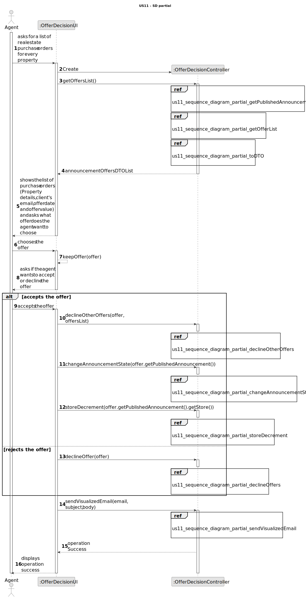
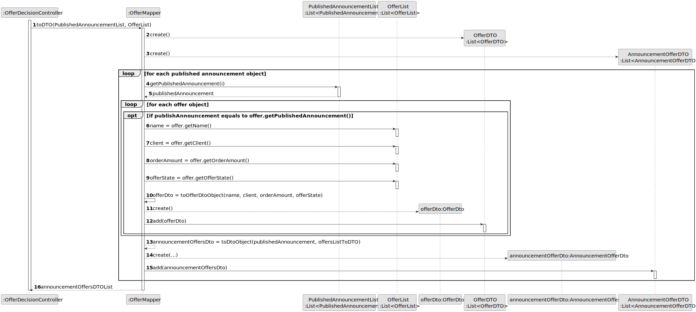
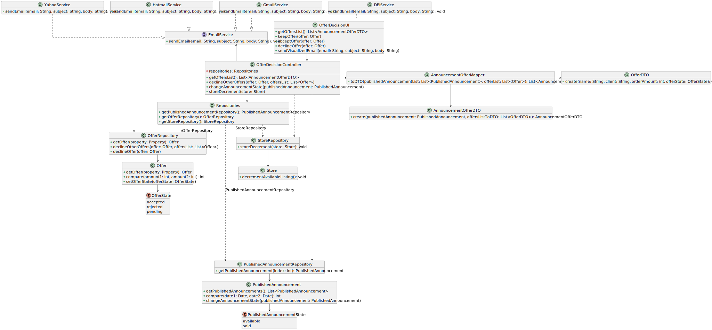

# US 11 - To list real estate purchase orders to accept or decline a purchase order for a property

## 3. Design - User Story Realization 

### 3.1. Rationale

**SSD - Alternative 1 is adopted.**

| Interaction ID | Question: Which class is responsible for... | Answer               | Justification (with patterns)                                                                                 |
|:-------------  |:--------------------- |:---------------------|:--------------------------------------------------------------------------------------------------------------|
| Step 1         | ... interacting with the actor? | OfferDecisionUI      | Pure Fabrication: there is no reason to assign this responsibility to any existing class in the Domain Model. |
|                | ... coordinating the US? | OfferDecisionController | Controller                                                                                                    |
|                | ... instantiating a new Offer? | Offer              | Creator (Rule 1): Offer is responsible for creating and managing Offer objects.                             |
|                | ... knowing the user using the system? | Agent                | IE: Represents the user (agent) interacting with the system.                                                 |
|                | ... knowing the list of properties? | PropertyRepository    | Information Expert: PropertyRepository has access to the list of properties.                                  |
| Step 2         | ... obtaining the list of properties? | PropertyRepository    | Information Expert: PropertyRepository has access to the list of properties.                                  |
| Step 3         | ... obtaining the list of offers? | OfferRepository       | Information Expert: OfferRepository has access to the list of offers.                                        |
| Step 4         | ... converting the PropertyList and OfferList to JointListDTO? | OfferMapper           | Data Mapper: OfferMapper is responsible for converting data between different representations.                |
| Step 5         | ... presenting the list of purchase orders to the agent? | OfferDecisionUI      | IE: The UI component is responsible for displaying information to the agent.                                 |
| Step 6         | ... obtaining the selected offer? | OfferDecisionUI      | IE: The UI component is responsible for capturing user input (selected offer).                               |
| Step 7         | ... sending the offer status (accept/decline) to the controller? | OfferDecisionUI      | IE: The UI component is responsible for capturing user input (offer status).                                 |
|                | ... changing the status of the selected offer? | Offer                | Information Expert: Offer owns the offer status and can change it.                                            |
|                | ... updating the offer status in the repository? | OfferRepository       | Information Expert: OfferRepository has access to and manages offer status.                                   |
| Step 8         | ... displaying the operation success message to the agent? | OfferDecisionUI      | IE: The UI component is responsible for displaying information to the agent.                                 |

### Systematization ##

According to the given rationale, the conceptual classes promoted to software classes are:

- Offer
- Agent
- PropertyRepository
- OfferRepository

Other software classes (i.e., Pure Fabrication) identified:

- OfferDecisionUI (for instantiating new Offer objects)
- OfferDecisionController
- OfferMapper

## 3.2. Sequence Diagram (SD)

### Alternative 1 - Full Diagram

This diagram shows the full sequence of interactions between the classes involved in the realization of this user story.

### Alternative 2 - Split Diagram

This diagram shows the same sequence of interactions between the classes involved in the realization of this user story, but it is split in partial diagrams to better illustrate the interactions between the classes.

It uses interaction ocurrence.

**Get Task Category List Partial SD**

**Get Task Category Object**

**Get Employee**

**Create Task**

## 3.3. Class Diagram (CD)

