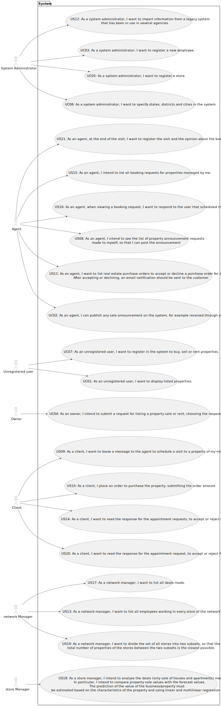

# Use Case Diagram (UCD)

**In the scope of this project, there is a direct relationship of _1 to 1_ between Use Cases (UC) and User Stories (US).**

However, be aware, this is a pedagogical simplification. On further projects and curricular units might also exist _1 to
N **and/or** N to 1 relationship between US and UC.

**Insert below the Use Case Diagram in a SVG format**

**For each UC/US, it must be provided evidences of applying main activities of the software development process (
requirements, analysis, design, tests and code). Gather those evidences on a separate file for each UC/US and set up a
link as suggested below.**

# Use Cases / User Stories

| UC/US  | Description                                                                                                                                                                                                                                                                                                                                                                                                      |                   
|:-------|:-----------------------------------------------------------------------------------------------------------------------------------------------------------------------------------------------------------------------------------------------------------------------------------------------------------------------------------------------------------------------------------------------------------------|
| US 015 | [As an agent, I intend to list all booking requests for properties managed by me. ](../../US015/01.requirements-engineering/Readme.md)                                                                                                                                                                                                                                                                           |
| US 016 | [As an agent, when viewing a booking request, I want to respond to the user that scheduled the visit. ](../../US016/01.requirements-engineering/Readme.md)                                                                                                                                                                                                                                                       |
| US 017 | [As a network manager, I want to list all deals made. ](../../US017/01.requirements-engineering/Readme.md)                                                                                                                                                                                                                                                                                                       |
| US 018 | [As a store manager, I intend to analyse the deals (only sale of houses and apartments) made. In particular, I intend to compare property sale values with the forecast values. The prediction of the value of the business/property must be estimated based on the characteristics of the property and using linear and multilinear regression algorithms. ](../../US018/01.requirements-engineering/Readme.md) |
| US 019 | [As a network manager, I want to divide the set of all stores into two subsets, so that the total number of properties of the stores between the two subsets is the closest possible.](../../US019/01.requirements-engineering/Readme.md)                                                                                                                                                                        |
| US 020 | [As a client, I want to read the response for the appointment request, to accept or reject it.](../../US020/01.requirements-engineering/Readme.md)                                                                                                                                                                                                                                                               |

